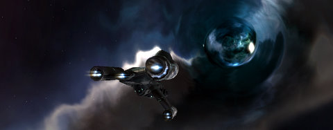

Back to: [West Karana](/posts/westkarana.md) > [2009](/posts/2009/westkarana.md) > [August](./westkarana.md)
# Daily Blogroll 8/19 - L2Test edition

*Posted by Tipa on 2009-08-19 08:00:08*

Having heard about the EVE Fitting Tool from a helpful commentator, I spent a lot of time last night working some Battle Clinic builds into viable builds for me. VERY happy. Later on, the corps went on an impromptu trip through a wormhole, where we were relentlessly shadowed by the corp (Bones) who had staked it out. They allowed us to take on a Sleeper cell before we left. We got some T3 loot, but since we'd all brought expendable ships (that's my Exequoror "The Liberator" hovering outside the wormhole), we weren't up for taking out the second wave, which included a battleship. (Drew at Wizard of Duke Street has [a little more about wormholing](http://dukestreet.org/archives/004716.html)).

The biggest news in the EVE realm had nothing (or little) to do with the space game. Yesterday, at GDC Europe, EVE developers CCP [announced Dust 514](http://www.gamasutra.com/php-bin/news_index.php?story=24886), a dirtside FPS for consoles where success on the ground leads to success ij space based planetary and system control. 

Not much is known about the title. [The teaser video](http://www.cedarstreet.net/2009/08/dust-514.html) shows standard FPS action on the ground, with two frigates trading shots overhead. I get that Starship Troopers feeling from it, and it's a good feeling. Darren of Common Sense Gamer doesn't see any way they can pull off a new MMO in [the current generation of consoles](http://commonsensegamer.com/?p=1447). Heartless\_ [wonders at the connection](http://hgamer.blogspot.com/2009/08/scott-jennings-in-left-field-finds-dust.html) between Dust 514 and the technology for EVE's announced "ambulation" mode, where players can walk about on space stations. 

With Blizzcon only days away, bloggers have been speculating endlessly about rumors that the next World of Warcraft expansion will bring a complete revamping of the old world. That didn't go over so well when EverQuest started on that path with the Prophecy of Ro and Depths of Darkhollow expansion, but maybe Blizzard can succeed where SOE failed. Spinks wonders if even [a total revamp could get people back into the old zones again](http://spinksville.wordpress.com/2009/08/19/the-problem-of-old-content-and-is-recycling-the-answer/), especially if flying mounts and other modern features were brought into the old world. Damion of Zen of Design [doubts people will want to revisit zones](http://www.zenofdesign.com/2009/06/21/content-exists-to-be-consumed/) they were already quite tired of before.

The Cataclysm rumors also suggest that many new previously forbidden (by lore) race and class combinations will get WoW players back in the alts game. Green Armadillo wonders why developers are all so eager to cite lore as reasons for something they didn't want players doing, [but have no problems breaking it at their whim](http://playervsdeveloper.blogspot.com/2009/08/role-of-lore.html) if they change their minds.

Writing about Lord of the Rings Online, Armadillo says:

> The problem? This game is set in Middle Earth. I don't remember Gimli's axes bursting into flames as he fought the malevolent ice wraiths of Caradhras. (Actually, I don't remember the malevolent ice wraiths of Caradhras either, maybe Gandalf was busy whining to Aragorn about being forced to go to Moria while the battle raged off camera. Of course, if the game stuck to just foes the Fellowship actually fought during the story, the beastiary would be very repetitive indeed, especially in the context of a game full of "kill 360 of this type of enemy" deeds.)

Naamah at Aionic Thoughts [has a new video courtesy of Kotaku](http://aionicthoughts.wordpress.com/2009/08/19/1-5-impressions-here-get-your-1-5-impressions/) about the game's 1.5 patch, the one that will launch with the game in September and has never been played by Western testers. The developers say there is no grind in Aion? That's good news. WoW-like gaming has been synonymous with grind for so many years.

And speaking of videos, Werit [has been going all Stephen Spielberg lately](http://www.weritsblog.com/2009/08/fallen-earth-walkthrough-part-2.html) with Fallen Earth, the post-apocalyptic MMO which has largely been overshadowed by higher-profile releases. Wanna kill posthuman mutants and zombies and save the scattered fragments of humanity? Fallen Earth might be your game.

A fan of Wizard101, but upset because you can't get anyone to team up with you for arena dueling? Stingite of The Friendly Necromancer advises sitting down with your friends and [finding what it would take to get them into the arena](http://thefriendlynecromancer.blogspot.com/2009/08/got-question-from-long-time-reader-here.html), or why they may be reluctant to go. Seven hour duels would be reason enough for me.

F2P game correspondent Warhammermer [has a Dream of Mirror Online AMV](http://en.wikipedia.org/wiki/Human_%28The_Killers_song%29) to the tune of The Killers' "Human". The line, "Are we human, or are we dancer?" refers here to DOMO's Dancer job. Yes! Dancer is a job in DOMO! Warhammermer also has some news of [a movie tie-in within SOE's Free Realms](http://exploringwar.wordpress.com/2009/08/18/free-realms-its-raining-veg/) which left those outside of the US without meatballs. 

Anjin at Bullet Points has been spending a bit of time in the F2P version of Dungeons & Dragons Online, and aside from a few crashes, [kinda likes how DDO mixes up the standard dungeon crawler](http://bulletpointsblog.blogspot.com/2009/08/played-lately-dungeons-dragons-online.html) with more action.

Spellborn has officially become a Free to Play game, says Acclaim Games' Community Manager, David "Historian" DeWald:

> At point, you checked out The Chronicles of Spellborn. Today, as you read this, Spellborn as it currently exists is now free to play. Keep in mind that there will be no upgrades and no patches. It has become in effect, an Action RPG with superior Multiplayer. The only thing it will cost you to play is the time it takes to download.

So play it. [http://www.tcos.com
](http://www.tcos.com)
Now because it is frozen in time, we will be creating events for the players and we will help support any players that want to make their own events. And if you have thoughts on how we might make this version more enjoyable as we wait for the New free to play version, we are glad to listen.

Is that enough news for you? It's just gonna keep flooding in as the games we've been waiting all year to play start hitting the shelves. So happy hump day, and keep gaming!

## Comments!

**[JC](http://phoenq-magson.blogspot.com/)** writes: Gratz on finding EFT. Sorry I didn't mention it to you sooner.... I was more or less under the impression that "everyone" uses the EVEMon/EFT combo or [EVEHQ](http://www.evehq.net/), so it didn't occur to me that you aren't/weren't.

Anyway, glad you found it and it's helping. I'm gonna have to look you up in-game soon and shoot you. Or you can shoot me. Whatever :-P

---

**[Tipa](https://chasingdings.com)** writes: Lots of people try to learn everything about their games, pore over help guides, forums and so on. I don't really do that. I had read about EFT on Massively a couple of weeks ago, but I forgot to follow up on it until reminded yesterday :)

If you're gonna shoot me, let me get into a cheap ship first? That Myrm cost me almost 50m ISK to replace :/ I could afford it, but not twice. Not yet.

---

**[Wiqd](http://wiqdintentionz.com/studios/blog2)** writes: I'll have to check out EFT. I've just used the fitting template tool on EVEMon thus far.

---

**[JC](http://phoenq-magson.blogspot.com/)** writes: I'll shoot you whenever I want, darnitall!

Admittedly I don't go out pvp'ing in anything other than T1 frigs myself. . . . . ;-) I'm starting to have enough cash saved that I'm willing to go bigger, but my medium and larger weapon skills are still all T1, so I prefer frigs anyway.

---

**Mallika** writes: Tipa -- I made this comment on Ysh's website but I was thinking of you as well, so here goes: I wasn't sure if it was you who professed an interest in Gatheryn (that mini-game Victorian steampunk multiplayer title), but they've opened their doors for people to come in and have a look-see. Go to http://www.mindfusegames.com/ and click on the "Download" link to the right -- it'll let you make an account and download the 171mb game file. 

I haven't gotten into the game yet, but I will probably do so soon. I'm in the mood for casual mini-gaming right now, for some reason. :)

---

**[Tipa](https://chasingdings.com)** writes: Thanks, Mallika :) I guess they did go ahead and go open beta and NOT TELL ME! How dare they!? Heh.

---

