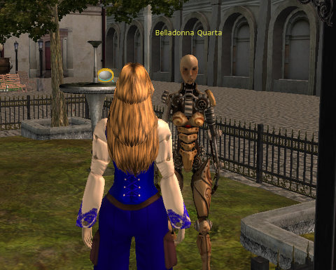
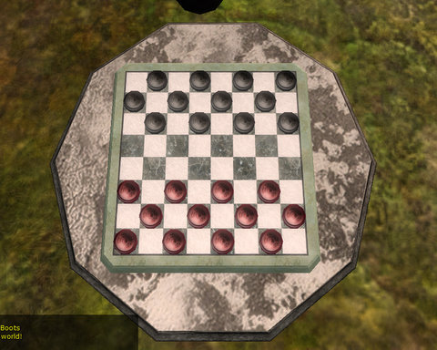

Back to: [West Karana](/posts/westkarana.md) > [2009](/posts/2009/westkarana.md) > [August](./westkarana.md)
# A first look at Gatheryn

*Posted by Tipa on 2009-08-21 06:37:54*

The Elymian Isles are a fabled land of peace and industry, where clockwork creations stamp noisily through the cobblestone streets while the populace engages in sundry pasttimes of strategy and skill to earn the silver coin of the realm.

It's steampunk, it's minigames, it's [Gatheryn, the casual MMO from newcomers Mindfuse](http://www.mindfusegames.com/). Gatheryn went open beta yesterday to very little fanfare, but I got the news through Twitter and they couldn't keep me away. I've been looking forward to playing this game since I heard about it nearly a year ago. Steampunk and minigames? Yes!

Gatheryn is the first game I've played that is based on Simutronics' HeroEngine, the same game engine that will be used by Bioware's "Star Wars: The Old Republic". So the sorts of performance and customizability we see here can perhaps give us a clue of what to expect when SWTOR comes out.

Gatheryn's character creator gives you an almost Vanguard-like ability to change all the minutiae of your body's measurements, from inter-eye width to average nosehair length, but comes up fairly short on clothing options, though the coloring palette will give you range to make your own, unique, look. The hairstyles were fairly extensive, and there's no reason to stick with natural hair colors. Want to make your hair look as if it were on fire? You can do that.

Your first introduction to Elymia is a city similar to Victorian London, except with wider streets and less sewage, probably thanks to the aid of the clockwork helpers scattered about. The clockwork above welcomes me to a small park full of tables with Draughts (anachronistically referred to as Checkers) boards on them. Sitting down at a table sends the camera to a bird's-eye position over the board as you wait for an opponent. I soon moved on -- there were few other players available, and most were enjoying other minigames.

Elymia's economy is built around Silver. You earn silver for winning games, or at least losing less quickly. You spend silver on fruit and drinks which you will need to survive and likely on clothing and pets. You have a health bar, and bubblers here and there that can heal you, so I think it's safe to say it's possible to come to some harm in some way, perhaps by not eating or drinking enough?

The city invites exploration, with mysterious doors, dark rooms and hidden plazas scattered about as well as tantalizing notations on the maps about docks and regions outside the city that, perhaps, are not as safe as those within.

Gatheryn's core activities are minigames, mostly familiar, but with a steampunky twist. I really enjoyed the five minute hunt through a lady's chambers for some hidden items to steal, and look forward to seeing more games along those lines, than the rather pedestrian implementations of such children's games as Hangman and Fishing. Also, Sudoku? This games gives one of the highest silver rewards, but solving Sudoku is a first semester programming exercise -- it's one of the easiest games in which to cheat. I expect a nerf to Sudoku before long.

Gatheryn has a great look, but the minigames to date, with some exceptions, are not as compelling as those in Puzzle Pirates, Neopets or Wizard101. The in-world games like the item hunt and draughts/checkers show a potential for a great timewaster in the future, but hangman, Sudoku, word search, fishing and a Boggle-like word maker will have difficulty competing with the thousands of similar Flash games on the web.

[gallery]

## Comments!

**[mbp](http://mindbendingpuzzles.blogspot,com)** writes: I never could quite stomach mini games in my mmos. For me its an immersion breaking thing. If my avatar is a brutish orc I want him to go around hitting things with big axes, not sitting down to play card games or shiny jewel games or number puzzles (the beast is innumerate for heaven's sake). If you tart the mini game up with some role play (like Lotro Summer festival for example) I can maybe stomach it for a while but just dont push it.

---

**[Tesh](http://tishtoshtesh.wordpress.com/)** writes: I love Puzzle Pirates, and look forward to spending a bit of time with Gatheryn. One thing that bothers me just a little is the art direction. The lighting is a bit flat, and there doesn't seem to be much in the way of a unifying art direction for the disparate elements of the game, judging from the screenies here. I'm expecting and hoping for more than a Steampunk-flavored Kongregate. PP does really well at making each minigame feel like part of the world. Gatheryn needs that as well.

---

**[Tesh](http://tishtoshtesh.wordpress.com/)** writes: To clarify, if you were to take a look at a series of Puzzle Pirates screenshots, you could tell at a glance that they were part of the same game. This collection of screenshots could be half a dozen different games. OK, they each have the little gears-in-gear logo, but that's not enough.

---

**[Dblade](http://mmomisanthrope.wordpress.com/)** writes: Those pictures look very ugly, I'm hoping it's them failing at using the Hero engine rather than an example of it.

I agree with mbp, especially since it looks like not even a nod to immersion was given in the choice of them. Sudoku? In a steampunk MMO? Word search?

---

**Val** writes: That looks.... pretty terrible.

---

**[Tipa](https://chasingdings.com)** writes: Where Gatheryn integrates the games into their world, like with Checkers and their item search, it works really well. I was hoping for a little more than that, and a little less generic Flash games. Maybe they are planning on bringing more of the games "in world".

The graphics don't worry me; they can always get better. But if their aim is to be a Sudoku portal, they should let you access all those kinds of games from a menu. There's no need to explore a city just for a rousing game of word search.

---

**[/AFK &#8211; August 26 &laquo; Bio Break](http://biobreak.wordpress.com/2009/08/23/afk-august-26/)** writes: [...] Steampunk + Minigames + Hero Engine = Tipa’s Daydream Come True [...]

---

**[Tesh](http://tishtoshtesh.wordpress.com/)** writes: Aye, I'm not writing off the game because of the graphics. I'm just noting directions that it needs to improve. Again, pointing to Puzzle Pirates, the mini games in that MMO are designed from the ground up to be unique and part of the game world. I love some good Sudoku to unwind, but I was hoping for some more original games that would really sell the world of Gatheryn. Perhaps those are in the pipe. :)

---

**[West Karana » Checking back with Gatheryn](https://chasingdings.com/index.php/2009/09/26/checking-back-with-gatheryn/)** writes: [...] and rattling pipes greets me when I step onto Elymia’s weather-worn docks. It seems ages since I was last here, though it’s only been a month. So many things have changed since I’ve been gone from [...]

---

