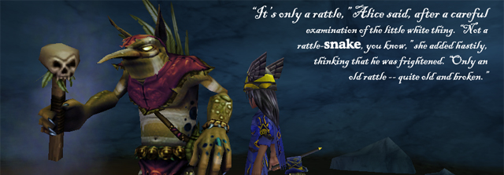

Back to: [West Karana](/posts/westkarana.md) > [2009](/posts/2009/westkarana.md) > [August](./westkarana.md)
# Daily Blogroll 8/27 -- Curioser and curioser edition

*Posted by Tipa on 2009-08-27 07:51:35*

Started on the second tier of Grizzleheim last night. The Virgil Roughlands (level 25+) are a pretty significant step up from Svarstaad Pass. Even two boxing, I had to choose my cards with a lot more care than almost any challenge in recently-completed Krokotopia. At levels 27 and 32, my two-box team is as closely matched as they have ever been. Thankfully, Marissa now has the (yucky) Humongofrog to match up with Allison's Sandstorm for mass monstery death.

Yesterday's "Sturm und Drang" edition was prophetically named. First, noted blogger Openedge1 [shuttered his Age of Conan blog](http://simple-n-complex.blogspot.com/2009/08/taking-break.html), citing low readership since he changed from a general MMO to a game-specific blog.

> I was hoping to drive some conversations about AoC in general and discuss the game as a whole. But, it does look like traffic has dropped way off here, and I can only assume no one wants to read about the game.

Hey, Edge... nobody wants to read about a game unless it is either new, or World of Warcraft. That's the simple fact of MMO blogging. Now, if you'd changed to focus on NEW games, or World of Warcraft, you'd have a zillion readers.

Like, [Gevlon of Greedy Goblin](http://greedygoblin.blogspot.com/), who has a huge fanbase of rabid World of Warcraft followers even though he is a psychotic sociopath. Or, say, [Tobold](http://tobolds.blogspot.com/), who [claims that he *is* Gevlon of Greedy Goblin](http://tobolds.blogspot.com/2009/08/my-secret-evil-twin-identity.html). 

> I simply created a second artifical blogger identity. Opened up a second blog on blogspot, and started posting in a deliberate anti-style to Tobold. The result was a success beyond my wildest dreams. You guessed it: My other identity is Gevlon, the Greedy Goblin.

Gevlon, by the way, [denies this](http://greedygoblin.blogspot.com/2009/08/point-of-decency.html).... The comments to Tobold's post are a treasure. Most are skeptical, but one bright light insists he didn't like Tobold's blog, but liked Gevlon's blog, and now he doesn't have to read them both.

Pete of Dragonchasers [has hung up his blogging pen](http://dragonchasers.com/2009/08/26/gone-fishing/), citing the implied contempt for the customer by MMO developers (likely sparked by Cryptic's off-again, on-again lifetime sub policy, but more on that later). He also has no love for certain other bloggers in our little community:

> And many bloggers are pompous, pig-headed and arrogant. I’m sure they don’t see themselves that way. And I’m sure they DO see ME that way. ... I’ve found that many bloggers seize on any concession as a point of weakness and just press harder. Whomever backs down in the slightest from their point of view loses.

Openedge1 and Peter, I've enjoyed reading your blogs, and look forward to reading your work again if you decide to return. Gevlon the Greedy Goblin, your greed and arrogance is the heart of the cancer that kills WoW's community. If you really are Tobold, and your blog nothing but a satire, then good going. If this is just Tobold being snarky with people who would rather he write more like Gevlon, well, nicely played, but the world needs *fewer* joysuckers, not more. Hudson has [some well-said words of wisdom](http://hudshideout.com/blog/?p=3267) here.

Is it still paranoia if someone really IS trying to kill you? Turbine kinda feels that way about Atari, the former publisher for their Dungeons and Dragone Online. Syp muses that Atari's new favorite son, Cryptic, is [hard at work on a "Neverwinter Nights" MMO](http://biobreak.wordpress.com/2009/08/26/ddo-suetown-online/) using the same D&D milieu and rules, and is only interested now [in killing off competition ahead of time](http://www.gamasutra.com/php-bin/news_index.php?story=24997) by a perceived lack of interest in promoting the game. 

Hey, do you remember way back to when Cryptic said they would have special lifetime and six month subscription options open for their Champions Online MMO until September 1st? And then cut it off days early due to a limited supply? [Remember how mad everyone was](http://dragonchasers.com/2009/08/26/cryptic-and-the-community/)?

Well, slam that angst imp back into Pandora's Box, because it's back. [The offer, I mean](http://forums.champions-online.com/showthread.php?p=823672). Cryptic now has [an unlimited supply](http://www.xenopulse.com/blog/?p=758) [of lifetime and six month subs](http://spinksville.wordpress.com/2009/08/27/lifetime-and-6-month-subscriptions-to-champions-online-are-back/) available until midnight August 31. So much so that [their servers are absolutely CRUSHED](http://ardwulfslair.wordpress.com/2009/08/27/champions-online-liftime-subs-go-back-up-server-goes-down/) beneath the load of people vowing to play CO *forever*. Most brilliant marketing move *ever*?

Syp, by the way, has an [already historically significant](http://www.massively.com/2009/08/26/ten-things-to-know-when-starting-champions-online/) post on the [ten things you need to know](http://biobreak.wordpress.com/2009/08/26/10-things-you-need-to-know-before-starting-champions/) before you set foot in Champions Online's Millennium City. Just ten?

Stick figure, turn-based MMO Kingdom of Loathing [has recently reached its two millionth user](http://www.wanderinggoblin.com/2009/08/26/2-million-adventurers-cant-be-wrong/)! This inspiration for other browser-based MMOs like [Legends of Zork](http://legendsofzork.com) has such thoughtful innovations as using meat for money and requiring a literacy and writing test before being allowed to use the chat system.

How much does Rer love Aion? He loves it [THIS MUCH](http://insert-awesome-aion-name.blogspot.com/2009/08/peoples-progessions-into-aion.html)! Marveling at the inevitable path from disinterest in Aion to camping outside Fry's for the collector's edition, he wonders how people could ever have had such a bad opinion of Aion to begin with, and how Aion managed to win them all over. Tune in for the inevitable Aion backlash a couple months after launch. That's the FULL arc. Disinterest followed by enthusiasm followed by wanting those months of my life back. Naamah has [the dates of the Aion open beta](http://aionicthoughts.wordpress.com/2009/08/26/open-beta-dates/) from Keen and Graev's forums, by the by.

Syncaine's been there before. Follow his rules, and [you, too, can have a hugely popular MMO blog](http://syncaine.wordpress.com/2009/08/26/eight-easy-steps-to-becoming-a-kind-of-a-big-deal-blog/). Think of how many hits you'll get when you finally, publicly, turn against the game you once built your life around!

Oh, and [thanks to Werit](http://www.weritsblog.com/2009/08/playon-followup.html) for his articles on the PlayOn media streaming software that sends Hulu, Netflix Instant Watch and a bunch of other internet channels to my PS3. It works WONDERFULLY.

This has only been about HALF the news from yesterday, but I have to be running along now. Keep gaming, keep blogging if you're into that, and see you tomorrow!
## Comments!

**[Andrew](http://teethandclaws.blogspot.com)** writes: I'm rooting for CO to tank out big time..... people who buy a lifetime sub to a game before it even goes live really have got to give their heads a shake. We have no idea what sort of long term traction the title has.....

---

**[Ravious](http://killtenrats.com)** writes: I've been taking a short break from W101 since I beat Krokland, and I was deciding whether to go to Grizzly or Marley next. Grizzly was slightly edging out Marley, but that pic sent it well over the edge. Now I can't wait. Definitely start on Grizzly this weekend.

---

**[Green Armadillo](http://playervsdeveloper.blogspot.com)** writes: "nobody wants to read about a game unless it is either new, or World of Warcraft"

So it seems sometimes. My comment volume drops like a rock whenever I post about EQ2 or LOTRO.

---

**[Sierra StarSong](http://www.modernautomagic.com)** writes: Love the Alice in Wonderland quote! My life wiz just finished the Jotun series over the past couple of days.

---

**[Barely Readable Diary](http://barelyreadablediary.blogspot.com/2009/08/defending-greedy-goblin.html)** writes: **Defending the greedy goblin...**

...Tipa of West Karana just called out Gevlon, the Greedy Goblin... Maybe there’s a bit of goblin blood in me, too....

---

**[We Fly Spitfires](http://blog.weflyspitfires.com)** writes: Gevlon is just a persona. I wouldn't get too worked up about this stuff - he just likes to antagonize people for a laugh. It's all very clever actually :)

---

**[JC](http://phoenq-magson.blogspot.com/)** writes: @Green Armadillo -- I only comment on your EQ2 posts. I don't play WoW or LOTRO, so I have nothing to say about them :P

---

