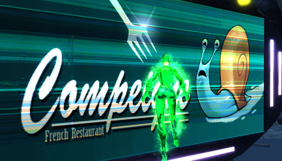
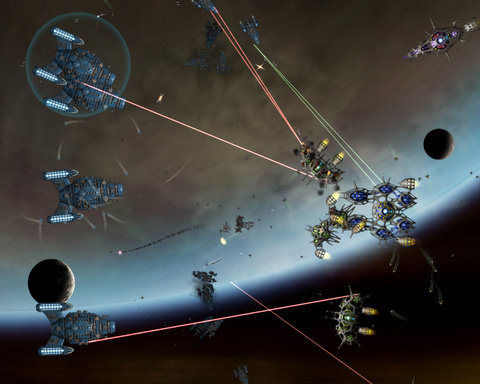

Back to: [West Karana](/posts/westkarana.md) > [2009](/posts/2009/westkarana.md) > [August](./westkarana.md)
# Daily Blogroll 8/31 - End of Summer edition

*Posted by Tipa on 2009-08-31 07:19:47*

Wow, can't believe it's almost autumn. Summer came so late to New England; cool and rainy through most of it, a couple of hot and humid days, and now the cooler days are back. It's like living in Seattle.

Played a bit of Champions Online over the weekend. I take a character to level 10, start them in on the Hero Games cage matches, see how well they do and take what I learned to the next character. My most recent character was the Green Reaper, a character with all of Green Lantern's abilities without the power ring. Custom framework of supernatural + telekinesis, allows for a ranged power builder, ability to make ego weaponry from thought alone, and the ability to toss heavy objects at people -- with her mind! Travel power is green fire flight.

This build usually gets me in the top two scorers for a match. Having my main damage power -- Ego Weaponry -- be a melee attack is a problem. You want to be powerful at ranged in cage matches. You need to be able to cast a hold. You need a travel power that lets you run away -- burrowing seems best for that, followed by teleport. DoTs are good for those people. My best cage match character remains Daddy's Little Girl, my gadgeteer from beta. Heals really help! Swinging was her travel power.

Playing Champions Online and wondering how it compares to City of Heroes? Or vice versa? Scopique has [a nice comparison of the two superhero games](http://www.cedarstreet.net/2009/08/champions-online-vs-city-of-heroes.html) which gives a decent idea of the differences. I'll add that City of Heroes has Day Jobs and Mission Architect, while Champions has the excellent Cage Match PvP instances. CO was looking mighty boring before I discovered those.

Saw a tweet from the Spellborn folks last week that implied [the F2P version of Spellborn was crazy popular](http://twitter.com/tcos). O rly? [Beau of Spouse Aggro says Ya, rly](http://epicdolls.com/beauturkey/?p=2057)! Looks like new dad Heartless\_ is [having some fun with it](http://hgamer.blogspot.com/2009/08/my-chronicles-of-spellborn-photo-album.html) as well.

Both WoW and EQ2 are [revamping their innate racial bonuses](http://fanfaire08.feldoncentral.com/2009/08/28/racial-traditions/), and the Verdant Dasypodid at Player vs Developer [looks at the reasoning behind the changes](http://playervsdeveloper.blogspot.com/2009/08/dueling-racial-revamps-in-wow-and-eq2.html), which seems to be at cross purposes. WoW is adding more fluff and less advantage to theirs, while EQ2 aims to give certain race/class combinations a decided advantage over others. I'm just kinda miffed they are taking away the halfling ability to summon pie :(

Spinks continues her mini-symposium on roleplaying in MMOs with a focus on [using emotes and fluff items to set a mood](http://spinksville.wordpress.com/2009/08/31/improving-roleplaying-props-emotes-titles-class-design-and-dressing-the-set/). Given how pretty much all her suggestions were commonly implemented in the era of MUDs just shows how much we lost when we moved to games with more of an emphasis on graphics than gameplay.

Syp asks if it's worth jumping into a MMO after the rush of release day has come and gone? [Do late adopters have any fun](http://biobreak.wordpress.com/2009/08/29/when-is-it-too-late-to-begin-a-mmo/)? Or do they have to catch up to everyone first? 

Stargrace at MMOQuests has [an excellent guide to EQ2's new Achievements system](http://mmoquests.com/2009/08/29/gu-53-part-i-achievements/). New to EQ2, anyway, since it's about as blatant a copy of similar systems in WoW and Warhammer as I've ever seen. I'm just happy there are still MMOs out there for *non*-Achievers. Ogrebears has the patch notes for [the complete list of changes coming for Game Update 53](http://ogrebear.com/?p=1283), including the Shard of Lurrrrrv. I am SO HOPING that's a no combat zone! I've been wanting to meet the Goddess of Love, Erollisi Marr, since I spent all those years on her server in EverQuest. I DON'T want to kill her!

Cownose loves Darkfall! He loves the world, loves the big fights, loves the exploration, loves everything about it! So [why is he quitting, never to play again](http://cownosethe50poundcat.blogspot.com/2009/08/cow-noses-take-on-darkfall-and-farewell.html)?

This is definitely the season for betas. Over the past few years, a game's beta has taken on an importance way out of proportion to its former status as a way to get some player feedback during development (the pre-2004 model), or a way to stress test the game before launch (the pre-2008 model), to where it is now -- a free trial in which the player is not expected to give any feedback on the direction or goals of the game and is more a marketing tool for which players should perhaps expect to pay a token amount. Maybe they should just call it a Gamma or something. Anyway. [Syncaine looks at the timing of open betas](http://syncaine.wordpress.com/2009/08/28/when-it-comes-to-open-beta-timing-is-key/), asking if companies should time their open betas for the time when no other mindshare-swallowing games are doing theirs? Should MMOs be scheduled like summer blockbuster movies?

Lastly, shout out to Cliffski of Positech Games, an indie developer whose [Gratuitous Space Battles](http://www.positech.co.uk/gratuitousspacebattles/index.html) lets you create mad space battles between huge fleets. Picture of me horribly failing my first battle in the preview beta for pre-order customers is below.

## Comments!

**[Green Armadillo](http://playervsdeveloper.blogspot.com)** writes: That post was a bit of a nightmare to write. It took me forever to decide on the appropriate balance between the micro-level impact on my existing and potential characters versus the macro-level commentary. I wrote at least three times as much as I ended up posting. 

One thing that has me slightly intrigued is the addition of NPC tracking to several races. The irony is that many of these were Scout-favored anyway (good one, SOE) but maybe it would be worth putting up with less-than-ideal stats and the less-than-exciting looks of the half-elves or furballs to get that perk on my hypothetical Wizard. 

I will really miss the fire breath, though. As a Warden, there are times when all four of my CA's are on cooldown and I have nothing to do but wait for a button somewhere to light up. I'd use fire breath even if it only did 1 damage, simply because it looks cool and is something to do while I wait. 

-Verdant Dasypodid

---

**[We Fly Spitfires](http://blog.weflyspitfires.com)** writes: Don't even joke about summer ending. We've barely had a summer here in Scotland. I think one day it was 20 C. Woot! Now it feels like winter :(

---

