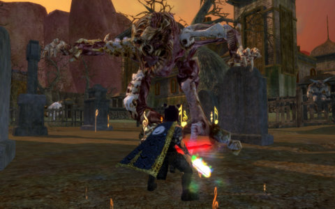
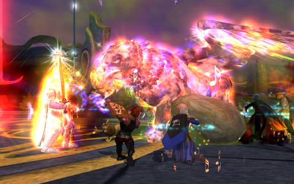

Back to: [West Karana](/posts/westkarana.md) > [2009](/posts/2009/westkarana.md) > [December](./westkarana.md)
# EQ2: The Hero's Dream

*Posted by Tipa on 2009-12-01 08:07:53*

We were hacking a Serpentis radar site in EVE last night, and it was a good site, too. A bunch of Gallentean Starship Engineering datacores that will come in handy, a skill book that Toldain needed, and other stuff which is now cooking on the market... but Tranquility shut down to prepare for the Dominion expansion going live today, so I headed to EQ2 for some fun.

And I actually got a group!

I started out the night with a quick Chronomagic daily quest, which last night was the Ancient's Table in the Pillar of Flame. I've always liked "Ancients" for the great experience -- I made a couple of levels on my troubadour in an afternoon there. It was also a little bit dull; you just go in there and kill everything until the boss spawns. I think at one point there was a time limit to ensure the Ancient Cyclops would spawn, but now, maybe just clearing the zone is enough.

Dera and I used Chronomagic to mentor down to level 70, enough to turn the quest green but not too low that we couldn't finish it. Troubadours are not the world's best tanks. Someday I'm going to have to try it with Dera tanking....

That done, I swapped Dera for defiler Etha and set out to do the EQ2 fifth anniversary event, the Hero's Dream, on its last day. Not much to it; you talk to some people in North Freeport, and are sent to awaken a man who has fallen into a magical sleep. The wizards attending him warn that any who touch the man themselves fall into a slumber from which they never wake, but we heroes are made of sterner stuff, and so we enter the man's dream.

He wants us to gather the broken shards of his soul from various dreams -- the Tower of the Moon from Desert of Flame; the Halls of Fate from Kingdom of the Sky; Karnor's Castle from Rise of Kunark; The Estate of Unrest from Echoes of Faydwer; and the Palace of Ferg'zhul from The Shadow Odyssey. All retuned for the solo player, and none too challenging for the troubadour, but the defiler was having trouble pushing out enough dps to make it worthwhile.

At the end, Thumore D'armer was set free, with hints that we may know of him in another form. Knowing the EQ devs love of anagrams, it doesn't take much letter fiddling to guess that Thumore was actually Morell-Thule, the Lord of Dreams, so I imagine we'll be seeing more of him fairly soon. In our dreams, at least.

And he gave a really cool statue of the Qeynos Claymore, which I placed directly in the middle of my scale model of Archer's Wood :)

Though it was late, there was a group looking for a healer for the Shard of Love! I logged Dera in and asked for an invite. When I got it, I admitted that I didn't have my mythical (not even my fabled epic!). They laughed :) It felt good not to be immediately judged on my lack of gear. The Shadow Odyssey expansion so often seems like all the bad parts of WoW's achiever mentality infecting my favorite game and driving away all the casual people.

We flew through the instance, met Mithaniel Marr, watched him greave over his sister once more. It was a lot of fun. It's nights like that that remind me of everything I love about EQ2. But I know that if I ever went so far as to look for a group as an 80 inquisitor -- or an 80 troubadour -- I'd only get abuse for my lack of AAs and high end weapons and armor. I don't expect this to get any better with the next expansion.

Tonight -- back to EVE to check out Dominion.

## Comments!

**Milia** writes: Wow! Down on EQ2 players much? Seriously, you are grouping with the wrong people. Yes, some things you just cannot do without gear and armor, unless the rest of the group has it and you can draft on them. If you're having this much of an issue finding people to play with, maybe you need to try a different server - one where you can group with people who aren't quite so uber and are looking to enjoy the game with fun people who enjoy playing for the sake of it.

Sounds like you're just looking for an excuse not to play EQ2. You don't need an excuse, if it isn't fun, it isn't fun. That's OK. But don't flush all of us out with last nights dinner.

---

**[Tipa](https://chasingdings.com)** writes: By no means... I love EQ2, but since TSO opened, groups have been nothing but unpleasant uberfests with gear and AA checks and parses and absolutely zero thrill of exploration or enjoyment of content. I was unsure about RoK when it opened, but the instances turned out to be a lot of fun and were easily done with people in all sorts of gear. Now the questions I get asked when I LFG are: do I have my Mythical? Do I have T3 armor? And do I have the UT AA? And that ends that conversation.

I only got that group with Dera last night because we were all mentored to level 56. I don't play EQ2 much any more not because I think the people who play EQ2 are bad, but because the game deva themselves have embraced an achiever mentality that does not jibe with the way I enjoy playing.

If people would just quit with the gear checks and just play for fun, I wouldn't need EVE for my casual, social gaming fix.

---

**[Ramon](http://www.psy-q.ch)** writes: Aww, this is too bad. I was wondering whether EQ2 might be the game for me, because I like the EQ grouping atmosphere a lot but surely some soloable content (like in EQ2) couldn't hurt.

But if you tell us it's all just for uber people, that excludes me since I might have 4, 5 hours a week to invest into any MMO. You never get uber at that rate.

Are there MMOs out there for people who still enjoy exploration, finding things out on their own and gearing up as it happens, not as other people think is right? I'd jump right into that.

---

**[Hudson](http://hudshideout.com/blog)** writes: I have to agree. EQ2 end game is not streamlined like WoW, it is all over the place. It is much harder for a new player to get caught up and know what is going on in EQ2 and to get to the level of grouping gear wise than WoW, which is defined and has a clear progression scheme and has measures in game to get people caught up fast. Real Fast.

In EQ2 I think that her statement rings true moreso than any other MMO except maybe EQ1. If you dont have friends in EQ2 willing to backtrack and do these things, well the game is a lonely place devoid of end game fun.

In WoW at least I can farm reg Tournament of Champions starting at level 78, get my purple gear in each slot, then hit heroics and group with everyone else. With the upcoming LFG system change, it will be even easier with Cross Server grouping.

Win win in my book

---

**[Hudson](http://hudshideout.com/blog)** writes: "Are there MMOs out there for people who still enjoy exploration, finding things out on their own and gearing up as it happens, not as other people think is right? I’d jump right into that."

Umm World of Warcraft?

Progression:
Get level 1-78 (solo if you want its easy)

Run the new dungeon put in specifically to get people caught up in gear. /lfg Looking to farm Reg ToC PST thanks!

Group until your eyes bleed since 11 million people play its easy to find groups

Gear up

Done? Do dailies at a casual pace and get purple gear after about 2 weeks of logging in one hour a night and making a ton of gold in the process. 

Find casual guild in the Gazillions of Casual guilds out there and raid 10 man dungeons at your own pace

Finished.

---

**[Tipa](https://chasingdings.com)** writes: I need to emphasize that I'm talking level 80 pickup groups. If you are still leveling, or have friends to play with, my issues are likely not issues at all. I should also point out that if I played EQ2 as my sole game, I would have acquired what groups demand of me in the normal course. I just really dislike having to constantly justify myself to strangers.

---

**[Ramon](http://www.psy-q.ch)** writes: Hudson: Oh, except WoW :) I just can't get into it at all, I tried several times for a month at a time and the game lost me after a week or so. It feels so empty and the atmosphere is all "oh, oh, oh, let's get to 80 quickly!" all around you. You're ridiculed for not taking the fastest path to 80 so you can "join in" with the people at level cap. 

That's exactly what I don't want, I want a game where you can take it easy and still find some people to group with, without all this pressure in the air. I get enough pressure at work, don't need to have that in my spare time as well ;)

Tipa: That's good to know! I'll give it a fair try anyway, because I just recently managed to recover my EQ1 account details and it seems I got those crazy veteran rewards on it for EQ1 (?) and that included some expansions and the same kind of veteran items in EQ2 as well (?) :)

---

**[Ramon](http://www.psy-q.ch)** writes: Oh, and here's a very evil theory. Over here, rumor has it that in the 80s and 90s, American kids were drilled to be ultra-competitive. They competed at everything, from school sports to finding a college etc., and being an achiever was seen to be one of the highest virtues. So when they grew up, people from this generation also competed in other areas. Who has the higher wage, who has the more expensive car, whose wife bakes the biggest bagels.

I have no clue if any of that is true or if it's an exaggerated image that is projected here, but it would correlate somehow with American MMORPGs, because they all seem to be achiever games. "You don't have tier n gear? Pffftth. Get out of my group!"

I'm not sure I see so much of that in MMOs from Europe or Asia. If you count the hardcore grinding that Asian games do as achiever gameplay, that might be right, although from the Asian perspective the whole grinding experience is more like a road that needs to be traveled, and the goal is to travel the road, not to reach the end as fast as you can. Or some such thing. At any rate, they're so much more grind-tolerant, they seem to actually enjoy it.

What are everyone's feelings on that?

---

**yunk** writes: Besides WoW is certainly not a game for "exploration" and "finding things out on your own"

---

**yunk** writes: Ramon you watch too much tv :) In America we white kids think the asian kids are the ones forced by their parents to achieve. We sure aren't. Though there is another stereotype of WASP kids in the NorthEast being pushed harder. In the North they think Southern males are forced to play football by their fathers when really they want to go into interpretive dance. It's all stereotypes.

We all had to take Meiers Briggs tests at work. I didn't realize ESTJ was a really huge group among males, and even females, and most people are J. They did not have a breakdown of who goes into computer science, but who knows if there is even a higher correlation among Js. There sure as hell seems to be one with managers. that could be part of it.

Yes asian grinds are achievments. It's the same exact thing.

I suspect achieving and killing are the two easiest styles to program for, both allow for repetition of content. Killing is harder in an RPG but easy to program for in FPS. But socializing and exploring seem to require a lot more content since they seem less interested in reusing (exploring where you have been is ... not exploring. And we want new hats and dresses for our RP parties, we're bored with the same old ones, etc). Content is expensive to produce.

---

**[Ramon](http://www.psy-q.ch)** writes: This isn't from TV (I don't watch much TV) but from what people were saying around school and university here in the years back. Think 1987 - 1998 or so. American elbow-society, that sort of thing :)

I don't know what the Meiers Briggs test is, and I think I don't want to find out ;) Sounds like a Bartle test for real life?

Anyhow, this whole discussion made me want to give EQ2 a serious try again. I gave WoW several tries and EQ2 only one, yet every time Tipa writes something about it, it seems like a fun game with a lot of well thought-out little intricacies. And some amount of depth that not many other games seem to have. I got bored of Runes of Magic quickly, for example, because it seems like a big grind through cardboard props, empty hulks of NPCs and predictable skill sets :(

---

**carson** writes: @yunk

and I would know I live in south Texas. And no we dont talk like hillbillies

---

**[Magson](http://phoenq-magson.blogspot.com)** writes: Back when I played EQ2 daily, I had toons in 2 different fairly large guilds. Both raided a time or 2 a week, but it was a pretty casual thing -- whoever showed came along and if we couldn't field 24 we'd advertise for the last slot or 3 needed. Generally we could fill the raid, though admittedly we weren't necessarily "optimal" our class setup either. Even so.... grouping was a breeze, I got some decent gear for whichever of my toon was "main" in the guild (inquisitor in the 1, fury in the other) and if I ever was in a PUG, nobody cared about your gear -- only that you could finish the instance.

About the time RoK came out I started having less time to play, my guilds both more or less disintegrated, and so I went back to a small "IRL friends" guild I'd been in. That guild was so small I can't recall if we ever have actually gotten a group of 6 together for any kind of instance run or anything. PUGs were still fine, etc, in spite of not necessarily being "perfectly geared."

Then TSO hit, and somewhere along the line "must have mythical, T2 gear and 170 AA's" seemed to become the "minimum required" for even a PUG. Obviously this isin't truly the case, since not 1 of my toons have mythical, T1 gear, nor more than 140 AA's and I've seen all TSO instances with at least 1 of them and the groups successfully completed them too (most of the time). Even so... the perception has increased over time, and my desire to log in has decreased, in spite of the fact that I have a blast every time I log in. Go figure.

Even so... I did something the other day I never expected to do -- I canceled my EQ2 account. I think I've only logged in to it maybe 4 times in the past 3 months and it doesn't fit the budget for the coming months. Perhaps in February with the new expansion I'll be back (budget issues should be gone by then too). Hopefully with the 10 new levels and new dungeons and such everyone will again be "the same" and not so worried about "let's do this faster faster faster."

---

**[Necrotherian](http://necrotherian.wordpress.com)** writes: I dunno, Magson, if you look at how content has been, progressing through the expansions, the bar has been consistently raised as far as gear and spell/CA requirements. Even for soloing. Back when KoS came out, you could get by with treasured gear and (as they were referred to then) Adept 1s. When RoK came out, the standard became MC and AdIIIs, then with TSO, the minimum standard, even for soloing, seems to be as least legendary with several Master spells/CAs. I see no reason to assume that soloing won't get even harder with the next expansion.

The funny thing is, some people seem to think that, just because it is an MMO, you have to group to have a good time. I'm not antisocial, but if I have a choice between soloing or grouping with someone that acts like their butt is a piece of headgear, I'll either solo, or craft some stuff. Of course, since I have 3 accounts and 27 toons, I can always find something to do, lol.

---

**[kaozz](http://www.ectmmo.com)** writes: Nice read Tipa, it was a nice event. Glad you found some fun peeps to group with. Honestly you just have to have thick skin in games out today or your never get past that and have fun. If I let every snide elitist comment bother me I wouldn't play anything. I'm not going to let other random people ruin my games for me. 

Hudson I agree with you about EQ2 being a bit of a lonely Climb and Wow is more streamlined and easier to jump into solo. Both games are great in different ways though, it really comes down to preference.

---

**[Town Crier 12.01.09 &#8211; Game News](http://www.top1news.com/1019/town-crier-12-01-09/)** writes: [...] fifth anniversary event was active over the Thanksgiving holiday. Stargrace, Shattered, and Tipa all give their [...]

---

**[Sentinel&#8217;s Fate beta opens! &laquo; Shattered](http://shatteredblog.wordpress.com/2009/12/02/sentinels-fate-beta-opens/)** writes: [...] are other theories floating about too of course, but this is mine. Go sign up for the Sentinel’s Fate beta and read for [...]

---

