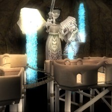

Back to: [West Karana](/posts/westkarana.md) > [2009](/posts/2009/westkarana.md) > [December](./westkarana.md)
# Wizard101: School House Gallery (and decorating tips)

*Posted by Tipa on 2009-12-03 20:45:51*

**The new houses have JUST gone live on the test realm, so more on the homes Real Soon Now!**

 **Balance:** I looked over all these pictures and the one I liked best was the first I looked at. The Balance school house is a series of rooms balanced atop a bottomless pit and connected by swaying bridges, while looked over by imposing statues of Balance herself.

The place is a MUSEUM, no lie. Each room is perfectly set up to be a whole new look. Hey, you're a Balance wizard, dedicate each room to one of the OTHER schools of magic... and how you take them down. Or a room for every world....

 **Storm:** Fittingly, the Storm house is set on a rocky, windswept shore with hurricane winds constantly striving to drive the land back beneath the sea from whence it rose. Those winds can't touch the Storm wizard in his undersea palace.

Curved walls seem make the Storm school a little hard to decorate. Keep things spare but ornate, like Captain Nemo's Nautilus from 20,000 Leagues Beneath the Sea? Or the "lived-in" look from The Abyss? Or the whimsical land of treasure and magic from Disney's The Little Mermaid? A unique dwelling for the most powerful wizards in all of the Spiral.

 **Fire:** Only Fire wizards can stand the intense heat of the Fire house. Metal grates over rivers of lava make every room a barbecue pit, and every meal is well done.

Decorating a home that will set anything made of paper or wood ablaze is a challenge, setting aside the issue of keeping your guests from turning into wizard roast. The Fire house is the place to put all your massive stone furnishings, dead trees, and lava fountains.

Word of advice: Leave some asbestos robes by the door.

 **Ice:** Every winter, people build [a hotel in Jukkasjärvi, Sweden](http://www.icehotel.com/uk/ICEHOTEL/), made entirely out of ice. The rooms are ice. The beds are ice. Drinks are chilled. The entire hotel is five degrees below zero, Celsius. Ice wizards can have this frozen experience year-round with their school house.

The place doesn't have a hot tub. It has a skating rink. Complete with frozen gobbler.

You'll want to contrast the stark whiteness of the house with splashes of color. But keep the torches and lava pits in your attic -- or you may find yourself missing some furnishings but ahead some number of mysterious holes in the floe where your stuff was.

 **Death:** KingsIsle has always seemed to have a soft spot in their hearts for the Death wizards. The coolest spells, the most dramatic looks, and of course, the greatest enemy of the entire Spiral is a Death wizard. This is a home that Malistaire could love. A place where the spectre of his departed wife, Sylvia, could roam without feeling out of place.

You COULD decorate the place with a Hallowe'en theme, but that's limiting yourself. Every room should be a testament to those things left behind when life, love and joy are forgotten. The things that stick around. Ruins. The remnants of the things left behind on Earth when the Sun goes nova in a few million years -- or in 2012, if you believe Jerry Bruckheimer.

 **Myth:** A temple admits the visitor into a marble ziggurat perched on the massive shoulders of a giant cyclops, turned to stone by the unblinking stare of the pitiless sun. Stories, myths and legends come to mind as you explore the stone halls that were built by no mortal hand.

Legends are larger than life, and so should your furnishings be. Statues, towers, columns, heroic pictures and tapestries -- these are the fitting decorations of a place of myth and majesty.

 **Life:** The living trees are the guardians of all the wisdom of the Spiral, from Bartleby, the massive tree around whose roots and trunk Wizard City is built, to the Fire tree in Dragonspyre Academy that survived the attack of the Dragon Lord's armies to teach yet another generation of young wizards the secrets so many died to learn. It's right and proper that the Life house is built around another of that prestigious line.

The Life house should be a place of rest and healing. Benches, maps, cheerful pictures all have places here. A picnic set up in some sunny glade would be ideal. Inside, cozy rooms filled with soft things. No matter how they enter, your friends should leave with a smile on their face, a song in their heart, and all their potion bottles refilled.

## Comments!

**AmberStargem** writes: Hey Tipa! I was looking through the patch notes and found this: Life minions will pay a little more attention to their summoners, and a little less attention on themselves. 

That means that your forest sprite wont pay that much attention to Thomas anymore!!

-Amber StarGem

---

**[Tipa](https://chasingdings.com)** writes: lol... Thomas is going to be so upset!

---

**carson** writes: Tipa, I was loging on to wizard 101 and I noticed they used the sentences about decks: " 'Deck contruction becomes an art.'
-Tipa, www.westkarana.com." If I were you I'd feel famous.

CONGADULATIONS, TIPA!

---

**[Tipa](https://chasingdings.com)** writes: That made me really happy :)

---

**[/AFK &#8211; Expansion Madness Edition &laquo; Bio Break](http://biobreak.wordpress.com/2009/12/06/afk-expansion-madness-edition/)** writes: [...] West Karana re: Wizard101 – “Word of advice: Leave some asbestos robes by the door.” [...]

---

**[Jonathan](http://www.throughtheaftermath.com)** writes: My daughter will love these! I especially like the "storm" themed one. It has a very Myst/Riven look to the entire setup. :)

---

**[Tipa](https://chasingdings.com)** writes: Dang, you're right! That's EXACTLY the vibe it gives off!

---

**carson** writes: Tipa, in your opinon, what is your favorite school house(of course you've already tested it)? Mine is the storm one because it has fish in it. I'm broke and my gift card expired so I cant test :(

---

**[Tipa](https://chasingdings.com)** writes: I like storm best, but decorating it would be a challenge.

---

**[kitty](http:/ace)** writes: i personnaly dont have a fave but i am fire so i guess that qualifies me as that to be my fave. i must admit i do love the inferno room with the teleporter and all 
P.S. does anyone know how to get a decent life spell so i could heal more than just me. i am fire with no other heals and i dont have crowns so i just really need one good spell to heal others if i need to......any suggestions? anyone?

---

**[candy591](http://ilovemaria)** writes: wizard101 is sooooo cool! lol

---

**[candy591](http://ilovemaria)** writes: i love wizard101! it is soooooo cool!

---

