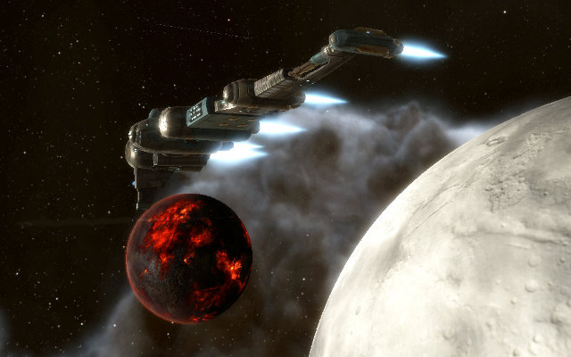

Back to: [West Karana](/posts/westkarana.md) > [2009](/posts/2009/westkarana.md) > [December](./westkarana.md)
# EVE Online: New Eden on 1 ISK/day

*Posted by Tipa on 2009-12-06 14:28:14*

In the end, the only way we can ensure the EVE economy functions as the finely oiled machine we have come to know, immune from the whims and disasters that strike the real world, is for each of us to step up and make it our business... to make it our business.

Case in point. I'm flying courier missions in the Kador region of Amarr space, trying to improve my standings with CreoDron as I start on the long, slow road to invention. Occasionally they toss a combat mission in with the interminable and meaningless trips to travel hundreds of parsecs just to buy some cigarettes, or oxygen, or dirt.

But those combat missions -- you know, the ones where they send you to mine some valueless gunk, and then you're attacked by waves of drones and frigates who want to stop you from mining the valueless gunk? Those drones and frigates leave mods and salvage behind, and selling or reprocessing those is a nice bonus to an otherwise dull mission.

I found to my shock, though, that SOME of this salvage ... couldn't be sold! There were no buy orders for these items that reached my station. I checked everything -- in this obscure corner of Amarr space, fully half of the mods and salvage could not be sold.

I imagined a poor, frustrated capsuleer compulsively stabbing the SELL button again and again, getting every time the message that there were no buy orders that covered his section of space.

This is where I stepped up, and where I stepped in. I would be the one to sacrifice, here. I'd be the one to set our capsuleer free.

I would make that buy order.

I'd spent a couple of months working on business skills. This let me have an astonishing number of outstanding buy and sell orders covering a wide area of space. So, for each item that did not have a buy order that reached to my station, I offered to buy a thousand of that item for 1 ISK each. I set the range to 5 jumps, which is well within the range of the courier missions. I could just pick up my valuable cargo along the way.

This worked beyond my wildest dreams. With fifty of these 1 ISK buy orders active, my wallet was pinging with people eager to sell their rocket launchers and asymmetric energy succor units to me for one ISK per. I had a production meeting to go to back in Sinq Laison, so I loaded an industry ship with all these goods and brought them back to the heart of Gallentean commerce.

Not only was I providing a market for eager sellers, but I was giving them a way of reaching lucrative foreign markets that they would not otherwise have had! And all they had to do was press that SELL button without worrying about annoying, bothersome details like how many percent my offer was below the regional average.

Am I evil? No. I am providing a service. In fact, I've recently upgraded this service. Now, I am selling their salvage from my home station at full regional price. If they feel they sold me that salvage at an unfair advantage, I now offer them the option of buying it back at a fair and reasonable price, just 10 percent more than the regional average.

Here at OtakuDyne, happy customers are our only desire.

## Comments!

**[Magson](http://phoenq-magson.blogspot.com)** writes: Gotta love the regional markets away from Jita/Rens/Amarr/Dodixie, no?

---

**[Stabs](http://stabbedup.blogspot.com/)** writes: Great stuff, I'm really enjoying playing the economic game in Eve.

---

**[Rer](http://www.multiplaying.net)** writes: Hahaha, that's great.

---

**[wilhelm2451](http://tagn.wordpress.com/)** writes: Playing close to the regional average is a mugs game. I suggest you ignore it completely since it combines buy and sell orders, so your 1 isk buys are factored in. Find the right station and you can charge many times the average.

I have found that, as long as you don't have much in the way of competition, there are very few low end, tech I, basic modules that you cannot sell for 15K or more.

---

**[Shirrath](http://shirrath.blogspot.com/)** writes: It's not the fool who asks..

---

**[Koori](http://mmolog.wordpress.com/)** writes: OOT: I love your screenshots of new planets.

---

**[Tipa](https://chasingdings.com)** writes: @Magson -- for a business newb like myself, it's a nice change of pace from the cutthroat competition around Dodixie. I swear half those traders spend the entire day refreshing the market list while sitting in station, looking to cut someone by 0.01 ISK.

@Koori -- Guess which MY favorite part of the Dominion expansion was? :)

---

**[mbp](http://mindbendingpuzzles.blogspot.com)** writes: Very nice Tipa - way to spot a market opportunity!

---

**[wilhelm2451](http://tagn.wordpress.com/)** writes: BTW, another great screen shot. My jealousy is manifest.

---

