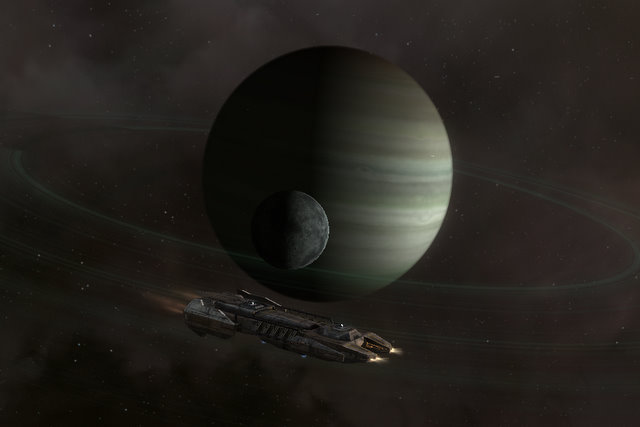

Back to: [West Karana](/posts/westkarana.md) > [2009](/posts/2009/westkarana.md) > [December](./westkarana.md)
# EVE Online: Cul-de-Wormhole

*Posted by Tipa on 2009-12-08 07:27:09*

I don't really like making posts about EVE back-to-back. It IS my main game, these days, but I am oft reminded of some tips to EVE bloggers I read on [CrazyKinux](http://www.crazykinux.com/)'s blog a few months ago: Nobody wants to read about how you did a level 4 mission. I try to keep the day-to-day out of the blog. But corp-mates have insisted I repeat yesterday's wormhole adventure twice, so I might as well just write it here.

Suzina of Kill Ten Rats writes that [a sandbox MMO is one where you can do anything](http://www.killtenrats.com/2009/12/06/the-ultimate-sandbox-mmo/), like, say, Second Life. This is pretty much like suggesting someone looking for a good book to read [write their own, instead](http://www.nanowrimo.org/). EVE provides a world for you, but what you do in it is entirely up to you. It's sandbox, but it's still a game.

I've looked through the available corporate titles, but I can't find one which fits what [Toldain](http://toldaintalks.blogspot.com/) does for the corp. Wormhole opener? Explorer? Scout? When Toldain gets bored, he goes diving into wormholes. Yesterday he found a good, stable wormhole in highsec. It was HUGE, full of stuff. Owned, of course, but the player station was at one end of the system and there was an asteroid belt full of crunchy ABC (Arkonor, Bistot and Crokite, three rare ores) to mine. These ores refine to some of the more expensive minerals needed for manufacturing and are ALWAYS worth mining.

I finished the mission I was doing and headed down to the wormhole's entry point in the Sinq Laison system of Mattere with my Retriever mining barge and the Iteron Mark V industrial ship in tow. Since I didn't want the trip to take all night, I charted a course through the notorious gate camp system of Vecamia. I packed a shuttle so I could scout the run, a major choke point between Gallente and Amarr space.

In Cleyd, I docked the Retriever and took the shuttle through the gate. It was clear, but on local were four -- no, five -- "red" names. Pilots with low security status. Known lowsec pirates, in other words. It was clear something was going on, but maybe they were just hunting the asteroid belts. I flew to the opposite gate, and found some reds. I accidentally flew back to the Cleyd gate (nerves!), and NOW there were some reds. I flew back to the other gate -- MORE reds -- and jumped through to safety.

This wasn't going to end well. I made a last jump into Vecamia, flew to Cleyd amidst a sea of reds (it's very hard to catch shuttles, and they didn't have a warp disruption bubble to stop me), and jumped back to my Retriever's system. I set the autopilot to avoid Vecamia in the future, and charted out a route through more of lowsec, but safer systems overall. As long as you were just passing through, anyway.

We gathered outside the wormhole, entered together, and warped to one of the safe spots Toldain had set. There, he'd put a can containing bookmarks to the target belt, one for each of us. We bookmarked the safe spot and headed to the belt. Red's Orca gave a nice mining boost. After clearing some rats and double-checking to make sure there was no other activity in the wormhole, we settled in to mining and doing whatever else IRL, because watching mining lasers really isn't all that fun. Every three minutes I'd come back from chores and move ore to my jetcan. When that was full, I'd bring my hauler (sitting cloaked 50km off the safe point) to collect it and bring it out of the wormhole to the Astral Mining station in Mattere.

After a few hours, Red decided it was time to take off. He sent his Orca (huge mining overseer ship) through the wormhole... and that destabilized it so much that it closed behind him.

My two ships, Vahz's two ships, and Red's miner were all stuck in the wormhole. We would have been very much out of luck if Red hadn't had probe launchers fitted to his ship. He scanned down another wormhole exit that opened deep into low security space. Dotlan pegged the systems as fairly safe, but Red kept scanning, and found a second exit into another wormhole.

Vahz decided to take the first wormhole and make the five-hop run to highsec. Both of his ships got ambushed and destroyed.

Red headed into the second wormhole to scan for any other possible exits to high security space. Meanwhile, some several ones had found their ways into both the old and new wormholes, and I saw probes flitting about on the directional scanner.

These people may have just been fellow explorers with no hostile intent, but you can't ever depend upon this. Mining barges and industrial ships are tempting targets even for pilots who might not have intended to fight. It takes half an hour to fill a hauler with ore, and both my ships were filled with ABC goodness. My hauler was safely cloaked, and I started flying my mining barge from place to place around the system, keeping on the move. That gave me plenty of time to check out the planets, take some screen shots.... Oh, come on. I'd been watching those planets on the directional scanner all afternoon. Planet (Storm), Planet (Ice), Planet (Gas).... I had to visit them at least once.

Red had found another entrance into lowsec, and time was short -- we had to run for it. I took the chance and jumped. The exit wormhole was being camped by a couple of high tech ships. We fled, straight to high sec, and we didn't come across anyone who wanted us dead.

I'm not into PvP that much, but it would be impossible for EVE to thrive without it. People would autopilot everywhere without fear, nobody would ever be at the keyboards, it would be a game full of bots going about their repetitive business. The ever-present knowledge that the world is Not A Safe Place gives EVE the spark that makes it worth playing.

## Comments!

**Longasc** writes: I think you are right about the danger and thrill of getting shot. And EVE is not that bloodthirsty either. One of my friends is cool enough to autopilot through low sec in smaller transporters like Iterons. He usually got shot by a player named Ginger Magician, but all in all he made it through quite a lot. This probably does not work everywhere though...^^

I think we have a general problem with open pvp. People always say they want it, once they get it, they think of various ways to restrict it to prevent "unfair" things to happen to them... sigh. The result is battleground and arena style only pvp in MMOs, which I don't like that much.

Maybe I would be a wormhole explorer nowadays, too... I always loved to fly to "hidden" complexes. I got the coordinates usually from websites like http://eve.grismar.net/

---

**[Tesh](http://tishtoshtesh.wordpress.com/)** writes: Tangentially, that "tang" of thrill is what makes Puzzle Pirates work, too. Any time you set sail, you're consenting to PvP. If you're a juicy target, expect to defend yourself.

I think I'd really like EVE... if I had the time and money. *shrug* Thanks for the writeups!

---

**[wilhelm2451](http://tagn.wordpress.com/)** writes: There is something to the rush you get when you come through a gate or a wormhole and find a flashing red ship on your overview.

And nobody wants to read how you did a level 4 mission UNLESS you screw up and lose ships. Everybody loves that.

---

**[Allods Tidbits and Beta Keys &laquo; Tish Tosh Tesh](http://tishtoshtesh.wordpress.com/2009/12/08/allods-tidbits-and-beta-keys/)** writes: [...] aspects of the game.  It would be awesome if they incorporated things like wormholes in EVE (thanks to Tipa for a fun article on wormhole exploring).  Cooperative PvE and multiship PvP really are a blast in Puzzle Pirates, even to this old, [...]

---

**[Toldain](http://toldaintalks.blogspot.com)** writes: Gosh, I actually blushed when I read that. Corporate Scout will do. And I do it for the cut on your mining that I get. After all, it's what I'm flying.

As to the PvP nature of EVE, I say to my offline friends about EVE: humans make much better villains than computers.

Actually, the best rush is hearing the lock alarm go off in your Iteron. When you aren't on AP, and get away, it's the best "so long, suckers!" feeling ever.

---

**[Callan S.](http://philosophergamer.blogspot.com/)** writes: When people say they want open PVP, they are saying it while imagining themselves pwning everyone. Everyone wears gamblers goggles, imagining themselves winning. And obviously, not everyone can win. Cept in PVE.

But I have to say, the idea of constant threat doesn't sound fun simply because it's endless. You never have to run a gauntlet of X threat and then there is no more because you have completed the game. It's just a lifestyle of endless threat.

Though to try and not to 'endless' games, if by running a gauntlet it gave you X amount of respite, where you get some resources for free, that'd seem a bit less heavy.

---

**Cj Didge** writes: AFK mineing in a wormhole, madness i tell you. Nice writeup though and a warning for everyone about wormhole capacitities.

---

**Wrapye** writes: I think the official title closest to it might be 'Cartographer', or at least training up those skills ends up getting you the Cartographer certs.

---

**[Tipa](https://chasingdings.com)** writes: Cartographer sounds perfect! Thanks!

---

