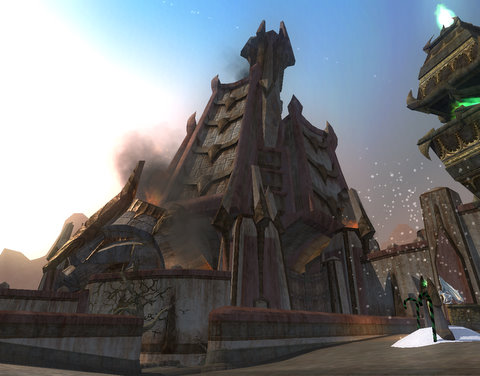

Back to: [West Karana](/posts/westkarana.md) > [2009](/posts/2009/westkarana.md) > [December](./westkarana.md)
# EQ2: Leave Freeport Alone!

*Posted by Tipa on 2009-12-11 08:04:31*

It used to be such a happy place. True story: I started EQ2 as a happy resident of Baubbleshire. I joined a roleplay guild on Antonia Bayle, settled down for a happy time in a happy land and --

-- and then I saw through the facade. These people weren't happy. They were miserable. That little kid who screamed constantly of gnolls -- why wouldn't anyone help him? The cheap grins that masked the terror every one of them lived with. The false hope that Qeynos' thick walls would keep the bad things away. It was a sham, a fraud, and I couldn't do my part any more. I couldn't live with the lies. I couldn't go to bed in my haffer hole and trust that the guards in their shiny silver suits could keep me safe.

I betrayed Qeynos and moved to Freeport. This was before the easy, solo betrayal quests; I had to spend three days killing five hundred orcs and a bunch of rare bosses before they'd let me in. I joined a lot of groups, met a lot of great people. Each and every one of them were kind, helpful, and unflinching companions in the face of the great evils that grip the Shattered Lands.

When I finally proved myself to Freeport, I was handed the keys to a small hovel in Big Bend, where the slumlord teased me mercilessly -- until he found out I had friends in high places, anyway. I was HOME.

That's what Freeport means to me.

Deathknell Citadel is as emblematic to Freeport as the mage towers are to Qeynos. Floating above the city on beams of powerful magics, it was a symbol of power and a challenge to the forces that would pull it down. It was my first glimpse of Freeport, back in the time when a level 15 character would face death many times on the long trek through the Thundering Steppes and Nektulos Forest.

SOE pulled it down. Not because of a challenge to Lucan's authority or a mystical shake-up in the city's centers of power. No. They did it because they HATE FREEPORT.

Back in EverQuest, the great cities of Oggok, Qeynos and Freeport stood fast to protect Antonica from enemies of the south, west and east. They did their jobs unflinchingly; bravely; without reward or notice.

Sorry, except for Freeport. Some quests had you calling out Lucan and killing him -- while the shiny Bayles of Qeynos went on their merry way. Aside from the occasional refugee problem, Oggok, too, managed to stay strong against the tireless depredations of lizard men from the Temple of Cazic-Thule and the horrors of the Gate to Fear.

But Freeport... Freeport was a wide-open city, full of life, color and happiness. Even the halflings of Rivervale found a home there that Qeynos never offered them. People would gather by the gates to trade languages; meet on the docks to share tall tales of travels across the Ocean of Tears and of the mysteries found in far Faydwer. The bank in North Freeport was a well-regarded trade center.

Then the Plane of Magic opened, and desolation spilled from that horrid cesspool of a plane and destroyed fair Freeport forever.

Freeport changed from a colorful, open, simple town to one of dirt and grime, a place no respectable person would ever go. And aside from people seeking entry to the Plane of Magic, nobody did, ever again.

The rebuilt Freeport of EQ2 was a place of wide-open spaces, broad streets, meeting places, a place of friendship and intrigue and mystery and tall stuff to jump from. Now SOE is tearing the place apart.

Don't let the cruel wizards in San Diego have their way with our fair city. We must band together to save our home. Save Lucan. Find ways to rebuild Deathknell. Don't let them do to modern Freeport what they once did to its predecessor.

Let Qeynos take the heat for once.

## Comments!

**[Stargrace](http://www.mmoquests.com)** writes: "Don’t let the cruel wizards in San Diego have their way with our fair city. We must band together to save our home. Save Lucan. Find ways to rebuild Deathknell. Don’t let them do to modern Freeport what they once did to its predecessor.

Let Qeynos take the heat for once."

Here here!

---

**Longasc** writes: They are really going to drive people away and maybe even alienate players who have fond memories of the "old" Freeport, now gone forever.

In Guild Wars people started out in the lush and beautiful Ascalon, which got destroyed after the introduction and replaced with a brownish wasteland that indeed made many people quit as it was really depressing and not as appealing. Plus they felt their "home" Ascalon got destroyed and replaced by that brownish, dirty place.

I wonder what happens to WoW players in Cataclysm, a surge of nostalgia for "Old Orgrimmar" or something like that? :)

---

**[Magson](http://phoenq-magson.blogspot.com)** writes: I totally agree -- I have only 1 toon that lives in Qeynos (out of 12) and then only becuz he's a mystic. Even my monk likves in Kelethin instead. Once Halas is out, the mystic moves too. . . . .

As for the other 10 toons 8 of them are high elves who couldn't stand the fake cheeriness of Qeynos -- Freeport all the way baby! It's just got a more "normal" atmosphere to me.

Yes... that's a lot of betrayals, and I did all of them back when you have to be level 17 or less, but.... to repeat myself. . . . Freeport all the way baby! Add in that the dark elves cheer when high elves walk by in FP and... I always liked that touch.

---

**[Stabs](http://stabbedup.blogspot.com/)** writes: Burn it all down to make way for....

Stabsville!

A brutal tyranny where I rule intimidated hordes of frightened ratmen, battered ogres and scurrying lizardfolk.

---

**[Sente](http://adingworld.wordpress.com)** writes: *As for the other 10 toons 8 of them are high elves who couldn’t stand the fake cheeriness of Qeynos — Freeport all the way baby! It’s just got a more “normal” atmosphere to me.*

Back in the days when I played EQ2 both me and my characters generally could not stand that horribly cheery attitude from Qeynos side - Freeport had a much more alive and fun atmosphere. Almost all of my toons lived happily in Freeport.

Noli Freeport tangere!

---

**[Toldain](http://toldaintalks.blogspot.com)** writes: I personally live in Qeynos, in the biggest house possible. Because I like it architecturally, and because, as a snooty high-elf, Qeynos seems to suit me. But I have many other toons that live in Freeport, which seems to me to be a place like Lankhmar, home of Fafhrd and the Gray Mouser. It's no coincidence that my Defiler Fahfrd, and my wife's brigand, Mauser live there.

And if those names don't ring a bell to you, look up Fritz Leiber, and read some of his novels. You'll like em, I guarantee.

---

**[/AFK &#8211; Moonkins Ate My Baby Edition &laquo; Bio Break](http://biobreak.wordpress.com/2009/12/13/afk-moonkins-ate-my-baby-edition/)** writes: [...] West Karana re: EQ2 – “Don’t let the cruel wizards in San Diego have their way with our fair city.” [...]

---

**[It&rsquo;s 2:37 am on Sunday. Do you know where your gamer is? &laquo; Between the Mountains and the Sea](http://stonekingdom.wordpress.com/2009/12/13/its-237-am-on-sunday-do-you-know-where-your-gamer-is/)** writes: [...] games I started playing again. I hear that there has been a big bug bash in the latest update, and Tipa has some concerns over the fate of Freeport, but all –in-all, I’m a bit ignorant of the state of play in [...]

---

**[Arkenor](http://www.arksark.org/blog/)** writes: I'm sure it's only temporary. As soon as we get Lucan back (Queen's orders, unfortunately), he'll get his horrid symbol of oppression flying again.

I remember the original betrayal quests too. Maltheas did it from Freeport to Qeynos. Bursting in on the Overlord with intent to put an end to his evil ways is an experience I'll never forget (though things didn't quite work out as hoped). Had full Christopher Lee voice-over too I think. Shame they did away with it.

---

**[Tipa](https://chasingdings.com)** writes: That's what I miss. I never betrayed FROM Freeport, so I never got to see Lucan in the flesh, as it were, until one of the first world events in the current line, where you finally do meet him.

---

**Bhagpuss** writes: Hang on! What? What happened toFreeport?

I just came here to read Tipa's thoughts on the WoW LFG nonsense and I find they are messing with Freeport AGAIN? Geez, you can't turn your back on SoE for a second.

I am on hiatus from EQ2 at the moment but on teh verge of coming back (trying to hold out until the expansion but doI really want to miss Frostfell). Now I am going tohave to go and find out what's been happening while Iwasn;t payign attention.

Why is it always Freeport? Can't they flood Neriak or something instead?

---

**[kaozz](http://www.ectmmo.com)** writes: In the original EQ I hated the change to Freeport. It looks so ugly, the place I once knew I get lost in. Yes heh, they need to leave FP alone in both games ;)

Maybe chop down some trees in Kelethin instead!

---

**quimbius stormfyre** writes: but but I'm KOS in Freeport of EQ, . I was a bad Elf

---

**Noffin** writes: I wonder why Quim :p

---

**[Tipa](https://chasingdings.com)** writes: It's that scary, pasty complexion.

---

