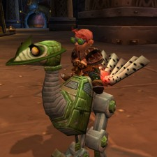

Back to: [West Karana](/posts/westkarana.md) > [2009](/posts/2009/westkarana.md) > [December](./westkarana.md)
# World of Warcraft: Just-in-Time Grouping

*Posted by Tipa on 2009-12-15 06:41:02*

")

He was like that when I got here! Honest!

I was wondering, the other day, what if you REALLY had to use the toilet -- it was an emergency, do-or-die situation. And you get into the bathroom and you discover a dead body in the stall you wanted to use. Do you report the dead body immediately or do you go do your business in another stall first?

I think I'm watching too many Bones reruns on Hulu.

It's been a week since patch 3.3 went live, the patch that turned Ironforge into an instance lobby every dungeon in the game into maps. The patch that turned WoW from a game where you mostly soloed until 80 and hardly ever saw the inside of a dungeon, to one where doing dungeons is by far the most efficient way to level.

In short, the patch that moved WoW even further from the MMORPG baseline. I've said pretty often that WoW shouldn't even be grouped in with other games that seem, on the outside, to be similar. It is its own, separate deal.

When I returned to Azeroth, before 3.3, I was mostly doing what I mostly did before. Going through my quests and doing them, one at a time, spending most of my playtime traveling from one place with monsters to another and relatively little time in the killing. Which was easy enough, if you see a monster, there's a quest to kill it somewhere. I wouldn't have subscribed past the seven free days if that's all it was. Because soloing quests is REALLY BORING, and I find it pointless to pay money to be bored. This is why I am not currently a LotRO subscriber. Soloing quests in North Downs is something Turbine should pay ME to do.

Now I still do quests, but I'm queued up for dungeons at the same time. My first time through WoW, all I cared about was leveling, leveling, leveling. Most dungeons I only did once, until Sunken Temple and Maraudon when I started actually needing to farm gear (or rather, the people in my guild did, and I played a priest, so I saw those two dungeons a LOT).

 I've taken some flack for diving straight into the "easy mode" bits of WoW. I have all the add ons I think I could use. Auctioneer sells all my loot for me -- and now I have over 100g, from starting at 15g -- more than enough to buy my epic mount when I hit level 40. QuestHelper (combined with the new built-in map enhancements that also came with 3.3) keeps my non-dungeon time efficient. And Azeroth Advisor makes me look like less of a noob when I'm in a dungeon.

Seriously, Azeroth Advisor is worth ten times the price. It sent me newsletters with info about Uldaman and Scarlet Monastery -- Cathedral, and wouldn't you know that those two dungeons came up pretty soon after. It tells me how to play a rogue, what poisons to use (Crippling Poison to defeat runners? Brilliant!), and in general, how to make it seem like maybe it HASN'T been over three years since I last played.

Though mostly I play with phenomenally-geared alts. I'm thinking that most of the people I play with (in the 30s) are using 3.3 in the downtime from their mains to level their alts.

Some people still play like they are on their uber mains. The Azeroth Advisor suggests people pull groups from the Cathedral in order to lower the chance of being overwhelmed by adds. Only ONE group did it this way. One time we managed all the adds. Another time we all wiped.

People come and go from the groups all the time. You can be in the middle of an instance and suddenly the tank or healer hearths out; no reason given. Then you're stuck.

Given all the downsides with grouping with people of random skill and gear whom you don't know and will never meet again, patch 3.3 has made WoW from a really boring solo game to one where you can just spend your time doing dungeon crawls, the ancestral RPG activity and the reason I love to play MMOs in the first place. It's what I loved about EQ when Lost Dungeons of Norrath came out, too, except without all the tedium of actually forming a group.

I hate to say this, but EQ2 could really benefit by adding something similar. It would be the natural extension of their Shadow Odyssey instance-based gameplay.

## Comments!

**Longasc** writes: I can understand the love for this feature, it makes running dungeons possible. Yet at the same time, it totally depopulates the world, which became even less important than it already was after people reached the "Endgame".

Yet I still claim that the WORLD is what made World of Warcraft popular, not the raiding that not so long ago was only done by a minority of the population - who raided Molten Core, Old Naxx etc.?

Now it turned from "World of Warcraft" into "Lobby of Instancecraft".

I find it just fascinating that Guild Wars 2 tries to become more a persistent, less instanced world than GW1, yet WoW, LOTRO and the by now really popular DDO are so heavily leaning towards instanced content nowadays!

---

**m** writes: ah wow is much more fun now that they've stolen most of the features that made warhammer unique. wow maybe should have had some of it already.

---

**[Rob](http://www.lostaneighth.com)** writes: I never really thought of it that way, Tipa. You're right though. Since 3.3 I have logged in every night and rather than flying around doing boring dailies for cash, I seek for a few groups, run some instances and log out. It IS a lot like the "ancestral RPG activity".

If anyone from SoE is reading this: PLEASE steal this feature. Blizzard is trying to steal your cool guild leveling system for Cataclysm, so take this idea from them now please. I constantly waffle between being subscribed to EQ2 and not being subscribed. I love the game, but soloing through the low levels just gets boring after a while.

@Longsac - The thing is, the instances are just pockets of content within an otherwise persistent and shared world. In Guild Wars, 90% of the world, and 100% of the world you are interested in exploring, is instanced.

This tool just lets people ignore the gristle and cut right to the meat of what they want to play. I DO wonder what happens to the persistent world around us when nobody leaves the towns though. I played the WoW of long ago and, yes, I adored the world and the lore. However, I also remember struggling to find/build groups to run the content I wanted to see. When you have kinds, a full time job, and maybe are going to school full time to boot, you simply don't have an extra hour or two to spare to find people willing to run through instance X. WoW has done nothing if not cater to the people who want to cut the chaff and get right to the action.

---

**[Stabs](http://stabbedup.blogspot.com/)** writes: "I’ve taken some flack for diving straight into the “easy mode” bits of WoW."

If someone has gone to all the trouble to hand write you a letter and walk around to your house to drop it through your letterbox then I think such criticism is entirely justified.

On the other hand if they've used easy mode methods of communication like computers you should feel free to disregard it.

---

**[Tesh](http://tishtoshtesh.wordpress.com/)** writes: Aye, Longasc, it does strike me as humorous that WoW is leaning more to the instanced dungeon crawling than the open world when pundits blasted GW and DDO for embracing that "cut to the quick" methodology from day one. Perhaps it's yet another sign that the WoW population is largely long past done with the leveling content.

Imagine that, though; jumping in and playing with other people being the point of an MMO, not a death march through a leveling grind to get to the "real game" at the level cap where you run instanced dungeons over and over and over. What a novel concept.

---

**Bhagpuss** writes: Surprised to hear you say that doing quests solo is boring. I'd say it depends entirely on the quest. A good quest can be totally absorbing, and, like reading a good book, it's an experience that you can thoroughly enjoy on your own. 

I wouldn't say that WoW had a particularly high proportion of good quests, though, sadly. Questing in Fallen Earth, or Allods, is a lot more amusing and entertaining, to name just two superior examples.

I have still only done the one WoW dungeon. I found it utterly exhausting. I literally had to go and lie down for 15 minutes at the end. I can't imagine doing more than one of those in a session. I wouldn't say it was fun, either. It was interesting, but not really enjoyable. Maybe if I did more I would get used to it.

I also loved LDoN. One of my favorite ever expansions. A big part of the fun, though, was meeting people and putting groups together from an extended list of people you'd got to know doing LDoNs. I don't know that it would have been somuch fun with randomly-assigned groups. 

As for Add-Ons, if they increase your enjoyment, of course you should use them. They decrease mine, so I don't.

---

**yunk** writes: Soloing quests was fun the first 3 or 4 times. Now? I can do without it. Sometimes I find something I haven't done, but that is rare. I'm sure most players are in the same boat.

I do miss the old days, when the world was full of people. You had group quests in areas of elites and you had to group up with strangers at the quest hub nearby and go tackle it. Lots of fun. 

But Blizzard can't bring those days back. The people aren't there, and they won't be, because we all did it about 10 times already. That's why they got rid of the elites, so we could solo those areas. Blizzard would have to bring tons of new people in, and somehow get them all on the same few servers.

Or an idea that has been thrown around is "leveling" servers where everyone levels on then transfers off of, but that would introduce a host of unintended consequences to the economy (for instance hard to level crafting unless your AH is full of mats low level players farmed)

---

**Sirhyl** writes: I also really like this part of WoW and it has gotten me playing the game again. EQ2 was fun when I had someone else to play with. But sadly most of the time I was stuck soloing. I haven't been on it in a while because of it. I think the people I used to play with have scattered servers anyhow.

I miss playing with you Tipa!

---

**[Saylah](http://notadiary.typepad.com/mysticworlds)** writes: I agree with much of our assessment but not that WOW should be grouped differently than other MMOs. I think they are evolving but it is still massive multi-player where the majority of the questing happens in an open world.

I haven't tried the new tool yet since I'm multi-boxing but I can surely see the benefit. Gamers are maturing in age/responsibilities and new gamers have arrived. Their patience for searching for groups during their precious game time has become more limited than in previous generations of MMOs. We should also consider the age of a game that continues to draw new customers. The gap between the veterans and new players grows each year. New players and older players with alts need an easy way of grouping to see the instanced content, ESPECIALLY for the older content. Veterans and even guild-mates get tired of being humped with requests to run old instances they've seen more than their share of when they were that level or on their 1st or 2nd alt. Blizzard can't revamp all the old content for higher level characters and new players still want to see the low content. And even players who roll alts might not want to only solo quest to level. I think it's a win-win.

EQ2 should do this. Sorry for people who don't like the method. There'd be a much higher probability of me resubscribing if I could more easily see/do some of the dungeons versus their quests which I just can't stand. As it is now, it's much to hard to find groups at the lower levels even in a big guild. Big guilds aren't the answer for everything. They get tired of the old content. Bottom line for a lot of players happens to be how easy is it for me to log in and have some fun, while getting something accomplished. The days of floundering, wandering, begging, camping, etc. being perceived as a badge of honor in a game, have largely disappeared. My age, priorities, responsibilities and time constraints changed that not WOW.

---

**[LFM LFDs In MMOs PLZ THX](http://blog.dontfearthemutant.com/?p=1416)** writes: [...] what I had written and then deleting that chunk of text. There’s been so much said about it lately, that I’m not really sure that I can add very much to the discussion (feel free to point out [...]

---

