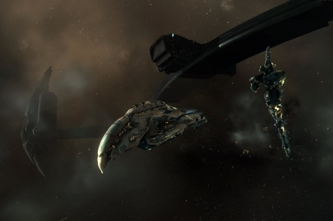
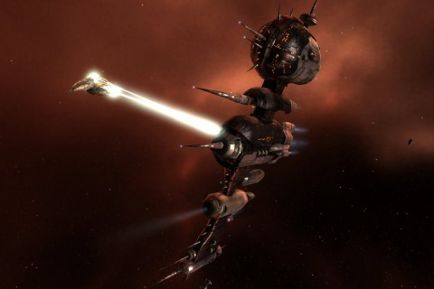

Back to: [West Karana](/posts/westkarana.md) > [2009](/posts/2009/westkarana.md) > [December](./westkarana.md)
# EVE Online: Acts & Revelations

*Posted by Tipa on 2009-12-26 21:30:28*

One of the big hurdles I've been struggling to, um, hurdle (I guess) in EVE Online is the whole process of a Level 4 mission. They are the big money makers and they give loads of standing and loyalty points, so if you're going to do missions at all, you want to do Level 4s if you can.

My usual process with Level 4 missions was first, to obtain the mission. My standings with the Gallente Federation Navy is so high that I can get these missions nearly anywhere in Gallente space. So that's good. Then I get my Dominix battleship ready. Make sure it is repaired and insured, loaded with drones (it is a drone boat, after all). Plenty of ammunition in the hold.

Then I go to the mission, escape with just a shred of armor left which I'm tossing in the path of the webbing frigates to distract them, run back to the agent trailing smoke, and ask for a nice, safe Level 3.

I came up eventually with two solutions to the Level 4 Problem. First, make sure that my battleship had [the correct resistances for the mission](http://eve-survival.org/wikka.php?wakka=MissionReports). My usual fit is kind of an "omni" tank -- it's fairly good on every resistance, but not spectacular at any of them. It's good enough. Usually. That doesn't work well for Level 4s -- you have to have a couple of spectacular resistances, and the others can do what they like. (Oddly, my usual fit does fairly well in wormholes, where the Sleepers can't find any specific weakness).

The second solution was to Get Some Help. Since CCP's "Two of a Perfect Pair" promotion (I've forgotten what it was actually called so we'll call it that), where you could have a second account for a discount rate, I've had an alt. She recently achieved Amarr Cruisers, and I couldn't help but notice that there wasn't much skill separating Cruisers and Battlecruisers. I trained Battlecruisers up to level 3 (if you're planning on actually using a skill for something, it should be at least to level 3, I figure), and started construction on a Prophecy, a really, REALLY wicked cool looking ship.

Red (our corp director) once asked me if I chose my ships purely on their looks. Well, not always -- I fly a Dominix, don't I? It looks like a green and bronze turd. But the Prophecy; I had this vision of it flying on a mission with my Myrmidon battlecruiser....

[  
Click to enlarge](../../../uploads/2009/12/ExeFile-2009-12-26-11-16-44-12.jpg)

I found a contract for a single run of a Prophecy. The material efficiency was low, but there wasn't much separating the material needs between a low and high ME blueprint. But the 'print was Really Cheap, so I bought it. I tend to sell my spare megacyte and zydrine -- expensive ores -- in moments of weakness, so I wasn't going to be able to make one of my signature 3 million ISK battlecruisers. Nonetheless, I'd been buying a lot of goods on the market that reprocess into minerals worth far more than their purchase cost, so I had a lot of the goods already. 

I sent out buy orders on most of the other materials. The only good price with enough quantity of pyerite, however, was in low security space. I didn't feel like dealing with lowsec right then. I decided to start a solo mining op in surrounding systems and run it mostly AFK in the background while I played World of Warcraft and listened for EVE to tell me when my hold was full and I needed to shunt another load to my hauler, or that the asteroid was gone and I should choose another. I got all the pyerite and 2/3 of the tritanium I needed. The final cost of purchased materials was 9.2m ISK, down from a market price of 19.1m ISK -- a savings of ten million ISK for a little bit of work. I could have just bought it outright, naturally, but I'd need that ten million to fit the ship.

I'd found a good starting point for a fit on Battleclinic. I took it into EVE Fitting Tool to adjust it for my alt's skills. She has had a very eclectic, shifting set of goals and is still missing some core skills.

[  
Click to enlarge](../../../uploads/2009/12/ExeFile-2009-12-26-11-22-59-52.jpg)

I needed something easy to try the ship on. Something where if things turned bad, I could get out of trouble easily. Starting with a Level 4 mission would just be wrong. So I sent my probe ship, *The Excursionator*, to find some low level 'plexes to explore. All I could find in Aunia's system was a wormhole. I warped *The Excursionator* in, saw it was a Class 1 wormhole -- the least dangerous -- scanned down a gas cloud site and several Sleeper cell, and decided to have my shakeout mission here, in wormhole space.

A well-fitted battlecruiser should be able to solo anything in a Class 1 wormhole, but just in case, I brought the Myrmidon as well. My main's skills are MUCH better. Even though you can't "tank" Sleepers, as they shift aggro frequently, two battlecruisers mean the damage is split between two ships.

I needn't have worried. Amarr ships generally have very good native resistances (keyed off the Battlecruisers skill in this case, I believe, which I'd trained to level 3), and my usual fits for ships are well-suited to wormhole exploration (if not level 4 missions). I cleared the sentry towers from the gas cloud and went on to clear all three waves of a sentry base without too much trouble, and the Prophecy handled it amazingly well.

I was fairly concerned, though, at how close the Prophecy had to come to a target to hurt it. My Dominix can send drones 71km away and hit effectively with guns at 35km. My Myrmidon can destroy targets from 25km. The Prophecy seemed to need to get within 5km to do enough damage to notice. This was troubling, and still is. Some googling advised bringing several sets of frequency crystals for the pulse lasers, swapping them out as you close in on a target. That did help (though it's a bit tedious), but it sent me back to EFT to figure out ways to make the ship faster. The only way I could make it work was to lose the 1600mm steel plating covering the hull, and I could not bring myself to do that. In the end, I reluctantly tabled the problem until my alt has more skills so that I can fit a 10M Afterburner II and Heavy Pulse Laser IIs without overburdening the power system.

Still, it was enough to get started. Radio crystals extend its effective firing range to 15km; not as good yet as the Myrmidon, but good enough to help cut down the opposing force. Like a really big drone, actually.

[  
Worth clicking on this one to see the whole thing](../../../uploads/2009/12/ExeFile-2009-12-26-13-24-16-79.jpg)

I'd been [talking with a friend](http://shatteredblog.wordpress.com/) the other night about about the Bible, of all things. He'd mentioned that historians had conceded the Apostle Paul had in fact written the Letters to the Corinthians in which the nature of the early Christian church, its methods, rules, goals and so forth are set out. But Acts was written long after by people with fairly extravagant writing styles who had their own ideas on what Paul was saying. Anyway, with that in mind, I named the Prophecy *Acts & Revelations*.

I grabbed a Level 4 mission, grouped *Acts & Revelations* with my Dominix, *Daddy Issues*, and set out to Auvergne to have a conversation with some Serpentis slave traders.

Part I of this two part mission went swimmingly. In Part II, my Dominix was torn apart in seconds. I repaired, tried kiting the swarm, still got torn apart (and webbed). I checked the mission reports. Sure, some may consider it cheating to look the mission up and see what damage is dealt, but I guess some people may have way too much money and like seeing their own ships burn.

I'm not one of those people. Those Sepentis were doing EM and Thermal damage. I dropped my Kinetic and Explosive hardeners, added more EM and Thermal, and with those resistances reading near 95%, headed back in.

It was easy, now that they couldn't really hurt me. The armor repair module handled any damage that made it through the hardeners. The Prophecy ran around and killed cruisers while the Dominix tanked everything and sent drones where needed. The Prophecy friend one of the battleships with ultra-high frequency light while Ogre heavy drones and shells filled with antimatter killed the other.

It was glorious.

And, you gotta admit, the camera loves the Prophecy.

## Comments!

**[mbp](http:mindbendingpuzzles.blogspot.com)** writes: Hi Tipa, I have long had the impression that a lot of serious EVE players run multiple accounts. Do you double box or run both of them on one screen? I remember reading that EVE is setup to allow multiple clients run on one machine but tabbing back and forth during combat sounds risky.

---

**[Tipa](https://chasingdings.com)** writes: I do run them both on one machine, tabbing between the two. There's a lot of tabbing going on in battles, for sure. I don't know if I would ever even try running two ships in PvP.

---

**[Magson](http://phoenq-magson.blogspot.com)** writes: The Prophecy is most definitely a sweet looking ship. Too bad the Harbinger outclasses it in every way :-(

Definitely work up your T2 lasers and fit Scorch M ammo. The range on that is as good as Radio while doing a lot more dps. Not quite Multifrequency level, but pretty darn close.

And I don't think it's cheating to look up what type of damage to tank against at all, and I'm glad your missions went so well after you were able to resist damage better.

FWIW, Sleeper do omni damage so you always want to omnitank them anyway. It's only on missions and vs specific npcs in plexes that you can get away with only doing 2 resist types.

And definitely love the shot of the Proph vs the Sansha BS. Very pretty!

---

**Cj Didge** writes: For amarr mission ships you could always try beam lasers instead of pulses, sure its a drop in dps but you can hit from much further away.

---

