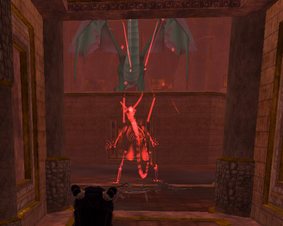

Back to: [West Karana](/posts/westkarana.md) > [2009](/posts/2009/westkarana.md) > [February](./westkarana.md)
# Weekend Gaming, such as it was

*Posted by Tipa on 2009-02-02 08:17:55*

This weekend was filled with "real life" stuff, leaving little time for gaming... but I did get some time in now and then.

I went ahead and made a kinship (called, unsurprisingly, Nostalgia) on the Windfola server in Lord of the Rings Online -- just to make it easier to talk with everyone. I'd prefer to be in some larger guild but I imagine it would be tough to find one that everyone liked. Small guilds, like this one, have an arc. They rise and then linger on for awhile before fading away.

Anyway. Had a great time working through the first few chapters of Book 1 with Caco and Malfirio. I fell asleep during Chapter 7, but got caught up to "Madman" Malfirio yesterday. Combat in LotRO is so fast paced. That's not good or bad, it just is what it is, but I don't think such frantic key-smashing is really keeping with the lore.

Fun fact: It takes 48 medium hides to make a set of Journeyman medium armor. A yellowfang drops a medium hide about 2/3 of the time. I farmed almost 150 medium hides yesterday.

So far, I haven't done anything in LotRO this time through that I haven't done many times on other characters. At level 18, though, lots of the world has opened up. I'm working through Barrows and Greenways quests, and should probably be thinking about moving on to the Lonelands pretty soon. I'll be needing lots of thick hides for expert tailoring REALLY soon, after all.

The Ascarey raid group cleared Veeshan's Peak (sans Trakanon) for the first time. It's a raid group, not a guild -- the raid leader and much of the raiders are from a guild called The Unforgiven (after the movie or the Metallica song? Was the Metallica song referring to the movie?), and a lot more are from Rage, and then there are the rest of us. I suspect a lot of the other raiders are alts of people from uber guilds. That's how successful pickup raids seemed to work back in EQ1. Anyway, we cleared it. I got my first piece of Tier 3 armor, the leggings. It focuses my self buff. Get two or three pieces (can't remember offhand) and it makes my lower-aggro buff take zero concentration, so I can cast another buff as well -- perhaps Song of Magic, Spell Reflection or Defense (but probably not Defense).

We've also taken our first steps into TSO raiding. We've gotten a fair ways into one of the Befallen raids, and here we are taking down the twin nameds in the first encounter of some raid deep in the Void. The next encounter after this is very much a WoW encounter, where you follow a script really well to win, but I guess most of the modern EQ2 raids are based on the WoW model. Except without all the add-ons. EQ2 players are forced to fly blind in raids.

Thomas, the Friendly Necromancer posted a wonderful interview with [the people behind the music of Wizard 101](http://thefriendlynecromancer.blogspot.com/2009/01/part-i-nelson-everhart-todd-coleman.html). I think I probably turned the music off back in Marleybone, after the Raiders of the Lost Ark-themed Krokotopia music wore out its welcome. I went back in to turn on the music and listen to it while doing one of those endless Dragonspyre tower quests, and I saw Thomas himself on.

We got to talking, and he said I just HAD to see the Crystal Grove. It was beautiful; I'm only showing a small part of it. I started working on one of the quests in the area, and then it was time to take off.

Dragonspyre is very large -- but also nearly empty. Has everyone who was waiting for it, finished it already? Are all the Dragonspyre players spread out among too many servers? The first couple of days of Dragonspyre, maybe even the first week, it was no trick to find people working on the same quests. Now... well, I keep an eye on my friend list. Dragonspyre is altogether tougher than any other world, and another person really, really helps. I've even been considering re-subscribing on my second account.

Drove to Rhode Island to visit my son, and after lunch we stopped by Best Buy and I picked up a USB thumb drive. The one I already had doesn't seem to work with my Playstation 3, but this new one did, and I finally am able to get pictures OFF of the PS3. I haven't tried it with LittleBig Planet yet, but if it does work (no guarantees), I might be able to document my LBP levels. Which would be nice.

Picture above is of Wipeout HD. I sat down and unlocked several new tracks the other day. It's a fun game; I loved the original one. I was shocked when my niece fell for it last time she was up. She was really good at it -- better than me -- so I felt I should unlock more tracks for the next time she visits.

## Comments!

**[Openedge1](http://simple-n-complex.blogspot.com)** writes: Hmmm...

May want to watch that NPC in LOTRO as he also twitches his shoulder every once in a while. Next time watch his eye and mouth movement for Micro expressions...then we will know the REAL truth...that sleeping while playing LOTRO is a common thing after all...

Cheers

---

**[Tipa](https://chasingdings.com)** writes: Well, I was waiting for people to catch up, and they were harvesting and doing quests on the way, and I fell asleep :/

---

**[wilhelm2451](http://tagn.wordpress.com/)** writes: I think Dr. Richard Kimble is looking for that NPC.

---

**[The Friendly Necromancer](http://thefriendlynecromancer.blogspot.com)** writes: I think one of those hands is prosthetic, Tipa. Watch out for those crystals, apparently they are being harvested by Sleestak for use in teleportation devices, um, or at least that's my conspiracy theory for the day.

---

**[Anjin](http://bulletpointsblog.blogspot.com)** writes: That's LotRO image is a classic. Thanks for the laugh.

---

