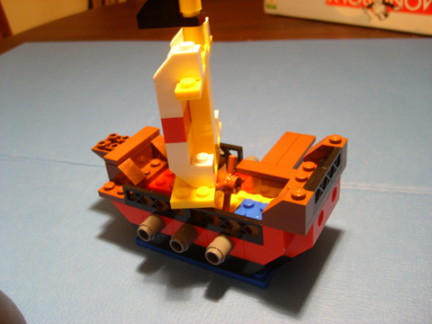
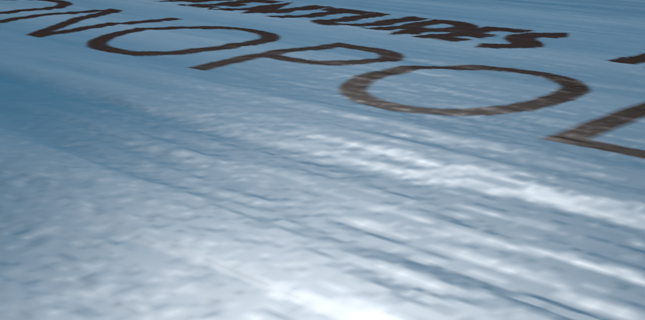
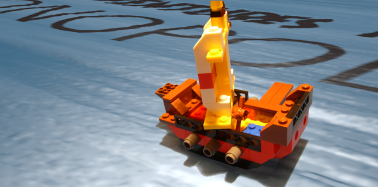

Back to: [West Karana](/posts/westkarana.md) > [2009](/posts/2009/westkarana.md) > [February](./westkarana.md)
# AiM: Behind the scenes

*Posted by Tipa on 2009-02-07 19:19:20*

I was working on the next Adventures in Monopoly comic, and thought it would be fun to show how I created the first panel.

I wanted a boat going over an ocean, and I wanted the ocean to be a game board. I couldn't find any good ocean game boards at Toys R Us despite all the wonderful ideas given by people on Twitter, so I decided I would make my own in Photoshop and render it for extra realism in a 3D ray tracer, POVRay.

First, making the pattern in Photoshop by building up layers -- rendering clouds, blending them with fibers, desaturating it all so it worked nicer, adding a coloring layer and then some text. The pattern would also be used as a bump map for that paper glued over cardboard feel, so I made two, one with and one without the text. Otherwise the text would have rendered as huge letter-shaped holes in the ocean.

|  |  |  |  |
| --- | --- | --- | --- |
|
 
 | 

 | 

 | 

 |

I photographed the Lego ship on the back of my Monopoly board so I could get an idea for how to render the image and so the shadow of the ship would be generally in the area of the right color.

Matching the angle of the light in the photograph, I rendered the board in POVRay.

I separated the ship's shadow from the ship in Photoshop and made it a new layer using the "Hard Light" blending mode to let the board show through. I had to patch the shadow a bit to give it all the coverage it needed.

Then I added the ship itself -- just need to add dialog and the first panel is done!

Elapsed time -- about two hours...

## Comments!

**[Ceadrick](http://www.fomarcreations.com)** writes: WOW just WOW. That is so cool. You did a fantastic job!

---

**[Tipa](https://chasingdings.com)** writes: Thanks!!! :)

---

