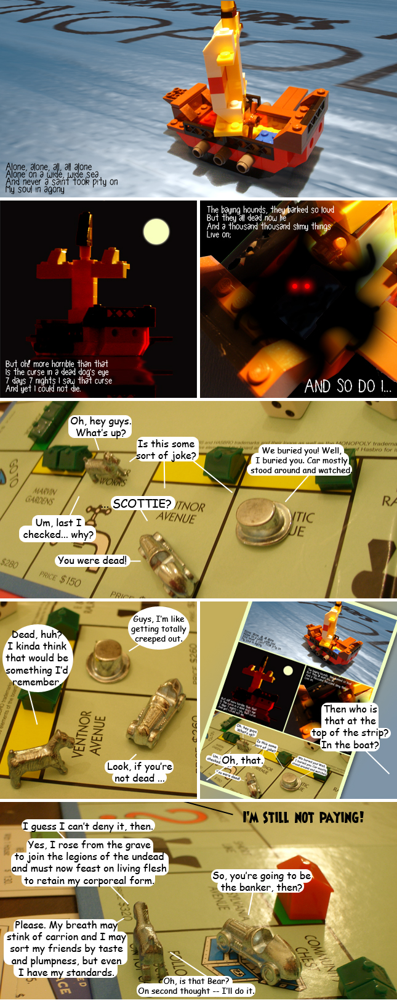

Back to: [West Karana](/posts/westkarana.md) > [2009](/posts/2009/westkarana.md) > [February](./westkarana.md)
# Adventures in Monopoly: Revenge, Part 2

*Posted by Tipa on 2009-02-08 00:59:45*

All this next week will be back to regular adventures in regular MMOs. This comic just forced itself to be written, so what could I do? I'm weak, I admit it.

Poem is in many ways similar to Coleridge's "Rime of the Ancient Mariner". The font used is RPG Script and was donated for general use by [Bad Gods](http://badgods.com/)' Lore Sjöberg, so for those people who wonder what you can get out of Twitter, hey, the occasional free font.

## Comments!

**[Still cranky after all these years &laquo; Stylish Corpse](http://stylishcorpse.wordpress.com/2009/02/10/still-cranky-after-all-these-years/)** writes: [...] ever tells themselves they really should have a game of Scrabble, or play a bit of Monopoly. (Well, maybe Tipa does, but that’s only because she has weird and frightening voodoo Monopoly [...]

---

**[Tesh](http://tishtoshtesh.wordpress.com/)** writes: "So, you're going to be the banker, then?"

That made my day. Thanks, Tipa!

Oh, here's another place for comic fonts (some free, some not):
http://www.blambot.com/fonts.shtml

---

**Milia** writes: Hey! I think someone over at Apartment Therapy is snagging ideas from WestKarana. 

http://www.apartmenttherapy.com/chicago/organizing/how-do-you-stay-on-a-budget-share-your-best-tips-076460

Sure they're saying they are talking about budgets but I bet you next week they'll be all "Oh! Look at our new comic about budgeting based on Monopoly."

---

**[Tipa](https://chasingdings.com)** writes: Wow, that's uncanny. For a second I thought they had just lifted one of my panels, but they hadn't. Still, Car and Hat chilling out on their way to Free Parking? What are the odds!

Nice catch :) I could only wish that they'd actually gotten it from me, though :) Probably just a case of coincidence. Still, if they have a vampire Scottie dog or, heavens, BEAR in there... well, we'll have to have a chat.

---

