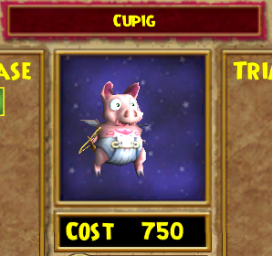
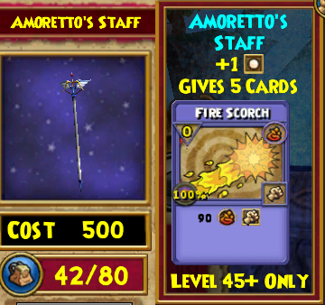

Back to: [West Karana](/posts/westkarana.md) > [2009](/posts/2009/westkarana.md) > [February](./westkarana.md)
# Wizard 101: This ain't the Summer of Love

*Posted by Tipa on 2009-02-09 08:51:54*

Um, sorry for the Blue Oyster Cult shout out.

Scratch that. I'm not sorry. Blue Oyster Cult RULES. And there ain't no angels above. Cuz things aren't like they used to be. And this ain't the summer of love...

Um, sorry. This post isn't about my favorite band. This is about Wizard 101's newest heartthrob, Valentina Heartsong.

> Valentina: "Hi! I'm Valentina! I'm standing on this street corner holding a huge staff with a heart on the top of it, trying to find some love, and everyone keeps on taking it the wrong way! PLUS, what's with all these GIRLS? Aren't there any BOY wizards?"

Tara: "Your eyes... they are so... deep and... pink..."

Random girl in Marleybone clothes: "I need to touch your hair. No wait, I need to run my toes through your hair... Grrrmmmmmm...."

*Cough* sorry. Valentina has this season's latest and greatest Crown items. Crown items, you'll recall, are bought with Crowns, and they are purchased with money. So how much do you want these items?

Valentina is the first of the Crown merchants who isn't selling clothing. That's a good move for her, as the clothing her brothers and sisters sold had no stats and so could not actually be worn. I'd have preferred that KingsIsle had added appearance slots so that the clothes you show could be different from the clothes that actually gave you stats, but at least saving people from spending real money on useless items is a good move.

She sells two pets. Both are re-skins of the common flying pig you can buy from Wizard City's pet vendor in the Shopping District. The first is just the Valentine-themed pig. The second is slightly darker, and adds a Fire Elf card to your hand. Even at higher levels, Fire Elf is a good way for Fire wizards (or those using Fire magic) to keep the enemies from casting annoying Fire shields to block your mega attacks. So if you have the crowns -- go to the pig who comes with an elf. All I'm saying.

As long as we're talking about pets, let's take a brief trip to Dragonspyre, where Zeke has a couple of new pets to sell. Note that you'll either need access to Dragonspyre yourself, or have a friend who can bring you, to buy these pets. Once you are there, though, there's no level requirement to buy or use these pets.

This Storm Hound is more or less an "I Win!" button for Storm wizards. It's as powerful as you want it to be -- cast it at one pip and it does 120 damage over three rounds. Cast it with four pips, as a high level Storm wizard would start many fights with, and it's 480 points over three rounds, which is pretty darn nice for a spell you can cast first round AND keeps those pesky Storm shields off. This is the most expensive Crown item in the game -- but for Storm wizards, it is so amazingly powerful that it would be hard NOT to buy it. I hope other schools of magic get similarly overpowered items, as this could be severely unbalancing in PvP, where Storm wizards already hold a real advantage.

Zeke's other pet is Jade Oni. You might think that, being a Moo Shu Life boss, that the Jade Oni pet would give a Life card. You would be wrong. Instead, Jade Oni just does a balance strike which is cool, I guess, but dammit. I'm a Life wizard, I want my Life pets to cast Life spells. Anyway, go go Balance wizards. I might purchase this just because, hey, Jade Oni.

Then again, as far as status items go, purchased pets are pretty low. It's the rare drop pets that you want to show, the rarer the better. My Storm Bat is never far from my shoulder.

Okay, back to Valentina, who has been waiting patiently all this time. She has more than just pigs in her pack; she's also brought a huge selection of fire wands with her. New with her are wands of different levels. Now we can buy wands that actually will be useful for our level.

Wands have many uses. Damage is one use, but as time goes on, it's not what you really look to them for. Removing your damage and accuracy debuffs, building up pips or removing enemy damage shields -- these are the bread and butter for wands. The level 40+ wands also can add extra pips to the beginning of a battle to get you fighting faster. That's the thing older Crown wands didn't supply -- but these do.

I'm just showing the level 45+ wands here, but there is a similar selection for wizards of every level.

Allegiance Staff, 500 Crowns, adds a regular pip to the beginning of a fight.

Amoretto's Staff, 500 Crowns, again with a regular pip.

Staff of Sentiment, 500 Crowns, yet again, just a regular pip. I do love the heart at the top :)

Wings of the Cherubim, 2500 Crowns, adds a power pip to the beginning of the fight. This is the one you want if you can get it; a power pip at the beginning of a fight is like 1-2 free pip-building rounds in a battle.

There's some pretty decent Crown gear coming for Valentine's Day, and it's clear KingsIsle gets that the Crown items must not only be attractive, but useful as well.

Now, when are appearance slots coming?

## Comments!

**[mbp](http://mindbendingpuzzles.blogspot.com)** writes: What's the exchange rate from Crowns to real money Tipa? I am intrigued to know how much folks would shell out for "the most powerful item in the game". That Storm hound costs 14960 crowns right? So if you tell me the rate for translating crowns into beer money I can do the sums.

---

**[Tipa](https://chasingdings.com)** writes: It would cost you about US$25 at the current Crown rate. The full table is found on the Wizard101.com site. It's only the most powerful item if you're a high level Storm wizard, because they can use power pips to charge it up at double the rate.

I should note that this is just the Storm version of the Heckhound, a Fire school spell, so they already had.

---

**yunk** writes: I just made my first wizard yesterday, he is a boy wizard, a whole level 2 :)

I was surprised in a child friendly game that I could make a guy named "Galen Lotusdreamer" :)

So far it's fun.

---

**[Tipa](https://chasingdings.com)** writes: You can make Luke Skywalker, too :P

Welcome to Wizard 101!

---

**[Winged Nazgul](http://wingednazgul.blogspot.com/)** writes: Blue Oyster Cult was one of my favorite bands growing up as well. Fun BOC/MMO convergence link:

http://davejmike.livejournal.com/74846.html

---

**[Tesh](http://tishtoshtesh.wordpress.com/)** writes: The Crown/cash exchange rate varies considerably according to how many you buy. The cheapest Crowns (costing the least cash per Crown, but the biggest "chunk" outlay of cash) are half the cost of the most expensive ones.

I keep meaning to write a big post about that... maybe this weekend.

---

**Dee** writes: Tipa, 

 First Hello, you got some nice tips there. I have a lvl 47 Fire/storm. I started with my daughter, but my work has changed my shifts so I am playing after 2am est. This means I am now a none healing loner in Dragonspyre, any tips for that?

Second Is is legal to MAKE your own treasure cards? I know of a lvl 50 player who claims to be able to do this. He has lately attached himself to the group of wizards I lvled up with. I have witness them 1st hand MAKE their own treasure cards while in a battle with the monster/card they want. This group of wizards are not bad people and I would hate to see them get into trouble over 1 guy and his hacks.

Third. Your right, Blue Oyster Cult is a great band!

Thanks for everything.

Dee

---

**[Tipa](https://chasingdings.com)** writes: makes friends with a life wizard :) I'm available most nights. I could definitely group up with a damage dealer. I have heals covered.

Second, it is absolutely legal and encouraged to make your own treasure cards. That's how the accuracy, power and mutate cards work -- they turn regular cards into treasure cards. Someone without a healing school, like you, would definitely want to make a bunch of Fairy treasure cards for heals when you need them.

BOC, you can be whatever you want to be, you have the power, we have the key. BOC!

---

**[Saylah](http://notadiary.typepad.com/mysticworlds)** writes: Oh no, I didn't think about going back to see about V Day items. Haven't been playing as much and just stayed in Mooshu when I have been on. Must have V-Day themed staff!

---

**[Tipa](https://chasingdings.com)** writes: Valentine's opens today, with all sorts of chewy goodness staffs, 101 free Crowns for everyone, and a new quest!

---

**Ramar** writes: I really love wizard101. Its the best ONLINE video game I played. I got lots of friends, sweet spells like skeletal pirate and I am a death student. I usually am leveling with my real life friend (Wolf emeraldshard) aka wolf. By the way I told him I am a faster leveler then him when I was a level twelve, next thing you know I was a level 23 and he STILL was the same level (28). Even though I am death, in live I love the fresh open air, I love forests and my favret color is green, but I chose death because i heard they are very strong ang get a way sweeter and way better healing spell called sacrifice that heals like 700 health. whatdoyaknow, I got it! well thats mostly me in the game oh and by the way my chericters name is Travis. Thats all

---

**[Tipa](https://chasingdings.com)** writes: Nice to meet you, Travis :)

---

**Loopster** writes: Well as a life wizard there are people that report me for no reason and it BUGS ME! I think they report me for not healing them. Yet they are like this: CONNOR HEAL ME OR I WILL KILL YOU IN PVP! Hang on, who said I was going to PVP? So I dont heal them for being rude. Thats just how life wizards work.

---

**[JediRex](http://www.JediRexrules.blogspot.com)** writes: Tell me about it :( On m fire dude i have the spell sytar (i think thats how its spelled) and theese noobs want me to heal them on round one and/or want me to heal them instaed of a grandmaster! So people new to this game dont expect me to heal you on round on or two unless its nessisarie. K?
-Samuel FireHunter

---

**Cilla Poo** writes: well, it says wizard101 invites going out. if they say yes then sure. that if they want!!! (:-P EWWWWWW)

---

**Cilla Poo** writes: could dome one help with the wizard101 down load.

---

**[darkblead](http://wizard101.com)** writes: i wish to reciave a free storm hound if you will please send me one one for 1000 dollars on my wizard 101 account

---

**[Tipa](https://chasingdings.com)** writes: Not really free if you're gonna pay for it, is it? Storm hounds cost Crowns, and you can just buy them yourself. Also, I have no ability to sell things to anyone anyway :(

---

**[colintolliver](http://wizard101)** writes: can you please send me a storm hound for 100 gold please

---

**[Tipa](https://chasingdings.com)** writes: Why would you think I could sell storm hounds?

---

**jack moonward level 49 almost grand master two more bars** writes: is there going to be an new school

---

**[kitty](http:/ace)** writes: hey does anyone no a guy named wolf thunderstalker he thinks my frien
d is dead

---

