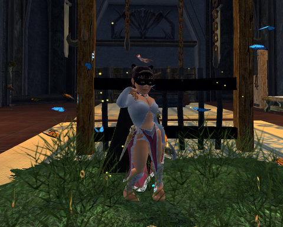
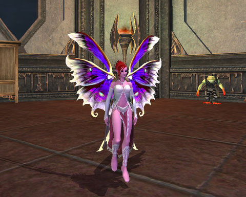
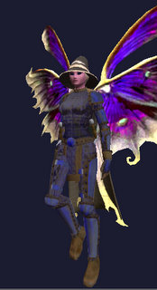

Back to: [West Karana](/posts/westkarana.md) > [2009](/posts/2009/westkarana.md) > [February](./westkarana.md)
# EQ2: Two girls ready for LOVE!

*Posted by Tipa on 2009-02-11 02:07:04*

And oh yeah, we finished clearing Veeshan's Peak and then cleared up to the Maestro in the Shard of Hate! First time the experience is new. Second time, it's like, can we skip ahead to the part where I get something :) No, it was fun, just not much to write about.

Afterward, I bought the Erollisi Day crafting book from the vendor in East Freeport, farmed a dozen or so Orc Love Letters in the War Elephant Breeding Ground and other orcs in the area, and made almost all of the things you could make. All except the ring at the end -- ran out of love letters.

My room downstairs has been empty since I removed almost everything because I'd just messed it up so badly, but I had to have a place to put the stuff I made and it's the only undecorated room in the guild hall, so I started filling it up again.

The rugs are new, the presidential motorcade-ready grassy knolls are new, there's some tapestries and cups you can't see... Dinah is modeling the $10 Dress for a $2 Girl outfit (I think that's the name).

There's zillions of house items you can buy with those love notes, but what I really, really wanted and heard that they had, was some holiday armor like the stuff they had for Frostfell. But, no dice. If they have any of that stuff, it's a well-kept secret.

Other people in the guild are into house items, but I'm really not. It's fun for awhile, then it's clutter, and then you're drowning in knick-knacks.

Dinah got AA 149 tonight. Slacking, I know, I know. Put that right back into elemental warding. Kasul got a cool master and pretty much almost always topped the DPS charts, proving that you don't need to be a hardcore raider to get the big numbers. Over 5K dps per encounter every time... very cool. I didn't finish the Greater Lightstone HQ on Brightknife (modeling the "She's a LOOKER not a H..." dress) because I didn't feel like two boxing. Plus it takes forever. I did farm it with Dinah to get love notes for crafting.

Oh, guildies -- there's some extra love notes and stuff in the guild bank, and I think there's still one outfit left in there as well. One of the blue ones.

Someone at work was wondering how the wizard RMT hat would look with the Frostfell scout armor. Really similar to this :) I was wrong, you were right -- it really DOES look cool!

## Comments!

**[Stargrace](http://www.mmoquests.com)** writes: "Other people in the guild are into house items, but I’m really not. It’s fun for awhile, then it’s clutter, and then you’re drowning in knick-knacks."

I have no idea what you mean. *giggles*

---

**[Tipa](https://chasingdings.com)** writes: No, this wasn't aimed at anyone but me. I used to go wild for house items, then it just turned into a big mess of stuff I couldn't deal with. Your rooms always look so well-designed :) No clutter!

---

**[Another Average Guy](http://anotheraverageguy.wordpress.com)** writes: I told you the hats would look awesome with the frostfell gear! Never doubt the Chrismeister!

---

