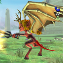

Back to: [West Karana](/posts/westkarana.md) > [2009](/posts/2009/westkarana.md) > [February](./westkarana.md)
# Beta News & More

*Posted by Tipa on 2009-02-12 08:31:01*

City of Heroes is currently running their [Valentine event](http://www.cityofheroes.com/news/news_archive/spring_fling_into_valentines_d.html), the one time in the year when heroes and villains can come together and luuuurve each other. Visit Pocket D, the rockin' night club presided over by the hip DJ Zero, his power vendors Chill and Dram, and somewhat alarmed mission-giver and part time DJ Scratch to find out how you can save the Rogue Isles AND Paragon City from an onslaught of super-powered war bots. There's also some more information about [the secretive Architect project](http://www.cityofheroes.com/news/paragon_journals/mission_architect.html), the future of interactive entertainment within City of Heroes. The Architect company will allow you to set the parameters, NPCs and goals for short missions of your own creation. It doesn't seem like you'll be able to actually build your own levels; you'll select a setting and probably a size, where the NPCs should be and what they say and do, and off you go. Not quite the game creator I was hoping for, but looks like a good time nonetheless.

Want to try out the super-cute Sanrio-themed [Hello Kitty Online](http://www.hellokittyonline.com/)? Now's your chance. "*Between February 14-17, 2009, SanrioTown members from select territories will be able to play Hello Kitty Online and participate in the "Happy Hearts" Valentine's Day event. "Happy Hearts" will feature exclusive content and some really cool gameplay enhancements.*" I had no end of problems keeping HKO running in beta. The patcher wouldn't work for me at all, and when I did get in, it was just -- grind grind grind. That said, I have not played it for six months and I understand from reading the updates that they have done some pretty substantial changes. They have completely overhauled farming, for instance. An Asian game built around farming makes me smile. Anyway, any Hello Kitty fan should definitely give Hello Kitty Online a shot.

[Freaky Creatures](http://www.myfreakycreatures.com/) is about to hit open beta. Freaky Creatures is more or less Webkinz for boys -- you go to a store and buy creature packs with a couple of action figures in them and a USB drive. Plug the drive into your computer and you have digital copies of the actual figures, along with a bunch of extra parts and powers you can mix and match to make your creature your own. Then it's off to the online universe to do battle with kids all over the world. FC stretches the Webkinz metaphor by not just having real toys to match their online counterparts and Flash-based mini-games, but games on the Xbox, Freaky Creatures valentines, and everything you need to make your Freaky Creature a palpable playground presence. I still can't figure out if their over the top marketing to boys is meant to be ironic or really, they are hoping that their audience consists almost entirely of pre-teen boys.

And lastly, my idol in online MMO journalism and former boss at Massively, Michael "Zonk" Zenke, has jumped over to [actual real game development](http://www.mmognation.com/2009/02/11/im-stepping-away-from-massively-and-games-journalism/) by accepting a position as a game designer with SOE on DC Universe Online. Way to go! Michael, I'd have made your icon in DCUO if, you know, I'd been in the beta. But until then, you'll just have to do with one from City of Heroes. At least I made you a hero! DC Universe Online has been doing something of a media blitz lately, and I have to admit that it's looking pretty nice. My problem with it is more general, though. What if I don't care for Superman or Batman? I guess I could be a villain and try to bring them down but, heck, to be honest, I just want to be part of the Green Lantern Corps and fly around battling Sinestro and having some quiet time with Guy Gardner. If DCUO lets me be in the GLC, I'm sold. Otherwise... well, I'll definitely be looking forward TO THE BETA. Subtle Hint.

*Ooops! I totally forgot about the Spellborn news! Well, another time.*

## Comments!

**isanox** writes: "And lastly, my idol in online MMO journalism and former boss at Massively, Michael “Zonk” Zenke, has jumped over to actual real game development by accepting a position as a game designer with SOE on DC Universe Online."

Well, I guess if shilling long enough for a company does payoff. It worked for Lum. It's working for George Snufalufagus.
Now if Keen can only get a 'job' for mythic.

---

**[Tipa](https://chasingdings.com)** writes: Ooooh harsh :/

---

**[Openedge1](http://simple-n-complex.blogspot.com)** writes: haha...
Ouch is right...

But if that is how it works...Keen and Heartless\_ would own Mythic by now....hehe (then Heartless\_ would have been fired...lol)

---

**[Michael](http://www.mmognation.com)** writes: Tipa, thanks very much for your kind words. They're much appreciated.

---

