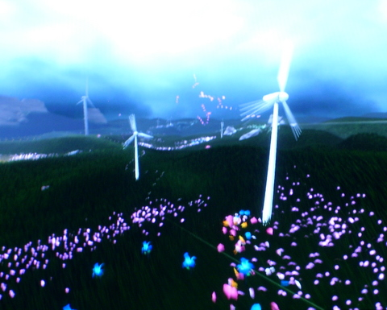

Back to: [West Karana](/posts/westkarana.md) > [2009](/posts/2009/westkarana.md) > [February](./westkarana.md)
# EQ2: Wings of the Void? WANT. Also, Flower.

*Posted by Tipa on 2009-02-13 08:16:22*

The new [Legends of Norrath set](http://legendsofnorrath.station.sony.com/), *Against the Void* launched yesterday. I want to get into LoN, I like collectible card games, but I just worry that to do well, I'll have to sink serious money into cards. That's what finally got me off Magic: the Gathering -- but at least I got to keep my cards when I stopped playing. I have nostalgic fun every time I move somewhere and move them from one box to a new box.

Against the Void brings at least two new loot cards. There's the one *I* got with my free subscriber's booster, "Title: Herald of the Ethernauts", and then there's the one that was linked over and over again last night and had people drooling from level 1-9 chat straight through to level 80 chat -- Wings of the Void.

|  |  |
| --- | --- |
|
 
 | 

 |

It's wings! And they are all lightning and crackle-y like the Void! And they give you super Fae glide powers, too! I wasn't able to get someone to link them to me this morning while I was on my Arasai assassin, Brightknife, so no word yet on what the wings look like if you already have wings.

PS3 owners finally get an artsy game to call their own. Well, we already had Everyday Shooter, but didn't every platform get that? And Eckachrome, I guess. And of course, we had the proto-artsy game, flOw. But that was pretty much it, and when the Xbox crowd got Braid, well, color us envious. We wanted a new, shinier, artsy game, too.

The people who gave us meditative survival of the fittest game, flOw, just yesterday released their followup game, flOw-er. Er, Flower. You are the wind (House of Flying Daggers flashback), and you lazily blow through valleys and over hills teasing flowers into bloom and turning a drab, colorless world into an explosion of color, while also setting windmills spinning, opening up canyons and so forth. There is no winning or losing, just -- drifting. Each level is packed with hidden paths and little secrets, but there's no reason to get all anxious about finding them as you just drift along...

Very meditative. I bought it and am loving the heck out of it. I doubt I'll play it much when I finish it, but maybe I will. Still lots of hidden valleys and wind-shaped arches to discover.

## Comments!

**[Green Armadillo](http://playervsdeveloper.blogspot.com)** writes: Wait, they're selling an item (technically booster packs that have a chance of containing the item) that grants any character an ability that I picked a specific race in order to get? I thought they just put out a statement about how they're trying not to "sell power" with their RMT schemes? People wouldn't accuse SOE of starting down a slippery slope if they didn't take a few more steps downhill every time they think no one is looking....

---

**[Tipa](https://chasingdings.com)** writes: It's an activatable effect and lasts 30 seconds, so it's not quite like Glide. On the other hand, a cloak from Emerald Halls that drops commonly has it as a permanent effect.

The Wings of the Void is not easy to get.

But, heck, LoN is RMT. No getting around it. This is what RMT based games do all the time.

---

