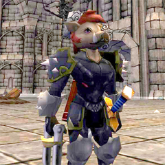

Back to: [West Karana](/posts/westkarana.md) > [2009](/posts/2009/westkarana.md) > [February](./westkarana.md)
# *Anthro* MMO Earth Eternal launches new web site

*Posted by Tipa on 2009-02-17 07:01:16*

There's a slim possibility [I may have been dismissive](http://www.massively.com/2008/07/25/furries-let-their-tails-down-in-earth-eternal/) of Sparkplay's Anthro (not Furry) MMO, [Earth Eternal](http://www.eartheternal.com/), in the past, but --

Okay, I just have to get this off my downy-feathered chest, here. [Earth Eternal](http://www.eartheternal.com/) is a Furry MMO. I understand why they are trying to distance themselves from it. The Furry sub-culture has gotten a reputation for kinkiness, but, seriously, there's a certain percentage of any sub-culture that's kinky. Go to any sci-fi convention and it won't be only the Furries who are getting odd looks.

I'm looking right at my [Erma Felna, EDF](http://en.wikipedia.org/wiki/index.html?curid=1464199) collection. I read my kids the [Redwall](http://en.wikipedia.org/wiki/Redwall) books and my son, in particular, loved them (to this day, even, and he's almost 22!) One of my oldest friends makes [fantastically elaborate Furry costumes](http://www.avians.net/~legend/Fursuit.html), okay? So when I say "furry" instead of "anthro", I'm NOT putting Earth Eternal down. I'm just calling it as it is. The Earth Eternal devs can go tirelessly from place to place correcting the usage, but I know and they know that it's a Furry MMO and they should accept it and move on. The Anthro vs Furry argument is of the same nature as Geek vs Nerd and Trekkie vs Trekker. Splitting (bristly) hairs.

Anyway. The game is fantastically colorful and whimsical, can be played in a browser or from your (Windows, for now -- Mac soon) desktop, multi-classing, is free to play ... [have a look](http://www.eartheternal.com/), watch the videos, sign up for the forums to have a chance at getting into the beta, and let your fur down with the community, all of whom are devout aficionados of anthropomorphic fiction, and NOT FURRIES.

