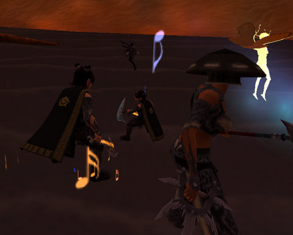

Back to: [West Karana](/posts/westkarana.md) > [2009](/posts/2009/westkarana.md) > [February](./westkarana.md)
# EQ2 Mish-mash!

*Posted by Tipa on 2009-02-18 07:58:18*

Lots of updates to progressin EverQuest II and, unfortunately, not a lot of time to write about them, so here goes.

I have three goals in EQ2 at the moment -- finishing Heritage Quests for our guild, Nostalgia, getting Dina's tailoring to 80 and also finishing the Rise of Kunark expansion by defeating Trakanon in Veeshan's Peak. Once these are done, I'll probably start focusing on doing TSO missions. I was reading yesterday about a friend who has almost finished his second set of TSO armor; I don't even have one item from the first set. I spent about ten void shards on resist jewelry for raiding and have five or so left over. Most TSO missions I'm in -- pickup groups every one, as Kasul and I are Nostalgia's only active members doing TSO content and we're far too few to form a group -- end in failure, so it's just a gigantic waste of time, usually taking more than an hour to finally abandon the mission with a pile of debt and repair bills.

It's probably just me. I'm so far behind the curve that I usually have absolutely no idea what's going on. People just rush rush rush and then we're all dead. I'm looking forward to seeing what those rumored solo missions for void shards look like; at least I'd be able to pace a solo mission so I'd have some idea of what I was supposed to be doing.

I love EQ2 and the friends who play, but I feel more and more as time passes that EQ2 doesn't have much use for people who just enjoy playing and grouping as a social experience. I still look back to nights spent happily whacking kobolds in Sol B, chatting and having a good time without much time pressure at all. People would sometimes just head to Guk or OS and just sit at zone in and chat while waiting for a group, and everyone knew everyone else.

Whatever happened to the social MMO? Did it die after EQ?

ANYWAY. Valentine's Day brought some new outfits to the EQ2 RMT store. Kaladim Stormguard armor is the bluish set on the left, and it looks really nice. Not nice enough to blow so much money on, but ... love the hat. You can get a similar hat just by itself (and another one which looks like that stocking cap that guy in Fat Albert used to wear), raising the chances that you'll soon be able to buy the brigand/swashie Hamburglar hat. When I was a guide back in EQ, people used to ask me all the time when they'd be able to get the hats like the halfling guards used to wear in and around Rivervale. I'd just tell them I wanted one, too! My main character wears a mask already; now she wants a hat to go along with it.

Maybe soon!

I was curious what the Wings of the Void cloak, which looks like two giant bat wings, would look like on a character who already had wings. Would they replace them? Would they just not show? Nope. Instead, you grow an additional pair of wings over your own set. The effect is creepy. I don't think many Fae or Arasai are going to be in the market for another set of wings. Way too many to keep clean.

Last night, the Ascarey raid group finished clearing Veeshan's Peak's second wing. It was an enormously successful run -- first pull kills on Nexona, Druushk, Taskmaster and all the other dragons in the second wing, except for Xygoz. And even then, we didn't wipe.

Xygoz ... is a funny dragon. He's a big dreamer. You come upon him when he's just so sound asleep that he doesn't even notice a raid snuck up on him. After you've been poking him awhile, he blurrily starts fighting back, then gives up and goes back to sleep, where he dreams about being attacked by a whole raid of people! Bad dream! Go away!

His dreams are magical and real and take form in the back of his lair, where a miniature Xygoz is being attacked by a miniature raid, and every person in the raid is there. Every raider has to go find their miniature double and pluck them out of the dream. Picture is of me with mine. Isn't she cute? I want a Dina-doll for my house :)

This wakes Xygoz up, and he reluctantly gets back in the fight, but that is so exhausting that he falls asleep -- AGAIN -- but this time, he dreams that all the other dragons of Veeshan's Peak are sitting around his lair, laughing at him for being such a wuss. The raid kills dream-Trakanon, which finally gets Xygoz back in the game, and then he dies.

Xygoz, Ashenwing and Hoshkar completed my and Kasul's Trakanon keys, so now we're able to go take down the Big Bad himself.

With the help of Kasul and Namien, Nostalgia completed the Return of the Light HQ and 2x Missing Mask HQ, and that brings the guild somewhat closer to level 42. Which is the answer to everything, of course. We were lucky enough to get a Nektropos Castle instance with the Swine Lord and the Chapel Billy up already, so all we had to camp was the Game Room Billy and the dark elf mask was nothing more than walking back and forth through the castle a million times. By the time we finished, I was lagging so badly I could barely move. I don't know what happened there.

Someday, I'm getting a computer that can run EQ2 well. MAYBE Vanguard and Lord of the Rings as well, for a bonus.

I finished some of the Valentine's Day quests on Brightknife. Gathering the roses in Enchanted Lands was a little challenging as most of the mobs there were way above her level. Fortunately, most of the ones in the area closest to the village weren't hostile, so I got the roses and presented them to unwary people on the Commonlands and Nektulos Forest docks. Didn't get any titles, but I did get a bunch of cool rewards, like a pet that tosses out hearts and a glowy thing that makes me all glowy. And a new cloak. In fact, I apparently loved the Valentine's outfit so much I wore it in place of my armor, as pointed out to me by someone in our Return of the Light group after we'd finished the instance.

Oops.

Anyway, out of time, but I'll see you in Norrath :)

## Comments!

**[rob](http://www.lostaneighth.com)** writes: I am having a blast with my new Inquisitor on Najena. I think that my play times don't mesh well with your though, as I am always on when no one else is. :)

As far as new computers go, I actually JUST bought a new laptop from bestbuy the other day just so I wouldnt have to go all the way down into our cold basement ( where my desktop is ) to play. I was floored at the amount of power you can get for very close to $1000 these days. Even better if you can get one of their 10% off coupons they give out all the time. My laptop cost $1200 after taxes ( $1150 before ), however, they had an ASUS laptop there with very similar specs for $999 before tax. Also, this is from best buy. I bet that you could search around online and find even better deals. I bought min in the store because I wanted it soon, and I also wanted to have a place to take it back to, should it be defective.

---

**[Tipa](https://chasingdings.com)** writes: I'm on (if EQ2 is the game of the night, as it often is these days) from 6-7 PM EST to some hours later. Unless I'm raiding, I'm usually goofing off on some alts -- Brightknife (assassin) and Ettie (defiler) are my current faves. I should be doing more TSO missions but I just can't raise the enthusiasm and besides, level cap likely raises in the fall so there's no real point in scrabbling for armor now when I will just have to do it all over again later.

You're on Xfire, right? Just bonk me if ya need a partner for anything. Grouping with friends in EQ2 is the best and only way to play!

---

**Ryan** writes: >> Whatever happened to the social MMO? Did it die after EQ?

Yup. Being social in MMOs hasn't died, its just become very scarce. There are too many "uber t00ns" to notice the socialites. Unfortunately, I can't claim that rushing to get the best stuff and do the hardest content is a bad way to play. It's just not the way I like to play. (And as such, have resorted to playing emulated old-school EQ!)

To be honest, I'm not sure if I see this game type coming back into the mainstream. It will be hard to convince the new MMO crowd that sitting around chatting or helping your guildmates is as much fun as leveling solo or getting the latest set of PvP gear.

Speaking of gear, the new MMO crowd doesn't like gear that is hard to get if it isn't "better" than everything else that is easier to get. I think that kind of stuff adds a lot of lore into the game -- i.e. you got it because you wanted it, not because you wanted +50 damage.

Anyway, I read WK a lot. Just a lurker until this rant. :)

---

**Egat** writes: You sorely tempt me to reactivate my EQ2 account.

---

**[Tipa](https://chasingdings.com)** writes: @Ryan -- Shards of Dalaya?

@Egat -- stop by sometime :) Guild hall is toasty warm and Buddy the Giant Dog hardly eats anyone any more.

---

**Ryan** writes: Nope. I play on PEQ. Though I've heard SoD is good, it is too "custom" for me to get into. EQ is a comfort  food game.

---

**[Tipa](https://chasingdings.com)** writes: PEQ? Hmm... never heard of that one. It's like old EQ? How old?

---

**[Tipa](https://chasingdings.com)** writes: Oh, Project EQ? (Looked it up). I have station pass so I can just play EQ Live whenever, or is Project EQ a date-capped version of EQ Live? Since they have Shadowrest, that implies at least Planes of Power...

---

**Ryan** writes: So PEQ is a (large) part of the overall eqemulator.net community (of which SoD is not a member). PEQ is generally considered the largest server on eqemu, and it is the most up-to-date. Currently, that includes content up to and including LoY. Some other servers do not include as much, and progression servers crop up frequently. It's a fun community, and the price is right (ie free). A major limitation is that the only client that works with eqemu is Everquest Titanium (off the cds, no updates). Since I stopped playing EQ in summer 2003, I don't know what the newer client is like. Maybe this is a good thing. :P

---

