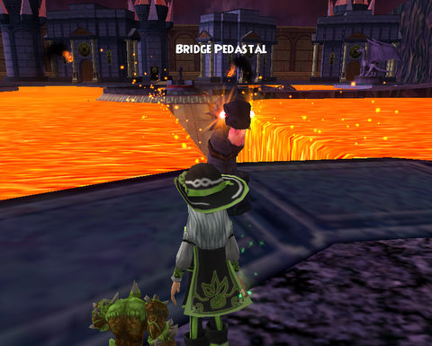

Back to: [West Karana](/posts/westkarana.md) > [2009](/posts/2009/westkarana.md) > [February](./westkarana.md)
# The clandestine Norrath/Dragonspyre connection

*Posted by Tipa on 2009-02-19 07:38:11*

Norrath, the planet itself, wasn't discovered by humans or elves or iksar or the ancient snake people or even the gods. It was discovered by the great she-dragon Veeshan, who chose this nondescript planet on which to raise her brood. She marked the planet with a swipe of her claws, claiming it as her own to all who could read her sign.

Her brood, the First, and all their many descendants chose that event as their emblem, until the time when the awakened Sleeper, Kerafrym, tore the moon of Luclin apart, and in defiance of Veeshan, chose for his symbol, himself, curled in the same way, bursting the moon. Veeshan may have been content to leave her mark on some forgotten frozen continent, but Kerafrym's mark would be laid across the entire SKY.

Those are the first and second pictures above; Veeshan on the left, Kerafrym in the middle, in EverQuest and EverQuest II respectively.

So, who is that in the THIRD picture, with nearly the exact same symbol? Veeshan? Some other dragon from Norrath's future?

Nope, the picture was taken in Wizard 101's Dragonspyre. I saw that last night while finishing my Crucible quests that grant me admittance to Dragonspyre Academy, and was so overjoyed to see a little bit of home in the game. Homage or coincidence? I don't know, but I loved to see it there.

Made me happy.

I dinged 50 (yay!) and started in on the Labyrinth last night -- a zone with eight boss fights in a row. The first two are Life bosses. After the first one, I gave up for the night, it was getting late. Those Life bosses are a real chore, not fun at all. Why can't all bosses be from the Death school?

## Comments!

**nestor diaz** writes: nice that you made it that far.by the way i'm a balance and life wizard the game is awsome i'm level 12 right now and right now i'm in fire cat alley.i have question how long did it took you from unicorn way to dragonsprye?

---

**Morgan Flame** writes: Its not really a comment it's more like some questions. So how in the world do you get that high in level? I'm only a level 9! I have really been wondering where is the Dark Cave? I looked everywhere! Another question, when you get to a higher level does it still cost to get into Cyclops lane and Firecat alley? Please reply.

---

**[Tipa](https://chasingdings.com)** writes: @Nestor -- it took me about three months to finish Moo Shu, and I have been adventuring in Dragonspyre since it opened in the beginning of February.

@Morgan -- I believe Dark Cave is the name of the cave that connects Firecat Alley and Cyclops Lane -- it should be on the map. I subscribe, so access to every area is included in the subscription, but if I stopped subscribing, it would cost to get into each new collection of areas no matter what level I was.

---

**[Cow Nose the 50 Pound Cat](http://cownosethe50poundcat.blogspot.com)** writes: Great fiind tipa, that is really cool.

---

