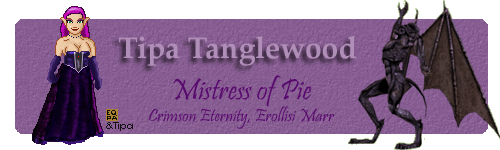
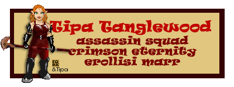

Back to: [West Karana](/posts/westkarana.md) > [2009](/posts/2009/westkarana.md) > [February](./westkarana.md)
# EQ: A signature trip down memory lane.

*Posted by Tipa on 2009-02-23 12:00:02*

Stargrace's [high speed romp](http://mmoquests.com/2009/02/23/now-thats-a-canon/) through EverQuest has made me nostalgic. REALLY nostalgic. I remember when each new victory, the culmination of much effort, many tries, and no little creativity, would bring us just a little closer toward -- I dunno. Guild status? That was part of it. The feeling that we were all a tightly knit group of friends that we could utterly rely upon? That was part of it. There was so much to it.

Back then, I used to make new signatures for most of the bosses we'd defeat... well, I guess looking at the signatures, you'd think the whole game was built around one certain halfling.

Most of these were hand drawn over EQ Pix pixel art dolls.

This one commemorated our first Terris Thule kill. I showed up to the raid really early to get screen shots of her dress. It's really complicated dress, with an underskirt and a see-through over skirt. Naturally, I wasn't a good enough artist to show that...

Terris' boss, Saryrn, was an incredibly fun fight, but the setup was murder. Our guild leader had this brilliant idea that we would save time by not fighting trash. Instead, we rogues would kill everyone via dueling, drag them to Saryrn's tower, and rez them.

BAD IDEA. Took FOREVER. And we rogues refused to do that again.

I loved the sand elf outfits in Lost Dungeons of Norrath so much, I decided that I should wear one of them, too. Again, lagging behind the group as I took screen shot after screen shot.

This signature predates the rest. This is back in old, old EQ, me and all my alts from the Erollisi Marr server and also Fennin Ro. Front and center is my druid, Etha, my main at the time. Tipa, my future main, is front right. She was probably all of level 13 at that time.

Concept screen shot for a halfling beast lord with a bixie pet. I was hoping SOE would see this, slap their palm to their forehead, and wonder why they hadn't thought of this themselves, and immediately release the Halfling Beastlord! Sadly, they passed this golden idea by.

Oh yeah, I remember this! This is when I won the annual Misty Thicket Bixie Hunt! Yeah, I remember it like it was yesterday :)

## Comments!

**[EverQuest: 10 Years of Ruining Lives &laquo; Bio Break](http://biobreak.wordpress.com/2009/03/02/everquest-10-years-of-ruining-lives/)** writes: [...] time playing CoH knowing how old it is and how far games have come since.  You’d have to go ask Tipa what the appeal is, I [...]

---

