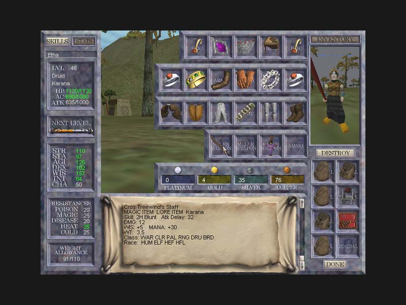

Back to: [West Karana](/posts/westkarana.md) > [2009](/posts/2009/westkarana.md) > [February](./westkarana.md)
# Sick Sixth Six!

*Posted by Tipa on 2009-02-23 18:44:46*

Okay, Stargrace [tagged me with a meme](http://mmoquests.com/2009/02/23/sixth-screenshot-meme/) to post the sixth screenshot from the sixth subfolder of my saved screenshots.

So that's what I'm gonna do. All my file names are actually a hash code I made so I wouldn't keep duplicate pictures so honestly, I don't know what picture is gonna show here.

This is from my EQ Classic folder, and shows us in a Hate raid, before it was made into an xp zone.

That's Bridgecrusher tanking, so this is either with United Norrath Coalition or A Twist of Fate, most likely UNC. I don't see any recognizable planar armor, but I do see Kunark armor, so that would probably make this screen shot from sometime in mid-late 2000.

I'm not going to tag anyone, but if anyone else wants to go through their screen shots -- sixth screen in sixth subfolder -- feel free, and link back :)

For Quain -- I loved the old UI!!!

Heh :)

Oh yeah, check out the awesome Sol B armor.

## Comments!

**Quain** writes: Don't forget the poor Bard there, she's kicking Imbrued Legs which are tres sexy planar gear.

I wish I could say was the sixth screenshot in my sixth folder, but it's probably the only EverQuest screenshot I have left. I think I just love it as a reminder of the fact that I played in the 'cockpit' UI for 50+ levels. In my defense, my computer was so terrible that it helped performance (which is also why I'm playing in the top down view).

---

**[Tipa](https://chasingdings.com)** writes: Added a REALLY old screenshot of my own :)

---

**Egat** writes: This is awesome!

---

**[Tipa](https://chasingdings.com)** writes: Heard some rumors about you, Egat... are they true?

---

**Egat** writes: Er? That could be anything... you must have been talking to Sebicakes about my pending marital status?

---

**[Tipa](https://chasingdings.com)** writes: That would be the rumor :)

Grats!!!

---

**Egat** writes: Thank you. I suspect this will kill my MMO days. I'd like to think marriage will be more 1v1 than massively multi-player anthing lol.

---

**[Tipa](https://chasingdings.com)** writes: Wow (looking back at the lower screenshot), I can't believe I was still using a Blackened Alloy Medallion at 46. I bet I still have all that gear around somewhere. Maybe not the BAM.

---

**[Tipa](https://chasingdings.com)** writes: Sorry I quit Facebook, but I wasn't really checking it that often. Do you use any other social web things? Twitter? I like Twitter these days.

~~Also, can I have your stuff?~~

So happy to hear you're finally getting hitched! Is this someone you met in England?

---

**[Caldabuse](http://www.twitter.com/cambrian_man)** writes: Whoa, it's Tipa. I had actually come across your blog a while ago, reading EQ2 and Wizard 101 stuff, but I didn't realize it was you until you posted your signatures (because I obviously don't read what is posted plainly on the site).

---

**[Tipa](https://chasingdings.com)** writes: Calda!!!! How's my fave gnome wizzie? Haven't heard from you in AGES!

---

**[Caldabuse](http://www.twitter.com/cambrian_man)** writes: Heh, I'm doing pretty good, been playing various stuffs for things, mainly EQ2 (on Antonia Bayle). I actually downloaded Wizard 101 again because of your posts so I've been playing that these days.

Anyway, I started following you on twitter (I'm cambrian\_man), it's just cool when I see people I know out about the internet.

---

**[Tipa](https://chasingdings.com)** writes: Well this weekend I'll be on W101 probably working on my PvP article if you wanna friend up. Do you still live in sunny California?

---

**[Caldabuse](http://www.twitter.com/cambrian_man)** writes: Yup, after a brief time in San Diego, I'm back in LA. I'm a Wizard 101 noob, mind you. I got as far as the early parts of Kroktopia in beta, but in release, I'm just going through the early stuff in Firecat/Triton/Cyclops stuff. My character is Devin Silverspear. )

---

**[Tipa](https://chasingdings.com)** writes: If you have the Sunken City quest, we're running through that tonight, you're totally welcome to come along. It might be early for you, though...

---

