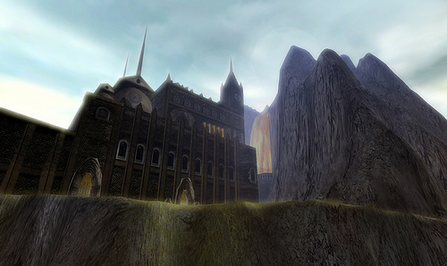

Back to: [West Karana](/posts/westkarana.md) > [2009](/posts/2009/westkarana.md) > [February](./westkarana.md)
# Gatheryn -- is this the Steampunk game for the rest of us?

*Posted by Tipa on 2009-02-25 08:14:39*

Yesterday [I wrote about "Neo Steam"](../../../index.php/2009/02/24/atlus-neo-steam-f2p-fantasy-steampunk-mmo/), which brings a decidedly Eastern, hardcore PvP, flair to that eternal conflict between technology and magic and the mystical substance that powers them both.

Intriguing? Yes, maybe, but -- it isn't Steampunk! Not to me, anyway. Just having a mystical substance called "Neo Steam" is not enough to make it Steampunk in my book. If it were called "Neo Granite", would that make it "Quarry Punk"?

Hey... actually... read it here first, okay?

[Tesh](http://tishtoshtesh.wordpress.com/) left a comment in that post pointing me to another Steampunk game called [The World of Gatheryn](http://www.mindfusegames.com/).

There's not much detail on the site, aside from concept art like the one at the top of this post, but ... come on, this is Steampunk.

> Step back in time to a place and era that never quite existed. Where steam engines trundle down the avenues and vendors hawk their wares! The sounds, the sights, the mysteries - all await you and your friends.

Come, journey to Gatheryn, a massive multi-player world of adventure, mystery and romance. Make your way through an ever expanding world, making new friends and enemies as you work through interactive games and puzzles, new adventures appearing with each successful solution. You can hop aboard the nearest air ship to reach a myriad of destinations or just to satisfy the explorer inside you.

Assume any of various roles of Victorian themed characters as you explore, socialize and quest your way through this amazing world. Scurry along the wharves and climb the riggings on wooden tall ships the likes of which you have never experienced before. Traipse along the avenues or skulk through the cemetery as the full moon lights your way. This is a time and place of mysteries to be unraveled and puzzles to be conquered, of land to explore and life to be LIVED!!

A social MMO ... set in the Victorian era ... with steam-powered machines walking around and even steam-powered pets?

This -- could be fantastic. I can't wait to see if they can pull it off. They are collecting email addresses for a newsletter and possible beta opportunities on their website, so if evenings spent chatting in the Queen's summer audience chamber might appeal to you, give it a shot!

They still appear to be really early in development, though.

## Comments!

**[saylah](http://notadiary.typepad.com/mysticworlds/)** writes: I looked into Gatheryn a few months ago and there doesn't seem to be much more information available now versus then. While the copy sounds steampunk the images I saw don't scream it. Still I'm likely to try it because there are so few options.

---

**Malfi** writes: Now THIS sounds interesting! Signed up for the newsletter. Let's see what they develop into. I've never been a huge SteamPunk fan, but I can't say I've really given it a solid chance. Recommended reading for me Tipa?

---

**[Tipa](https://chasingdings.com)** writes: Oh dear, where to start? KW Jeter's "Infernal Devices", Gibson and Sterling's "The Difference Engine", Stephen Baxter's "Anti-Ice", China Mielville's "Perdido Street Station" are all what I would consider "steampunk". Others may disagree. The Mielville books are, says Wikipedia, part of the "New Weird" movement, but I think they are strongly in the "steampunk" genre. The tone if not the particulars of Neal Stephenson's "The Diamond Age" echoes steampunk as well.

---

**[Tesh](http://tishtoshtesh.wordpress.com/)** writes: Aye, Saylah, it seems to be going pretty slowly. They may be another victim of the economic crash. Still, it's heartening that someone seems to get it, and I'm hoping they can pull it off.

Have you all seen the steampunk Star Wars art? Crazy stuff. The clockwork Death Star is my favorite.

---

**[Tesh](http://tishtoshtesh.wordpress.com/)** writes: Oh, sorry for the double post, but another reason I'm keeping an eye on Gatheryn is because it's using the Simutronics HeroEngine as a backbone, rather than coding an engine from scratch. I tend to think that MMO development needs to trim some fat, and good middleware like the HeroEngine might be one piece of the puzzle that allows for a more diverse selection in the genre. If WoW, EQ2 and the like can be challenged by smaller games providing unique and comparable (or better) game experiences, it's good for the health of the genre.

Plus I want a Steampunk game.

---

**[Tipa](https://chasingdings.com)** writes: Has any game using the Hero Engine actually been released? I hear a lot about it, but... all I see are games in development.

---

**[Tesh](http://tishtoshtesh.wordpress.com/)** writes: I've not found any released yet. I may have missed one, but all I've seen are "in development" works, too. That's why I'm hoping this one works.

---

**[Openedge1](http://simple-n-complex.blogspot.com)** writes: Yum...me loves Steampunk. I saw this alos on Aspendawns website...this would just be too good to be true...just like a Shadowrun MMO would kill (talk about scrips if it was done right), or the discussed World of Darkness MMO CCP is working on.

Basically this boils down to "make something besides straight Fantasy or Straight Sci-Fi" that is worth a darn, and you will bring in the customers..

Gimme!

(PS: No released games yet with HeroEngine. I sure am ready to see one. An engine made just for MMO's...heck yea)

---

**[Kasul](http://shatteredblog.wordpress.com)** writes: A World of Darkness MMO would be very cool, but honestly I'd rather see them branch backwards into the Arcadia and Changeling side of the White Wolf properties. Maybe it's sacrilege to say so, but the Werewolf vs Vampire feels a little done, though I'll be the first to admit White Wolf did it best.

We need a real steampunk game, MMO or not! Arcanum's heart was in the right place but the interface bogged me down. When Gatheryn gets closer to release it will definitely be one to watch closely!

---

**[Tesh](http://tishtoshtesh.wordpress.com/)** writes: I stumbled onto this Gatheryn bit today:

http://www.tentonhammer.com/node/63930

Interesting to me is that combat is only one "minigame", and not the most prominent one. I appreciate that, coming from Puzzle Pirates, but I'm not sure that the "WoW junkie" will find their groove in Gatheryn. That's probably wise to carve out a new niche, but it will mean coming to the game with a more open mind than just looking for "DIKU does Steampunk".

---

**[Tipa](https://chasingdings.com)** writes: I didn't have time to look at the news on other sites, but that one sentence makes me wonder if it IS in the Puzzle Pirates/Free Realms mode? In which case -- good for them!

I can't wait to see what they come up with!

---

**[Tesh](http://tishtoshtesh.wordpress.com/)** writes: Oh, yes, lest I be misunderstood, I'm a huge fan of Puzzle Pirates, I'm excited for FR, and this just keeps looking better. I'm really hoping they take some microtransaction lessons from Three Rings, at the very least. :D

---

**[Omer](http://mmohut.com)** writes: this game doesn't even work, Don't bother. The publisher is pretty bad, as their links are broken.

---

