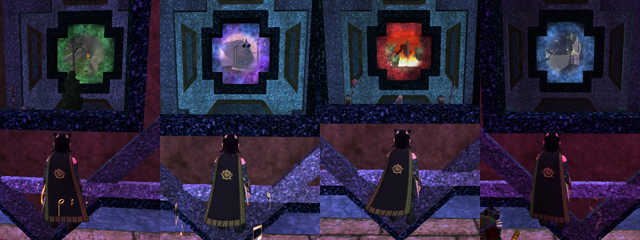

Back to: [West Karana](/posts/westkarana.md) > [2009](/posts/2009/westkarana.md) > [February](./westkarana.md)
# EQ2: Don't leave your guild hall without your appearance armor!

*Posted by Tipa on 2009-02-25 08:45:57*

It's been a long time since I peeked beneath Dina's appearance armor to see what all that cool stuff looks like. I'd gotten the TSO Tier 1 armor crafting book from a crafting mission Kasul and I duoed, and so was making TSO armor like crazy to fill up some gaping holes in my outfit.

But -- what does this stuff look like?

|  |  |
| --- | --- |
|
 everquest2-2009-02-22-23-56-36-63 |
 everquest2-2009-02-24-23-04-41-07 |

Yeah. Like THAT. You will never see my characters undressed again, I promise! On the right, Dina is in her normal outfit.

She's a bard. A troubadour! She sings happy songs that make people feel better! So... why does she dress in black? I DON'T KNOW. I have TRIED to put some color into her outfits, but it never works out, and soon enough she's back in black.

But -- cool axe, huh? Got that from Druushk last night, I think. We finished clearing Wing 2 and will probably finish up VP Thursday, leaving Saturday for TSO raiding or something. I love raiding. It brought me back to EQ2.

Sunday, Kasul and I did a bunch of TSO missions, including Anathema, one I'd never done before. It was full of cute puzzles, like the one above where you have to look through mystical windows at four planes from the original EverQuest, and place the correct idols beneath the window.

Was nice to get a glimpse into the past like that. Brings back so many memories!

Oh well. Time to get to work. Have a great day!

## Comments!

**[Hudson](http://hudshideout.com/blog)** writes: First picture looks like TRON

---

**[Tipa](https://chasingdings.com)** writes: You should see the FULL armor set. *shudder* or maybe not. It's pretty bad for bards.

---

**[Toldain](http://toldaintalks.blogspot.com)** writes: I'm delighted to hear that you had some better experiences with the TSO instances.

---

**[Tipa](https://chasingdings.com)** writes: Well, kinda. We mentored a level 50 character, zoned in, unmentored, and duoed the level 50 instance as level 80 characters. It's not really easy to fail an instance when nothing can aggro you :P

---

**[Green Armadillo](http://playervsdeveloper.blogspot.com)** writes: I have taken to inspecting quest rewards to see if there's anything I'd like to stick in an appearence slot. I'm leveling fast enough that A) solo quest reward gear is often out of date compared to my crafted stuff anyway and B) even if I did use the quest reward, I'd probably replace it sooner than I expect. Paradoxically, something that I'd keep in an appearence slot indefinitely but would never equip is more valuable to me than something that would give me a stat upgrade right now. :)

---

