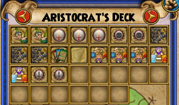
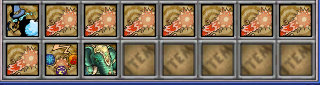
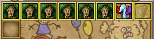

Back to: [West Karana](/posts/westkarana.md) > [2009](/posts/2009/westkarana.md) > [February](./westkarana.md)
# Wizard 101: Building a deck

*Posted by Tipa on 2009-02-26 08:50:13*

Wizard 101 is built around a card game, and that card game is built around your deck. Deck construction can be tricky. I was [talking with a friend](http://shatteredblog.wordpress.com/) about building decks for collectible card games last night, and he told me of some people who would bring massive decks of eighty or more cards to a tournament. How could that player ever get the card he wanted?

How indeed? In the best Wizard 101 decks, you always get the card you want.

These are the cards I turned up in my first round against two Ice school cats in Marleybone, as my 27 Balance wizard, Allison. Every single card in that draw, I will use.

If you've ever found yourself madly discarding cards to get to the card you want, you've probably been listening to the knowing professors of Ravenwood. But I'm here to tell you that these professors in their little classrooms and their magic trees don't know about life on the STREETS, man. They don't know how to keep things REAL. It's easy to push ever larger decks on students and advise them to put every new spell in their deck when you're sitting behind a lectern while magic chalk writes your lessons for you. It's easy to slip new cards into a student's deck without even telling them, when it's not you that's going to be going face to face with Malistaire and let me tell you, he doesn't waste much time casting Dark Pixies.

Even though each new world gives you newer and bigger card boxes, even though you have so many spells available, you can easily win normal fights with just a few copies of a few cards and never get a card you don't want to play.

This is Allison's regular deck. It can't hold all that many cards, but even so, it only uses just over half. Aside from the two heals from the Life school, there aren't even any spells from another school in the deck. Her secondary school is death, but there's no death school spells that are better than the equivalent balance school spell until Feint, for which she needs one more training point. After which Feint (+70% damage to target, you take +30% damage, costs 1 pip) will be in the deck.

Truth is, I could do with far fewer cards. Mobs in Marleybone's Hyde Park have around 500 health, give or take. I will pull two at a time, so I need to do around 1000 damage (more or less) in a fight to win. To be safe, I should probably have 2000 points of damage in my hand to easily win any normal fight in the entire zone.

Balance school is fortunate in that they can cast spells out of their school easily. Spectral Blast delivers a shock of ice, fire or storm to the opponent. Hydra does all three. Balance is the only school that is strong against creatures of the same school. But the concept is similar with other schools. Figure out how much damage you need to do, put double that in your deck, and no more.

Now add in your traps, blades, shields, heals and other similar cards. You need to have zero pip cards to play while you power up your damage cards. Just like your damage cards, you'll only want to put the zero pip cards that you'll actually need. Allison's deck contains the elemental shield because she is facing elemental mobs. There are no spirit shields in the deck because she is not facing spirit mobs. They could cast a random Death or Myth spell, but the bulk of their damage will come from their main school.

There are seven damage cards in her deck and nine zero pip trap/blade/shield spells. Doesn't she need more zero pip cards to charge up her damage spells?

No, because she has a little extra selection of cards that come from the items she is wearing or wielding. Her staff gives a bunch of nukes that are perfect for charging up spells, removing enemy traps (especially that -50% damage shield ice mobs are so happy to cast), and finishing off mobs who aren't yet ready to find honest work.

This is a good time to mention choosing the best pet and amulet for your wizard.

The sole purpose of amulets are to give you an extra spell. That's it. So which extra spell to choose? A six pip Minotaur? Well, maybe if you're a Myth wizard. But for his base damage (around 575 over two hits?), Allison could cast two Spectral Blasts for potentially double the damage.

|  |  |
| --- | --- |
|
 [wizardgraphicalclient-2009-02-25-21-40-47-99](../../../uploads/2009/02/wizardgraphicalclient-2009-02-25-21-40-47-99.jpg) |

 [wizardgraphicalclient-2009-02-25-21-40-58-82](../../../uploads/2009/02/wizardgraphicalclient-2009-02-25-21-40-58-82.jpg) |

While Fire Elf isn't a balance school spell, it IS one of the most efficient damage spells in the game, and is well worth the two pips necessary to cast it, especially if you don't have to waste a power pip to do so. Plus it effectively prevents enemies from keeping fire shields up, which is handy if your attacks include a fire component, as those of balance wizards can, and you're facing ice mobs, who will happily waste their time putting up fire shield after fire shield.

Pets are very nice and it's lots of fun to collect them. But the ones you use in battle should also be helping out in the fight. Allison uses the Jade Oni from Dragonspyre, which adds a five pip balance spell to her deck. She had to fight a lot of monsters, open a lot of chests and sell a lot of trash loot for the money to buy that pet, but if you're going to get a pet for the card it gives, it should be the best one, right?

But wait! We can't forget treasure cards! These live on your sideboard and are the one reason why you might want a larger deck -- to put more treasure cards into play. These cards just sit around doing nothing until you really need them. So, the treasure cards you choose should be the ones that you use when you REALLY have to have a specific card RIGHT NOW.

Heals, I choose you?

The Life school Dryad card heals 200 points of damage per pip spent, can be cast on other people, and can bring people back from the brink and put them back in the fight. These cards are not easy to get, but I know whenever I really, REALLY need a heal -- I can have one.

Like everyone else, I have many, many treasure cards, but aside from heals and spells in my own school (like the Hydra), how many would be better than just casting my regular spells? Maybe AE spells, especially in PvP. Or traps/shields/blades that I need only occasionally and can't easily get any other way. Most of the other alter school treasure cards should probably be traded to friends of the appropriate school for their treasure cards in YOUR school.

That's, after all, why we can trade treasure cards, right?

But what if things go horribly wrong, just disastrous, and you run out of cards? What then?

There is a little old lady in Colossus Boulevard that has your answer. You can buy a Reshuffle card from her for one training point (free if you're a balance wizard). When you play Reshuffle, all the cards you have played or discarded, except for treasure cards, are placed back in your deck. If you're daring, you could even have fewer cards in your main deck and just always plan on using a Reshuffle during a fight.

That would be living on the edge.

The little old card seller, who also sells Life Trap and three counterspells for elemental magics, sits in a huge house at the end of a long alley near Mandy in Colossus. Pay her a visit sometime, I understand she loves visitors. She's so lonely, living there, far away from the Commons, selling spell cards that are available no place else in the Spiral!

Remember, the best decks contain only the cards you will need. Don't be afraid to discard spells you won't need and add new ones that you will when about to fight a new type of monster. Decks that have every kind of spell in them turn out to not be really good at anything. Small, focused decks keep fights short. Choose your pets and amulets to complement your deck, and get a Reshuffle card just in case things go wrong and you run out of cards.

## Comments!

**yunk** writes: thanks, some of this I have only just been figuring out - like wearing clothes that give you your own school. Took me awhile to realize the other spells weren't helping much. I have been having a hard time with my deck and getting cards I don't need (like tons of 0 pip cards and 1 pip) and I was thinking it's too many cards in my deck. I guess looking at your deck I can probably get rid of the 1 pip cards

Woot i better go get reshuffle, I had read about it but didnt know where to get it or when it was available :) My balance wizard is 22 already. I actually never went into colossus, just to open it up so I can get the smith.

One strategy I read about in the balance forum at wizard101central is to have 2 reshuffle cards in your deck, and always discard the first one. That way you get infinite reshuffles. If that's possible - does the old lady give you more than one card like every other trainable spell?

---

**[Tipa](https://chasingdings.com)** writes: Cute trick with the Reshuffle card, hadn't thought of that! Yes, you can put as many of Reshuffle in your deck as any other Balance card.

Based on my analysis of all the cards I could find a couple weeks back, the cards hit a plateau in efficiency with the 3 pip cards. After that, higher pip cards do more damage at once, but without traps or blades to boost them, are pretty much just as efficient, pip-for-pip, as lesser cards.

---

**[Tesh](http://tishtoshtesh.wordpress.com/)** writes: The higher level pip cards have more "punch per card", which can be significant if you're packing things like Feint, though. Feint is more effective when paired with Spectral Blast than with Locust Swarm, for example. The "per pip" damage levels off, but especially if you're streamlining your deck, the "per card" damage is another important factor.

---

**[Tipa](https://chasingdings.com)** writes: @Tesh yup, if you're trying to cut down on the number of blades, traps and perhaps prisms you have to cart around, using high pip cards over more than one lower pip card is definitely the one to use.

---

**[Don&#8217;t Fear the Mutant &raquo; Blog Archive &raquo; Wizard101 - first impressions](http://blog.dontfearthemutant.com/?p=249)** writes: [...] The latter is even planning on writing a couple of guides for the game and has already published a great deck building article. So of course I had to download it and give it a [...]

---

**Nestor D** writes: wow this good info i well keep this in mind i sure need to get reshufull thanks for the info tipa.

---

**[Channel Massive &raquo; Blog Archive &raquo; The Electric Eye - End of February Edition](http://www.channelmassive.com/blog/?p=329)** writes: [...] has written up a couple of fantastic guides to Wizard 101.  Great information on building your own deck and the ‘hidden numbers’ of Wizard [...]

---

**[Saylah](http://notadiary.typepad.com/mysticworlds)** writes: Great information. Once I built and perfected my first short deck, I stayed short and never looked back. I find myself struggling if I switch over to a larger deck now. The only large deck I carry is for PVP when you need to react more creatively to other players and circumstances.

---

**[Rohan](http://blessingofkings.blogspot.com)** writes: You know, I actually reported this as a potential issue/bug back in Beta. In all CCGs, you tend to opt for the smallest deck possible, in order to ensure that only your best cards are used. That's why most CCGs--like Magic: the Gathering--have a minimum deck size, but not a maximum size.

---

**[Tipa](https://chasingdings.com)** writes: @Rohan are you suggesting W101 needs to have a minimum deck size? I dunno about that...

---

**[Tesh](http://tishtoshtesh.wordpress.com/)** writes: It's probably not important in PvE, but I could see PvP abuses that might come from a lean very small deck. That said, I think that the blade and trap stacking that tend to make up the bulk of W101 damage dealing means that there isn't really a degenerate combo like a three card instant win that we might see in something like MTG. The worst I can think of is a three card deck, two Reshuffles and a Judgement, maybe with a wand that eats normal pips (like the newbie wand)... but that would still just be too slow to be degenerate, even with power-pip granting and boosting gear. Maybe someone will break the game, but instinctively, looking at the game structure and designs to date, I don't think that the present card pool is degenerate enough to really need a minimum deck size.

That's not to say that it can't be a problem, just that I don't think it is with what we have at the moment.

---

**[Tesh](http://tishtoshtesh.wordpress.com/)** writes: Hmm... Now I'm thinking of making a deck with nothing but a pair of Reshuffles, some Judgements (bonus if two of them are from crown gear), a Dragonblade from a Pioneer/Friendly Dragon and some Feints to eat normal pips. More than one Feint won't stack, but you could have a pretty painful Dragonbladed Feint-fueled third turn 1326 power attack (assuming a free power pip to start, the first two turns using either a Feint on a normal pip or a Dragonblade on a power pip, then the third turn using up three power pips for a baseline 600 power Judgement, augmented by the Dragonblade and the Feint). Other gear boosts would just be a bonus from there. That's a pretty optimal "opener", and certainly not guaranteed, but even that isn't always enough to outright kill most level 30ish opposing wizards, not even if they have their own Feint up for another 398 damage. Higher level wizards would be even tougher to kill. Fizzles would obviously kill this, too.

I'm still trying to think of a degenerate combo that would always kill, and kill quickly. Maybe there's something with a Storm-Feint combo, maybe a Dragonbladed-Feinted Triton, but again, that's still third turn, and Fizzles mean it's not foolproof.

---

**[Tesh](http://tishtoshtesh.wordpress.com/)** writes: Oh, if you're using the Crown gear Judgement, that augmented triple power pip attack from the last post should be 1658, 2155 with an opponent's Feint active. Ouch.

---

**[Tipa](https://chasingdings.com)** writes: Problem with these is you give the opponent plenty of time to see what's coming. In PvP, your main hand should probably be heavy on various shields, traps etc, with your big damage cards on your sideboard. So you build up power by blading, trapping and charming, then draw a high-accuracy damage spell and lay that on them.

Anyway that's what I'm going to be trying this weekend as a 1v1 strat.

---

**[Tesh](http://tishtoshtesh.wordpress.com/)** writes: One more reason not to sweat the minimum deck requirement. ;)

If you're going into a mirror match with such a tightly focused "damage only" deck, it's almost literally down to luck in who goes first and who gets the power pips. I tend to design for more robust decks, including that concern for PvP defense. These were just thought experiments to try to find a degenerate deck. *shrug*

---

**[Rohan](http://blessingofkings.blogspot.com)** writes: Wizard 101 might not *need* a minimum deck size. But the pressure tends toward making decks as small as possible. This makes things weird if you give out bigger decks as a reward. As well, larger decks are more interesting, as they provide a more varied play experience.

For example, if your best 2-pip damage spell is the Fire Elf, why would you ever include another 2-pip damage spell in your deck? The answer is that you wouldn't. But that means that you make use of only a small subset of your cards, which leads to very repetitive games.

---

**[Tesh](http://tishtoshtesh.wordpress.com/)** writes: That's unavoidable, though, Rohan. It's just part of what Raph Koster labels "players optimizing the fun out of a game". There will always be "Spikes" in MTG parlance who don't derive fun from the play, but from winning. Likewise, there will always be Timmy and Johnny players who play for different reasons.

Even in Spike terms, that Fire Elf is a good example; it's the most powerful per pip in the two slot, but its damage is over time. If you need something dead *now*, it's not the optimal card. In a well crafted game, that sort of tactical consideration in different situations is what makes for good depth.

---

**[Tesh](http://tishtoshtesh.wordpress.com/)** writes: Oh, sorry for the double post, but yes, that does make larger decks a bit weird. I've found that the decks that allow for different multiples of cards (more than 3 copies of any given card) are more interesting to me for deckbuilding. Well, that, and I do like the big decks for trying out new ideas and just horsing around. *shrug*

---

**Nestor D** writes: does anybody know if death prisms well work to increase the damge of a life spell on a opponent.

---

**Nestor D** writes: does anybody know if death prisms well work to increase the damge of a life spell on a opponent.

---

**[Reviewing &laquo; Tish Tosh Tesh](http://tishtoshtesh.wordpress.com/2009/03/18/reviewing/)** writes: [...] especially an MMO, write about it!  The obvious examples to me are Saylah with Runes of Magic and Tipa with Wizard 101, but even Keen and Graev and Syncaine’s love letters to Darkfall have piqued [...]

---

**[Capn John](http://capnjohnsblog.blogspot.com/)** writes: So **that's** where you get Reshuffle. At the cost of a Training Point, it's not a Treasure Card, is it?

Because I LURVE Yunk's recommendation of having two Reshuffles and always Discarding the first. That's a wicked strategy, and a very useful find, Yunk ;)

As a Necromancer I'm naturally a fan of a Death Blade-enhanced Poison DOT, especially against a Life School Wizard/Mob. Using Feint + Death Blade + Death Trap and Wraith attack, I've hit Life Mobs for well over 2,000 damage (with a simultaneous 1K+ Heal to me). That's from a lvl 40 Necromancer with the best Crown Gear I can get at the moment. If there's even better gear waiting for me in Dragonspyre my boosted Wraith should hit for close to 3K, while fully Healing myself at the same time. And using the double Discard trick I should have very little trouble soloing most Dragonspyre Bosses.

Excellent guide, Tipa, and great suggestions from the other contributors :)

---

**[Tipa](https://chasingdings.com)** writes: Nope, regular spell card. I don't usually run my deck short enough to use it very often -- but I do always keep two in my deck and discard the first. Once or twice I have actually needed it, now that I've taken to using my short deck even in boss battles.

---

**rachel** writes: nice cards but i have better cards than you

---

**rachel** writes: i have cards like helephant and jade oni and that life tree and sand storm and meteor and evil snowman and life trap and reshuffle melt and vampire and some thing that death that in has a picture of lord night shade and i am a member and i have something to ask how come fire cat alley has lava on the ground and has n water at fire cat alley

---

**alex** writes: I'm a non-member and only have starter deck, I really need both my healing spells and weakness, I'm not high enough level to use novice life deck, pinewood deck STILL dosen't have space, I don't have any treasure cards that I need, my friends to trade with are usually offline, help!!!!

---

**[matt](http://westkaranawizard101)** writes: i grand got dragonfire deck fits 60 crds

---

**Danni** writes: Wow i didn't know about that shop :D I rushed through colossus. WHOO my balance wizard gets reshuffle for free! lol

---

**kaitlyn** writes: how does a lazy person lvl up faster???????? xD

---

**[tell me more about slyvila drake](http://wwe.com)** writes: tell me more about slyvilla drake.

---

**Blaze** writes: I like the guide but i cant level up because i have finished all the nonmember quests and all the bosses wont help!
Can someone please find me a trainer?

---

**Kitty** writes: Does anyone know Wolf Thunderstalker?

---

**Blazer** writes: I find with the fire elf card that a 0 pip blade card are really good together just to get in that little bit.

---

**[Tipa](https://chasingdings.com)** writes: Fire elf is a beast.

---

