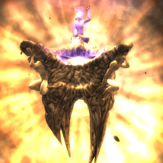

Back to: [West Karana](/posts/westkarana.md) > [2009](/posts/2009/westkarana.md) > [February](./westkarana.md)
# Spellborn Developer Chat transcript, Part 1

*Posted by Tipa on 2009-02-28 11:08:00*

This is a transcript of the first half of the Acclaim Spellborn developer chat. The first half, as in, I typed until my fingers could type no more -- and I was just halfway through. Even in the first half, though, many exciting topics come up. 

In attendance were David Perry; Howard Marks, the CEO of Acclaim; Neal, the CTO of Acclaim, Aaron from marketing and communication; Historian, the Acclaim Community Manager; and El Drijver, the Spellborn lead designer, on the phone from the Netherlands.

Any transcription errors are mine and mine alone. If something seems wrong, it's probably my fault, and I'm only typing this out for convenience; [the original chat as an MP3](http://www.thehistorian.org/?p=280) is hosted over at Historian's site. In particular, I have no idea how to spell the player names, and I'm sure I confused David Perry and Historian more than once.

Topics include how Acclaim came to publish Spellborn, how Spellborn compares to other MMOs, the combat system, PvP, whether EU players and NA players can play on each other's servers, and upcoming features such as the Arena, World PvP and the Marketplace.

All that and more (oh, my aching fingers!) -- after the break.

David Perry (DP): Before we go, I just wanted to give a little bit of history to this project. I don't know how many of you have been in on Howard's talks with the community, but Howard used to run Activision with (Harvey Kotek?). He was one of the ones that made the Activision you all know and love today. He decided to bet the future on free games online, and he was kind of watching what was going on in Asia. And so went down to Asia to see -- you know, to met the companies and see what was actually happening and we ended up choosing a game called 2Moons, which we liked the look of, and we were kind of interested to see what kind of response a game like that would get if we brought it to the Western market. You know, a free, big, MMO.  

 

DP: And as a result it turned out people liked it. Acclaim's now got nearly 10 million players, and we've got all kinds of feedback from the community, they wanted all kinds of changes to the games. I'm talking endless, endless feedback. And we found that, because the developer was off in Korea and that they had their own whole world over there that they're dealing with, the game is called Dekaron in Korea, that we weren't getting the kind of  access that we really desired as a company to be able to just make the changes the community wanted.

 

DP: And so Howard and I thought, maybe it's just a communication problem. Maybe we should just fly to Korea and present our ideas and the community ideas -- I have a 60 page Powerpoint. Anyway, we went down there and we did a presentation of all these ideas from the community, and still, we didn't have the access that we really wanted. So we were a little disappointed by that. And so, it's something that we've been trying to find a way around, we've been really working hard on this. 

 

DP: I made a speech at the DICE conference to the videogame industry about how important the community is, you can see that on my blog at http://dperry.com. 

 

DP: And so, you know the only solution we could see really was to start funding our own games. So now Acclaim is starting to fund their own games and we have this kind of rule that all the new games that we design have to have some sort of user-generated content or some way for the users to interact. 

 

DP: For example, we have a game called Kugamo? now, that -- it's very early in development, but the idea is that basically the whole game is going to be handed over to the gamers, with all the tools that we use, so if they can make a better level than we can, please do, and people will be able to play it. 

 

DP: So then Howard and I went to a conference in Korea called GStar, and this is a great place to go and see all the best MMOs in the world. And we saw this game, Spellborn, and we thought wow, you know, this game looked gorgeous, and I found myself looking around the show, but I kept going back to Spellborn. And so, we put a request in, we got a copy of it, and I was playing this game -- and it's kind of funny to be playing an MMO by yourself. Like there's this one person walking around the entire world. But it was a lot of fun, So, we actually decided in the end to go ahead and sign up this game.  

 

DP: And we talked to the team -- and talking to this team was like a breath of fresh air, because these guys are really, really, really pro-community and pro-listening to the gamers and responding. And that's -- every conversation I have with them, and this is the way the conversation ends up, that they are. And you can see it even from their forums and stuff the response that these guys do. Every discussion is about what they've been reading and what they need to do and why because someone in the community is saying it. So that's why this game, to us, became very very attractive. The game's beautiful and the developers 'get it' as far as we're concerned. 

 

DP: So, they were kind of locked into this retail box idea and subscriptions, but they're also smart, they were looking at the rest of the world going huh, if we want this game to be popular in Asia, we're going to have to think about going free with it. And so Acclaim was a great partner to help them take the game and release it for free. And so we're looking at the USA launch of Spellborn as really an opportunity to let their game get the attention that it truly deserves. Because when we release it for free, obviously we're going to -- anyone that wants to try this thing is just welcome to come and play for a good long time. It'll probably be between 10 and 15 hours of gameplay before they'll be expected to pay any money whatsoever. So you should have a very good idea of what the game is and if you like it or not. 

 

DP: So what I did was, I thought it would be cool if we could have a call. And what we wanted to do was get together key people from Acclaim that could answer just about any questions you guys have. So on the line today, we have Howard Marks, who is the CEO of Acclaim, and we have Neal, who is the Chief Technology Officer of Acclaim, and his highest priority right now is to get Spellborn launched, and he's personally setting up a whole new structure of servers to handle this game. So his job is to launch the latest, latest version of Spellborn, everything up to patch 1.03. And so you're welcome to ask him any questions about that whole process, because he's here on the call. But right now, the official word is, we're going to launch next week. 

 

DP: So it's not like, hey, we're six months away or something crazy. It's actually day by day, and we're saying next week. So all you need to do if you want to play the game is go to http://spellborn.acclaim.com and register there, and you'll be able to dive in and play as soon as this thing launches. 

 

DP: Now, 'Historian' is also on the line, and he manages our community, and I want to say thank you to Historian for setting this up. If you end up coming up with a question that we, for whatever reason, just can't answer, then Historian will connect with you after the call, and he will make sure that you get the answer that you need. 

 

DP: And Aaron is also on the call, he's in charge of marketing and communications, so he's the one who actually set this up and got it, you know, got the word out on this call. And then we have El, who's the lead game designer from the Spellborn team. Now, he has full access to the team members so, this is really just our first chat, there's going to be plenty of these as people actually start playing and experience the game. But if you enjoy this, and think this kind of thing is interesting, we'll do more of it. And he has access to the team members, so he can bring any team member on to the call that we want to include in the call. So if you guys want to talk to someone in particular on the team, we can make that happen.  

 

DP: So I want to thank all of you people for coming. It's really not that common these days for the executive team to spend time chatting with the gamers, but we think it's important, we think it's a very important part of the future of the industry that there's two communication between all levels of the company. And so this is really just the first one of these chats; there will be plenty more.  

 

DP: So I just want to open up the floor to questions. It's not only questions, if you want to discuss things, or 

chat about the game, or chat about the game, or chat about what you hope the game is, then feel free. Thank you. 

 

Historian (H): If you guys want to hop on and ask your questions, let me know, and I will open your mike and you can talk that way, or if you would rather type it in and have them respond, then we can do it that way. Alright, we'll go with -- let's see -- Mystery? first. I'll find you in the list. Okay, you have the floor. 

 

Mystery: I was just wondering if there have been any more official talks in the way of the IP blocking 

issue, you guys were working on that, trying to improve it everything like that. 

 

H: Howard, you want to take that, on the IP blocking? 

 

Howard: Sure. As of -- when we launch open beta which will be shortly, there will be no more IP blocking between any of the servers -- the Acclaim servers, which handle most of the world besides France and Germany and Belarus, and there will be no IP blocking on the Spellborn side as well. 

 

H: Okay, Reyorc? 

 

Reyorc: Hi, I just had a question about -- is Spellborn using a proprietary toolset in order to design the 

levels and the game itself? Is that something you came up with in house, or is it something you got from the original company? 

 

H: You want to take that one, El? 

 

El: Spellborn was developed with Unreal Engine, so we naturally use Unreal Editor, but it's heavily modified and heavily customized to fit all the things we need for an MMO. Because, obviously, being developed for a shooter, it didn't completely fit our needs. So we use Unreal Ed but it's heavily modified. 

 

H: Okay. GTONizer? 

 

GTONIzer: I was wondering if current Acclaim players will still be able to play on the European servers like Dravhere International and vice versa or not. 

 

H: Who do you think is the best one for that one is? 

 

DP: Let me, let me have him ask the question again so I catch it fully. 

 

GTONIzer: Well, the current European players play only on their servers and when the game gets released in the USA and Acclaim countries, will they be able to play on the European servers like International PvP/PvE? 

 

DP: Okay, I think I understand. He's kind of asking if the server will be one server, if the German players will see the American players and vice versa. I'll let Neal answer. Neal, are you on the call? Okay seems like Neal isn't there. El, do you have an answer to that one? 

 

El: I think there will be a separate client for Acclaim and a separate one for Europe, but they will be free to use and IP blocking is gone anyway. I don't really have the final details on that. That's how it should work. 

 

H: Tier Runner, I'm going to get to you as soon as I find you in the list. There you are. 

 

Tier Runner: I was just wondering about the community and everything, you said it's really important as an idea to Acclaim. I was wondering, what kind of plans do you guys have to keep us connected outside the game. I know some other MMOs have almost like a tracking system, where you can look at things on the server and everything, what kind of things do you have like that? 

 

DP: You know, that's kind of a multi part. At least on our end, as far as communicating with you guys, we'll be doing things like this chat, using things like our web site which we'll be overhauling at some point soon to use something a little more robust, so we can communicate faster. As far as getting data from the servers? I'm not sure – that's maybe a Neal, and maybe an El Drijver question. So I'll let them answer that if they can. 

 

El: I can respond a bit to that. At the start of Spellborn we really had this out of game conversation open, we even had guild chat accessible by IRC. But a host of problems happened during development, so that was closed off. In the future we'd like to have the mail available through the website, and account management and stuff, and guild chat and stuff as well. You wouldn't have to log in to the game to have access to those features. But that's really not available at the moment, and won't be in the short term. 

 

H: Okay, we have a question from Nea which is asking about better descriptions and localization in the US version. Nea, maybe you can tell me what version you've seen, and we can compare and contrast? El, can you answer that? He's wondering if we're going to have updated text in the American version. I know that you've been doing some bug fixes in the EU version, and we're going to be getting all those, but do you know if they've done any work on the text? 

 

El: Well, we developed the game in British English, and as far as I know, the American release will use the same text. I don't know which issues there were with the descriptions. Are there specific examples of what wasn't correct?  

 

H: On the question you have there about being open and accessible, a US player would be able to play on the French or the German servers, and they could play on the American servers, but we don't know if there'll be one server where they can see each other yet. So far, it doesn't look like it. 

 

El: What Nea refers to like descriptions and points of interest, we are, indeed, expanding that. 

 

H: Alright. John Extreme is asking about the long walking paths and quest helpers. Will they be improved? 

 

El: Yep, the quests and long walking paths, they weren't intended, they didn't come out as we intended. We're changing them, but it's a long process. Next patch, a lot of quests have been polished, so to speak. And were also adding quest tracker, quest management tools. This is a slow process, so over time, we will add those. 

 

H: Okay, I've got a few more questions here. World PvP, will there be anything done to promote world PvP. And is there an estimate on the release of mounts yet, or is it still kind of off in the future? 

 

El: World PvP, definitely. It's a feature I am looking forward to myself. First, we're working on some arenas like with a competition ladder. In the meantime, we've added some outdoor points of interest for PvP objectives, but that will take a bit longer than the arena fights. As for mounts, also on the planning but not this month or something. 

 

H: Alright, Reyorc has another question. 

 

Reyorc: Hi, I just wanted to ask, what was your greatest challenge in bringing Spellborn to the European and North American market? 

 

El: Well, for this project specifically, we do a lot of things different, and communicating that to the players is really hard. You have to somehow make things work as they expect it to work, and then it makes it even harder to make things different. Like the statistics on armor, and controls even.  

 

H: We have another question from Tier Runner. 

 

Tier Runner: I was hoping to find out, what are the features for each of you that really make the game stand out. I know I'm excited about the High House features and how the lore is ingrained within the game itself.  

 

DP: I think for me it's kind of a combination of that the combat system is up to the user, up to the talents of the actual player. You know I've heard a lot about how either these people are crazy, these people are nuts for coming up with a new combat system, or they're geniuses for coming up with a new combat system. I'm really interested in seeing if our users, our players, are willing to invest the time into the combat system to really master it. Because if they do, I think they're really going to enjoy it. That was one of the things that drew me to it. Also the visuals and the world are absolutely stunning, so  I found myself exploring just for the fun of exploring, just walking around going wow, I wonder what's over here. It was really, really amazing they work they've done.

 

DP: Secondly, you have to remember the game's they've done, that come over like from Asia, these titles have been out four or five years. You've got to remember this is a brand-new game, so it's one of those things. I can't imagine how visually stunning this game is going to be four or five years from now at the rate these guys are putting new content and new features into it. And so we're privately excited to know what's coming and to see what's coming, and then on top of it, we're very impressed with what we've seen thus far. 

 

DP: You're welcome to add to this as well, El. Tell us what you like about the game, or even about European players, what they like best about the game. 

 

El: For me personally, it's totally PvP. Time flies by when you're in PvP fights, and so our community and the devs during beta had a couple of PvP events and they've always been a great success. Yesterday, there was... Also they would help their own, there was a marketplace where they would trade reagants for crafting, and they had a little 1v1 PvP tournament. Absolute great fun. 

 

DP: For myself, I'm kind of the explorer type when it comes to MMOs. I tend to press my characters as far as I can, and go as far into the high level areas as I can before I should really be there and see how long I can survive. The combat system in this is really good for that. Even though I may not be technically strong enough to handle what I'm fighting, the way that I build my deck means I could survive longer if I have skill with my character. And that goes with other characters, too. A low level character with with right deck can just wipe the floor with somebody high level who has a deck that just doesn't work right.  

 

DP: So I think, skill decking, you'll see a lot of that on the forums, we're you're building up your skill deck, as opposed to other MMOs, where more than you're character, it's going to be the decks that make the big difference.  

 

H: Alright, let's see if I can jump back to some of these questions from the chat. 

 

DP: In fact we do have Neal, but his microphone doesn't work, but he can type his response. In fact, why don't we do that while Historian finds the next question. Neal, if you want to discuss how the servers are going and how we're doing in bringing this thing live? While he's typing that, feel free, Historian, to ask the next question.  

 

H: Okay, John Extreme wants to know if you had to explain in one sentence why to play Spellborn, what would it be? 

 

El: I would have to go again with the whole combat system with the aiming and the skill deck. It's a fresh take, and even if you're not an achiever or killer type, or like Historian says, an explorer type, it's still a great feature. 

 

DP: For me it's – this is a brand new game, a brand new MMO, not some old MMO. As you're doing right now, you're talking to the lead designer on the project and so you have a direct path so you can say, can you do this, can you do this, can you do this? It's like, let's make this great. That's how we feel about it at Acclaim. We see an opportunity here, it looks absolutely stunning, let's make it just amazing. The way to do that is just to speak up, so we're going to give you the opportunity to do that. That's what excites me, that's the most important thing for this game. 

 

H: Okay, here's a question which kind of slipped past us, which is a comparison with the MMOs that are out now, such as World of Warcraft, and some of the others. What makes Spellborn different from those? What sets it apart? 

 

El: I'm not going to dig into the combat again. World of Warcraft is based on episodic content and what we're aiming to do is make a world where people can entertain themselves for a long time, though we will expand with shards, which are a form of episode as well. We also aim to keep the world player-driven with the High Houses.  

 

H: I mentioned skill decks. El Drijver, can you talk a little about the skill deck and how to use it? 

 

El: Basically you can compare it to a normal hot bar, but there are several action bars above each other, and when you execute a skill from one bar, you have to move to the next. But it's represented with a big wheel, and when you execute a skill or choose a skill from the first line, it rotates to the next line, and you'll have to execute a skill from the next line. You can place your skills on these bars, on these tiers as we call them, any which way you want. Basically, you build your sequences. Of course, you can put the same skill above each other so you can always fire off the same skill, though it will be blocked by its cool-down. Basically you build your combos as you want them. That's part of the art, actually having the skills you need at a certain time on the combat tier where you are.  

 

H: Alright, there was a question about if we were going to take the Spellborn lore and take it into other media types such as comic books or action figures, that kind of thing.  

 

DP: That's a good question. In my experience in the game industry, if you have something good, then you don't actually have to do anything, because people will come to you. We're not out there pounding to make notebooks and lunch boxes. But trust me, if this game takes off, that's kind of something that we expect to happen somewhere down the road and we'll look at the opportunities as they come along, but we're certainly not out pimping this game. We're focused on getting it launched and supporting it, that's really our focus. 

 

DP: We have all the relationships for that. Back in the Earthworm Jim days, we did like sixty licenses.  

 

H: I know, I have a couple Earthworm Jim action figures. Don't tell anybody, but I do. 

 

H: How friendly would you say Spellborn role-playing is? I know a lot of places, some MMOs, some focus on it heavily, some focus on it lightly. The question is, do you think the role playing things, cosmetic things like housing, are really there? 

 

El: Player housing is on the menu, but long term. We don't really have features that the game will offer you like in-game marriages and stuff. But in terms of cosmetics, the fact that we don't have statistics bound to items, to visual items, I should say, allows players to wear what they want, which really adds to the roleplaying part of what we have now. 

 

DP: El, what sort of things do you hear from the community that you're going to be putting in pretty damn fast? What's the 'earlier' on your list, not the far off stuff, what's the stuff that you're thinking we really have to get on that in this game? 

 

El: Well, the first is the ability to trade items without the chat form of communication, so next patch we'll have the marketplace to accommodate that. It's a bit like the auction house in other MMOs like World of Warcraft without bidding options, but just the ability to buy and sell stuff there, which turned out to be a really nice feature. The next biggest thing is incentive for PvP, and we're starting with the Arena on that, then we're going to outdoor objectives. That's really what we're focusing on. In the meantime, we're working on a lot of smaller features as well, but these are the big chunks that are coming. 

## Comments!

**[Pete S](http://dragonchasers.com)** writes: Once again, thanks for taking all the time to transcribe this. Very much appreciated!!

---

**[Ysharros](http://stylishcorpse.wordpress.com/)** writes: Absolutely zero time to read this now but You Have Been Bookmarked, and thanks again for the effort. Since I'm typing my own fingers to the bone (translation, not transcription), I know how you feel.

Stumpy salutes you. ;)

---

**[Sente](http://adingworld.wordpress.com)** writes: Thanks for the effort to transcibe the chat Tipa!

While not part of the info for Spellborn, I found it interesting that Acclaim claims they have almost 10 million players. 

For me it was great to see that they will drop the IP block finally. What server I will play on in the end remains to be seen though.

---

**[Spellborn Developer Chat transcript, Part 1 | West Karana | The Historian](http://www.thehistorian.org/?p=284)** writes: [...] Spellborn Developer Chat transcript, Part 1 | West Karana Share and Enjoy: [...]

---

**Tierrunner** writes: I'm so glad I got to ask my questions!!

---

