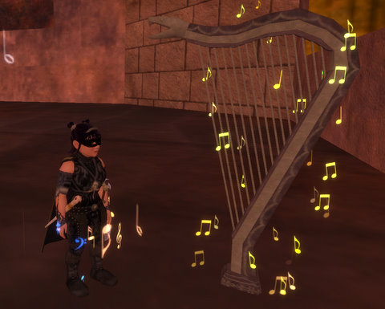

Back to: [West Karana](/posts/westkarana.md) > [2009](/posts/2009/westkarana.md) > [January](./westkarana.md)
# EQ2: The gladdest/saddest sight in Veeshan's Peak

*Posted by Tipa on 2009-01-04 00:32:37*

I'd worked so long on the [Spellborn comic](../../../index.php/2009/01/03/the-many-worlds-of-chronicles-of-spellborn/) -- way longer than I thought, it took forever to come up with the story and then I had to go back and make tedious reshoots to fill in the plot and a long time in Photoshop to make it look like Mercy and Erisa were in the same place at the same time -- that I thought I would reward myself with some EverQuest II time. I don't play enough of my favorite game :)

I grabbed the TSO Daily Double quest and went looking for group, but the same folks who brought me to Veeshan's Peak a couple of weeks ago asked if I'd like to come along again.

Duh! I'd LOVE to!

Back on the menu were the Elder guy and Druushk. Last time, there were plenty of mages. This time, plenty of scouts, so we had to fiddle with the strategy a little bit, but he died, and I got a nice upgrade to my Shard of Hate sword out of it. I love the looks of the sword, but the only stat it has is a + to STR, a stat I have already capped. The new short spear has +INT and +WIS, so more damage and more resists... good stuff. It looks kinda like a unicorn horn. Or a knitting needle... if you make your knitting needles from unicorn horns. I'm just going to have to go with that last, because I am, after all, a tailor. A knitting needle made from a unicorn's horn would be just the sort of thing an evil seamstress like myself might have. To get all stabby with.

After, we fought our way up to Druushk. He's the gatekeeper and blocks further progress into the dungeon, and is also the final raid mob for many classes mythical epics -- including mine.

Each time we pulled Druushk he'd get a little closer to dying. 15%. *1%*! That one was stupid. D. was just about to die, and we were all gratsing ourselves, when one person died, which boosted D.'s health. And then another. And then it was a wipe.

1%! And no Inquisitor in the raid! I bet if I wanted to go Inq again, I'd be raiding whenever i liked. Though her gear is cruddy. And she hasn't even got her fabled epic (hasn't even started on it).

Next pull, D. died. VERY happy. She dropped lots of loot, and people were excitedly getting their epic updates.

I ran into the back room for mine -- and there it was! The mystical harp! If I looted that, I could hand it to that Ice Maiden I last met a year ago and walk away with a very glowy axe! Maybe the game would recognize that I'd killed the Leviathan a couple of times, but before they added the epics!

But... though I could see the harp, I couldn't touch it or carry it away.

I'd killed Druushk, but my epic was as far away as ever.

Well, not really. If I can finagle my way into a Leviathan raid, I now know I can be raiding with people who can *kill Druushk!*.

The unicorn horn knitting needle, btw, may plainly be seen at my side. It doesn't really look like much.

The raid force meets again Tuesday to take on Nexona. And they do raid Leviathan. So, goal for me: Keep on being available for raids and work toward my Mythical. It's not something I really need, I'm not a raider, but it's something I would enjoy having just for the having.

