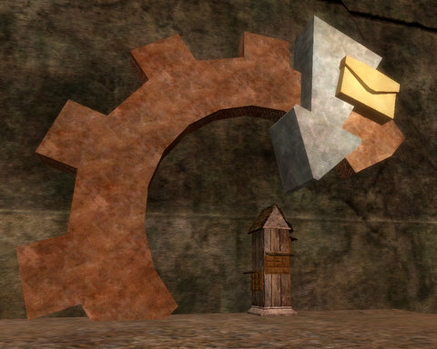

Back to: [West Karana](/posts/westkarana.md) > [2009](/posts/2009/westkarana.md) > [January](./westkarana.md)
# EQ2: You've Got Mail!

*Posted by Tipa on 2009-01-05 00:51:23*

I don't know why I missed this HUGE sculpture in the gnomish bit of the Moors of Ykesha before. So like, NOW you know where the mailbox is... from ORBIT.

I wish they did the same thing for the location of the druid ring. People kept trying to lead me to it. "It's right next to the landing pad!" "From the cannon?" "No, just where you get off the boat!" I run around for about ten minutes. "Is it the wizard spires?" "No, but it's near them." "Yay! Okay!" Five minutes later. "Okay, this druid ring. Does it look like other druid rings, or is it like a pipe in the ground or something?" "No, it looks EXACTLY like all the other druid rings! It's right next to where you get off the boat! Just go down a little and THERE IT IS!"

More running around. I load up the EQ2 Wiki. It has the locs of all the druid rings -- EXCEPT this one! It's a friggin' CONSPIRACY!

So I start taking the "down" bit to heart, and start circling the landing pad. Cliff. Cliff. Cliff. Certain death. Cliff. Monster. Cliff. Oh look, here comes a ledge. Complete with druid ring.

Duh. I can't imagine I could have possibly sounder thicker over guild chat.

I didn't spend all night sounding like a trickster god had struck me blind and the only cure was at the druid ring. I had just gotten back from driving my son back to school in Rhode Island, and was poking around the City of Heroes holiday stuff while totally forgetting about the rice I had steaming in the cooker. "Why am I hungry?" I thought, as I sent my ninja army chasing down another group of angry snowmen in Cap du Diablo. "Didn't I cook some rice?"

Cook, yes. Eat, no. 

I got a tell on XFire inviting me along on tonight's Daily Double, and nothing was going to stop me! I'd never been to this zone before. It went so fast that I'm not sure I've been there yet :P This was the bouncy one where someone bounces and catches balls of magical energy. I ran out of arrows halfway through that fight -- those nights in Veeshan's Peak go through arrows like anything, and I'd forgotten to restock.

The moment I got into game, the same guild that I've been raiding VP with asked me along again to clear further in. I declined, I had more important business, but it was nice to see I had a raid slot. Mythical is so close!

So that was fun. Afterward, I logged to do some housework and ended up watching movies on the PS3 as I copied some shows there from my computer. Next time someone visits, they will be ambushed by Blackpool :) It would be really nice if the PS3 preserved my folders, though. I did some virtual house cleaning as well. I cleaned up the mess in the Nostalgia guild hall basement. I'm a failure at decorating. I know what I want to do but I don't know how to do it and it just comes out all wrong. I'll try to figure out something in the privacy of my own apartment.

I was playing City of Heroes because I am about to cancel my account. Money is incredibly tight these days and I have to cut corners where I can. But I thought I would get a couple more play sessions in before I canceled and deleted all the files except the patcher. I'll probably cancel EverQuest as well, and drop the Station Pass for my main account, leaving me with only EQ2. It seems SOE is bringing out their new MMOs under a non-subscription model, so the Station Pass will become less and less valuable. If The Agency and Free Realms and DC Universe Online move toward RMT business models, what good is Station Pass? It's double dipping, and I'm not a fan of that.

I also organized those blog posts I've done comics for, as well as the old Crimson Eternity comics, and made them easier to get to, should you want to see them all for some reason. I was kinda surprised to see I'd been doing the CE comics, some of them, since I'd been blogging. I thought I finished doing those before the blog, but it turns out it wasn't as long ago as I remember that I was raiding in CE. It seems like ages. Anyway, the "My Comics" link in the sidebar will have them all.

## Comments!

**[Gordon](http://blog.weflyspitfires.com)** writes: I always thought the Station Pass was a good idea as it gave excellent value for money plus it let games such as Vanguard continue to grow and develop as it may have not done so on normal subscriptions only.

I had the Station Pass for a good while but unfortunately never had the time to play more than EQ2 so I got rid of it.

---

**[Tipa](https://chasingdings.com)** writes: It is a good deal, if you play more than two SOE subscription games. But I hav to ask myself if I am getting $720/year worth of enjoyment out of my two Station Pass accounts, plus my son's regular EQ2 account, which he doesn't even play any more. There are free games that can do what SOE games do. The only thing special about EQ and EQ2 are the people who play.

---

**[It&#8217;s madness&#8230; madness I say! &laquo; Gestalt Mind](http://raoworld.wordpress.com/2009/01/05/its-madness-madness-i-say/)** writes: [...] madness… madness I say! There is a lot of talk going on right now… a lot of people making statements.  These statements are not new.  In fact, [...]

---

**[Lazaretto](http://completeheal.com)** writes: Tipa,

You can't cancel EQ! We need to have a Nostalgia revival and finish the journey :)

---

**[Tipa](https://chasingdings.com)** writes: Maybe when they open the new server :)

---

