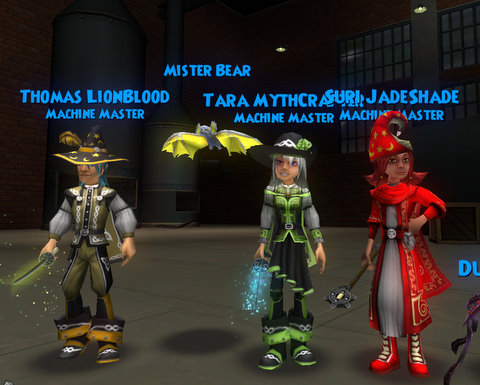
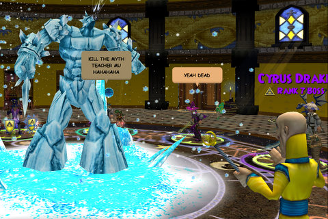
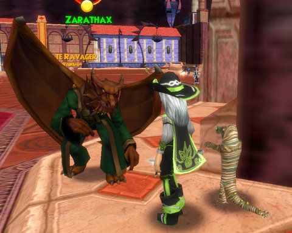
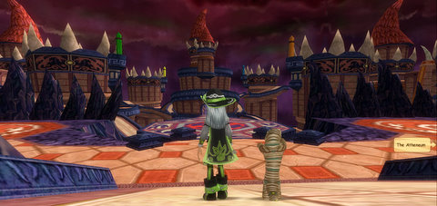

Back to: [West Karana](/posts/westkarana.md) > [2009](/posts/2009/westkarana.md) > [January](./westkarana.md)
# Wizard 101: Kensington... and DRAGONSPYRE!

*Posted by Tipa on 2009-01-10 14:28:28*

I'm mad at my Sprite. Most of the time, she's a good pal. We go out in the world, fight evil, have a laugh, do magic tricks... Sure, sometimes she asks about boys, but I just laugh it off. She's not ready, you know? She just isn't ready for that thing.

But little Sprites grow into Pixies so fast these days, and I blame myself. I should have known, should have had "the Talk", before she met... Thomas.

Oh, he's a [Friendly Necromancer](http://thefriendlynecromancer.blogspot.com/), all right. VERY "friendly". So friendly that he took my Sprite from me. And I don't know where she's gone now. I just want her back. I just want to know if she's safe, if she's okay.

I guess I should tell you the whole story.

It's very hard in Wizard 101 to meet up with people you know outside of the game. You have to set a specific time and place to meet. At least you don't have to worry, in Wizard 101, about if you're on the same server as your friends -- server switching is transparent and automatic.

Thomas, who chronicles his adventures over on "[The Friendly Necromancer](http://thefriendlynecromancer.blogspot.com/)", told me through Facebook that he'd be on at a certain time and place, and so we met up in Moo Shu.

I hadn't summoned my Sprite. So I had no reason to be suspicious.

It was great meeting the famous Thomas Lionblood. We became fast friends and wondered what to do. We talked about the Oni loot problem. How hard it was to level. I thought [Suri](http://notadiary.typepad.com/wizardadventures/) would want to be here, so I sent her an email and in a few minutes she, too, was online.

I thought tonight would be a wonderful night to do Kensington, and Thomas and Suri agreed. We all knew it would be a long night. Kensington Court is the longest, most brutal and most punishing instance in all of Wizard 101. Nothing before it can prepare you for the pain, though Sunken City can come close if you do it when you get the quest. Moo Shu has nothing on it.

Kensington is fight after fight with mobs that have north of 2000 health each. And they come in groups of four. And they are all elites. And a lot of them heal themselves. And it takes about three hours.

Whenever I would cast my sprite, she'd be all "Oh, Thomas! Do you need a heal? Do you need another heal? What if you still get hurt? Will kisses make it better?" Poor Suri, who did most of the damage and took most of the aggro, would be perilously close to dying (while I charged up heals to keep her alive), and Thomas would be at full health, surrounded by four or five Heals over Time, and my Sprite tossing Pixies at him like she'd just come back from a fire sale at the Pixie Deluxe Warehouse.

It was kind of embarrassing, actually. She was just ALL OVER him.

It took so long that each of us had to go off and do other things in the middle. We managed it, though. We killed Stoker -- TWICE. We each got a good amount of experience (and I finally leveled to 46!) I discovered I had a bat pet I didn't know I had. Suri says I must have picked it up from Wavebringer during one of my Plague Oni runs... so they were worth SOMETHING anyway.

The only loot I pay attention to in Plague Oni runs is the shoes!

It was crazy late when we finished. Thomas had a friend who was in the middle of Counterweight West, so we went and helped him out. I was fading in and out of sleep by the time we were done, so I crashed...

Thomas, though, went on to Dragonspyre, just released on the Test server.

When I woke up, I went, too :)

There's a little mini quest you have to do before you can go to Dragonspyre. You have to go back and talk to Merle Ambrose, and he'll send you to talk to Cyrus Drake, the malevolent professor of the Myth school -- and brother to the villain of W101, Malistaire, former head of the Death school.

Cyrus sends you to meet him in the Myth tower, where he goes bonkers and attacks!

Some of the players just got a little TOO into it. I think they have teacher issues.

After what seemed like HOURS of loading, we were finally let in to see the Fifth World. Off to the left as you enter if the Basilica, home of the old Dragonspyre Academy, the most prestigious school of magic on the spiral. Gone, now. Destroyed. Enmeshed in Malistaire's evil. He tossed out the old dragons who ran the place, and now he is the big boss.

I ran down the stairs and right into Cyrus Drake! Taking up my sword, I prepared to fight, but he cautioned me against that, claimed that he had only fought us to make sure we were prepared for Dragonspyre, and that he would help as much as he could to defeat his brother. He couldn't come any closer to the city, though, or Malistaire would be sure to sense it.

We wizards would, once again, have to be the foot soldiers in this magical war between two brothers.

Time was short, and the need was great, so I did the only thing I could think of to do, the thing that would do the most good, the quickest.

I went shopping!

This is the Life outfit from the vendors. There was a store for rings, a store for shoes (!), and a store that sold both hats and robes. No pet store that I could see.

Many of the patterns seemed familiar, but there are some hats that look like dragon skulls... those are really cool. But we Life wizards just get a little green beret.

I think I know now how John Wayne must have felt.

After surviving a full-press Pun Ambush in the Library (I won't repeat them here... I don't want to draw out the torture), I was sent deeper into the city to talk with Zatharax, who told me I'd have to spark the crystals in six towers -- the towers of the old schools of magic -- in order to open the portal that brings me deeper into Dragonspyre. He sent me into a three dimensional maze of confusion.

Doors that teleport you places. Tower tops crawling with evil creatures. Twisting paths and dead ends. 

I could tell right away that this was a place of evil.

The experience from the first few quests was fantastic. I dinged 46 again almost immediately (my test character is somewhat behind my live character) and was a couple bubbles in by the time I was done.

It's more of the Wizard 101 magic. The monsters are tougher and the puzzles are harder, but it's still the same game. I don't know if they are raising the level limits. There were no extra spells sold by the professors, and I couldn't find a treasure card vendor (I may have just missed him). There are definitely more types of monsters running around, and though Dragonspyre looks fiery, there are monsters and bosses of all schools there; fire wizards won't be saddled with any unfair disadvantages.

What little I played seemed pretty bug free; Professor Moolinda Wu asked me to see her when I turned 46, but she didn't have anything to say to me (neither did the one in the live game).

I'm very much looking forward to playing through Dragonspyre when it goes live!

By the way -- what was that QUACKING I heard while we were fighting Cyrus DRAKE?

## Comments!

**[The Friendly Necromancer](http://thefriendlynecromancer.blogspot.com)** writes: BeWaRe, ThIs RaNsOm NoTe'S aWeSoMeNeSs:
I hAvE tHe PiXiE. BrInG mOrE sEw ShE aNd BeAr Or I hAnD hEr OvEr To MaLiStAiRe! MuHaHaHaHaA!

---

**[The Friendly Necromancer](http://thefriendlynecromancer.blogspot.com)** writes: p.s. I'm glad they used lava in Dragonspyre . . . it's not a good video game without lava.

---

**[Danshir](http://themmoexperience.com)** writes: Ok, Tipa. I finally played some of Wizard 101. I only got past the tutorial before I had to get off the computer.

Ninja..Pigs...That's all I can say. I'm scarred for life. But I'll admit it was entertaining. I'll try to play some more tonight and post something about it.

---

**[Tipa](https://chasingdings.com)** writes: Ninja Pigs ROCK. That's all.

---

**Jason** writes: I've played through all the free area and got to level 10. I'm debating on paying for membership and playing further. I want to like the game, but I'm scared it's going to be a bit repeatitive.

---

**[Capn John](http://capnjohnsblog.blogspot.com/)** writes: Danshir, get yourself 4,000 gold and you can buy a Ninja Pig Pet, if someone is nice enough to port you to Moo Shu ;)

And as a Life Wizard (Main) can I just say I love that Green Beret! It looks awesome! Do the Death Wizards get a Skull Hat out of Dragonspyre? That would be cool, coz my second Alt (after my other Life Wizard. What? I like Life Wizards :P) is a Necromancer.

---

**[Danshir](http://themmoexperience.blogspot.com)** writes: Danshir, get yourself 4,000 gold and you can buy a Ninja Pig Pet, if someone is nice enough to port you to Moo Shu ;)

I'm interested..and scared.

---

**[Tesh](http://tishtoshtesh.wordpress.com/)** writes: I've recently purchased some Access Passes, and I find myself very happy to be able to buy content instead of subscribing. I can play at my own pace, and not sweat the ticking clock of a sub. This is exactly the sort of thing I was waiting for, since I quite liked W101 when I played in the beta.

It's good to see someone else having fun with the game!

---

**[Saylah](http://notadiary.typepad.com/mysticworlds)** writes: Oh man Tipa, that was priceless!! I did a messy rushed version. I'm so glad you did a post worthy or our adventure. I had two rough W101 nights back to back with having to do instances in a single session. So I just wanted to post it and thank folks before it was too far after the events.

hahaha - I'm laughing to myself because your description of your sprite healing Thomas, typifies the funny snark I mentioned you do when that happens. Classic funny. Having been there in person I can't stop smiling.

@Jason - In the beginning I worried about that too especially since the interiors of the boss rooms look the same in the same zones. However, if you like a good story, scenery and a lighthearted fantasy setting, you just can't beat W101. Seriously, and I've played a lot of MMOs. I often sit down thinking, "Eh, let me just knock out one quest tonight." Next thing I know it's midnight! WAR when it was busy was that captivating - lose track of time. W101 is ever bit as engaging but in a different way.

Thanks Tipa and Friendly for a great time.

---

**bob** writes: hey can any one take me to moo shoo and what are the pass things do the ninja pigs cost that much srry for all the questons just need to know also i dont have 4000 gold so it will take me some time

---

**[bob](http://deleted)** writes: how do you get access passes

---

**[Tipa](https://chasingdings.com)** writes: Not sure what you mean by access passes. If you don't subscribe to the game, you can by access to the parts you don't have with crowns -- a window pops up when you try to go somewhere you've unlocked but don't have access for.

If you ask around Bartleby, you can often find people willing to bring you to Moo Shu. The Ninja Pig is pretty expensive, but the money shouldn't be too hard to get -- money comes much more quickly once you get into Krokotopia.

---

**[Jordan](http://Wizard101.com)** writes: I Love This game it is soooooooo fun!!!!!!!!

---

**[Tipa](https://chasingdings.com)** writes: @Jordan How are you liking Dragonspyre and PvP, if you've been there or done that?

---

**[amanda](http://wizard101)** writes: It ugly.

---

**Talon Ironwraith** writes: I just started playing like a week ago. I am now at Krokosphinx and I can't beat the dungeon in the barracks can someone help me??? I'm a Level 24 can some one email me and help me beat the dungeon.

---

**[Tipa](https://chasingdings.com)** writes: Which dungeon is that?

---

**james deathshard** writes: i was windeing what level shoud you be at when you enter mooshu.
i am level 33 and still at the start of marleybone

---

**Death wizard** writes: that sprite story is o funny! also i wonder if i lot of ppl are so eager to kill a teacher o.O
but yea i am a lvl 30 death wizard in mb, i cant wait till mooshu, it will be a change, cause mb is all scary and mooshu is all pretty and nice (i prefer scary, since im death :D) i just wonder when ill get to go, still have to get past ironworks...

---

**[Tipa](https://chasingdings.com)** writes: @James -- I'd wanted to be 35 when I started Moo Shu, but I was just 34. Sounds like you must have done Grizzleheim to be such high level at Marleybone! I doubt Marleybone will be that much of a challenge for you.

@death wizard -- After Ironworks, you're pretty close. Big Ben is the last required instance; that opens Moo Shu for you.

---

**miranda deathspear** writes: I just wanted to say thanks for your posts. I've only been playing wizard 101 for a month and have absolutely fallen in love with it. I was afraid that it would be too easy and kid centered but after making it to level 43 I know that the game is not overly easy. I too can log on to play for "only an hour" and find myself still happily engrossed three hours later. Hopefully i will finish up Moo Shu in the next few days. I am really looking forward to unlocking Dragonspyre for myself and not being able to go only when a friend is over there. Again, thanks for the posts and tips. They have helped a lot.

---

**[Ryan](http://Ryanville)** writes: Hi this is fun & stuff actually laughing out loud.

---

**[Ryan](http://Ryanville)** writes: Hi this is cool & stuff Laugh Out Loud this is the abreviattion of it lol.

---

**[Ryan](http://Ryanville)** writes: I just wanted to say thanks for your posts. I've only been playing wizard 101 for a month and have absolutley fallen
in love with it. I was afraid that it would be too easy and kid centered but after making it to level 43 I know that the
game is not overly easy. I too can log on to play for"only an hour" and find myself still happily engrossed three
hours later. Hopefully i will finish up Moo Shu in the next few days. I am really looking forward to unlocking
Grizzlehiem for myself and not being able to go only when a friend is over there Again, thanks for the posts and
tips. They have helped a lot.

---

**[Ryan](http://Ryanville)** writes: Sprites ROCK. That's all

---

**[Ryan](http://Ryanville)** writes: Sprites are awesome

---

**[Ryan](http://Ryanville)** writes: I have to be a level 20 to return to Grizzlehiem

---

**[Ryan](http://Ryanville)** writes: Anthony's a dumb at Wizard 101

---

**Amber Pixiedust** writes: Hi, Tipa
Just wanted to say that I have the same problem with my sprite. I am level 32 Life student and I, like you was in first position fighting and I had a male friend fighting with me and she kept healing him. There I was taking all of the blows and having to heal myself while she is healing him (who didn't even need some of the heals). I believe our pixies are very fickle. I wish I had discovered this game and all of these wonderful sites sooner. 
You all are truly amazing (including Friendly) and this really incredible and addicting game.
Maybe one of these nights I can catch up to you all.
Amber Pixiedust, aka Sharon Smith

---

