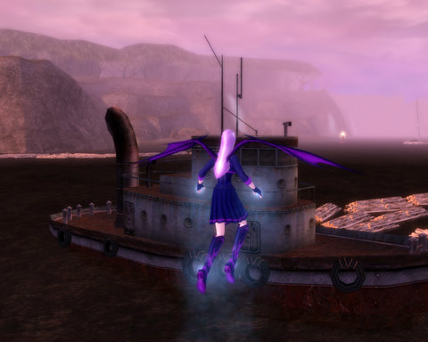
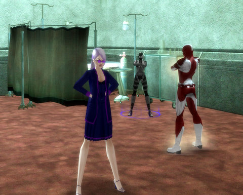

Back to: [West Karana](/posts/westkarana.md) > [2009](/posts/2009/westkarana.md) > [January](./westkarana.md)
# Veeshan's Peak, illustrated by City of Villains

*Posted by Tipa on 2009-01-15 00:25:58*

The pickup raid group I'm with killed Venril Sathir and cleared up to Elder Enron in VP last night, but I'd crashed earlier and after I rebooted, didn't dare launch FRAPS and XFire in case they were the cause of my crippling lag, so no pictures. Since I hate posts without pictures, I've illustrated last night's raids with pictures of an entirely unrelated mission in City of Villains.

See what I did there?

Why has "see what I did there?" become such a meme? It's something you say when you think you have done something clever but are afraid your readers are too dim to 'get it', and you want to point it out, but in such a way that people think you REALLY mean "what an obvious joke, I am making fun of myself." It's a subtle way of putting people down, like using Latin pointlessly (I am the most *amica curiae* you will ever have!) or spelling English words from French roots with all the correct accents (I made a *crêpe* from my *résumé*. It was the *piece d'resistance* of the *pas de deux*).

See what I did there?

  
*The raid gathers outside Venril Sathir's lair in the dungeon of Old Sebilis.*

I wanted to raid; my computer didn't. The raid leader whispered at me to see if I was coming, but I was already there :) Just fading in and out as I frantically tried to adjust the settings so that I wouldn't lag so much.

Nothing was to be done. By the time the raid was assembled, I was seeing the raid as a series of dramatic, action packed stills, and I was as interested in what was coming next as anyone. I had zero control, and it wasn't a big surprise when I ended up suddenly dead. I revived on the other side of the dungeon from the raid, tried to catch up, died again. I asked for a Call of the Hero from the conjurer in the raid. He pulled me to the raid, and then I crashed as everyone rushed into the Lair.

I pressed down the power button on the laptop until the whole thing shut off. Booted it back up, loaded EQ2, got in game, got an invite back into the raid, headed into the Lair and didn't have any other problems the rest of the night. Lesson learned. Reboot before raiding.

Back when I started raiding in EQ1, before they gave all the options to cut down on combat spam, my dial-up modem couldn't handle the load. I'd still be watching the fight two or three minutes after it had ended as my system struggled to catch up. I cast spells blindly. It wasn't any fun at all.

  
*Venril Sathir is a raid you win by paying attention. Here, the entire raid keeps their power near 50% or the raid wipes.*

A lot of people dread the Venril Sathir fight. I love it. It's not about the DPS or the intricate strategy. It's all about staying focused and paying attention. If everyone on the raid can do three things, Venril Sathir dies. If anyone on the raid doesn't do their three things, the raid wipes, and you can clearly see in the combat spam just who it was that wasn't doing their part.

Attacking Venril Sathir wipes the entire raid, nearly immediately -- UNLESS there's a person clicking the two pillars near his throne one after the other with an item taken from a previous raid.

After awhile, Venril gets a little sneaky, and summons a Watcher. The Watcher watches the raid, and if anyone's power goes below 30% or above 70%, kills that person and anyone near them. That's the first thing. Keep your power near 50%. The Watcher will occasionally cast a debuff on some people that will make spells and combat arts use 4x the normal amount of power. Which can easily bring your power < 30% if you're not paying attention, so only autoattack then. That's the second thing. Lastly, VS spits out a progressive poison DoT which will soon kill you. Click on your Noxious Cure to remove it.

We took him down on the third pull! Which is REALLY GOOD for a pickup raid. It's excellent, really.

  
*We cleared the first couple of minor names in VP as a finisher.*

Since we plan on spending most of Thursday night clearing VP, hopefully up to and over Nexona, we went into VP early to do some clearing. I've never been in on the start of a VP raid before, so there were a couple of minor nameds I'd never seen that dinged the quest you get to kill all the nameds in VP. We tried a couple of pulls on the first real named, Elder Enron, but left without him being dead.

Thursday, they plan to open the night with a quick Leviathan kill. Levi is now the only kill you need to get flagged for VP. It's also the next kill for my Mythical epic weapon.

I'll be there for sure :)

## Comments!

**[The Friendly Necromancer](http://thefriendlynecromancer.blogspot.com)** writes: I think I see what you did there! um, nope . . . no I really didn't—yes, yes I see!—ok, no I didn't.

What's your take on people that know the difference between an em dash, an en dash, and a hyphen?

—
–
-

See what I did there?

p.s. flashbacks to EQ1 raids where I'd point my cleric's nose down to avoid the lag

---

**[Toldain](http://toldaintalks.blogspot.com)** writes: Fights like that are the best part of Kunark.

---

**[Ysharros](http://stylishcorpse.wordpress.com/)** writes: *cough* Piece de resistance *cough* -- ignore the lack of accents, I can't be arsed to go find them and put em in. But it's not d', I'm sure of that, being one of those strange French people by birth. Then again, as someone who knows the difference between em- and en-dashes and hyphens and yet doesn't adhere to it, I probably don't have a leg to stand on for making corrections. ;)

It's interesting though, I always thought SWIDT? was more of a nudge-and-wink routine than a "I'm so much cleverer than YOU" routine. Now I'm going to have to go back through my comments and see who was being snide at me!

---

**[Tipa](https://chasingdings.com)** writes: I think it's about as subtle as an Applause sign in your living room. But that's just me :)

---

**[Ysharros](http://stylishcorpse.wordpress.com/)** writes: I wasn't clear. No, it's not subtle, but it's not subtle in a self-conscious way (nudge nudge wink wink) -- I just didn't think it was not subtle in a one-upmanship way.

Not only am I gullible, I'm naive. And no, I can't afford another bridge this week, I'm full up. :P

---

**[Danshir](http://themmoexperience.com)** writes: I remember having to stare at the ground in open wonderment when I ran through very laggy areas, especially raids. Can you imagine how that would actually look like ?

Warrior swinging his swords like crazy while staring at his toes, praying hes hitting something..

---

