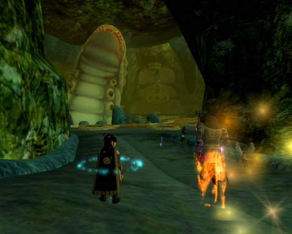
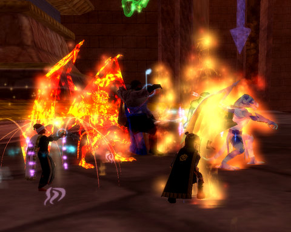
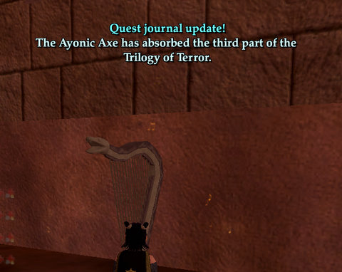
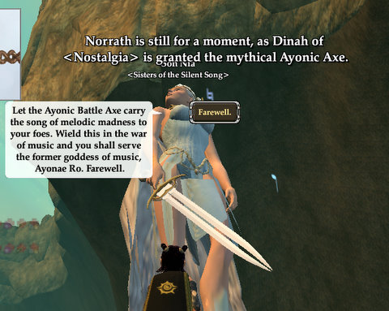
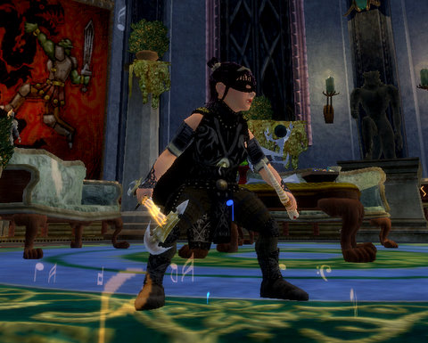

Back to: [West Karana](/posts/westkarana.md) > [2009](/posts/2009/westkarana.md) > [January](./westkarana.md)
# EQ2: All of Norrath is still for a moment...

*Posted by Tipa on 2009-01-16 00:51:24*

Regular readers of this blog may know that my eyesight is really bad. Tonight, I set up my laptop to use an old 1280x1024 monitor that I could set pretty close instead of its own display, a 1680x1050 display that is really cool, but has tiny pixels. I can see again! I can actually read all the text on the screen, and follow conversations!

It was pretty important to do so, because tonight was a really good night, and I wanted to see it all.

Troubadours aren't fantastic DPS, we can't tank and our healing won't save anyone, but we're pretty darn useful as support classes. One of our big abilities is Perfection of the Maestro, which, for half a minute every few minutes, turns the casters in our groups into unstoppable killing machines. Our Mythical epic weapon extends that from just our group to our entire raid. When I started raiding with Ascarey, the raid leader assured me that if I signed up, I'd get my mythical just so the raid could have that benefit.

All I needed was to find three evil harps in three very obscure places and suck the evil from them, into my Ayonae Axe. The first harp was guarded by Venril Sathir, and I got that about a year ago.

The second part was in the the Leviathan's Lair, and the old Peni-saurus himself just happened to be the first on the menu. Since he is now the gatekeeper for Veeshan's Peak, there were a few people eager to see him die.

Like Venril Sathir, Leviathan is a simple mob that just requires you to pay attention. He reflects spells, has an astounding regeneration rate, casts nasty AEs, and in general is Hard To Kill. So you could pling him from the outside for hours and maybe take him down -- except that if you take too long, he resets, ruining all your progress.

You can't kill him from the outside. But you can kill him from the IN-side. He has a lot less protection there. So to kill him, you simply kill the huge fishman guards, loot the skins from them -- they each have a single charge of an illusion that turns you into a fishman. Put that on, wait around until you get swallowed by Leviathan, then root around in his stomach until you find a parasite there, kill it and loot the Vile Fluids they drop, get spit out, continue until you have maybe thirty fluids or so, then get swallowed again, and start tossing them at his innards.

Pretty soon, dead Levi. And the second harp.

Off to Veeshan's Peak. We ran in and killed Elder Enron on the first pull -- flawlessly. Next was Druushk, the guardian of the third and last harp. This is yet another fight that rewards following the script over sheer dps (though dps is needed). It's also a gear check, with everyone really needing more than 9000 heat resistance to survive. I'd bought some better jewelry from the shard merchants in the Moors of Ykesha, and won the Tier 2 bard tunic from Levi which also had heat resists on it, and I finally hit a career high of 12000+ heat resistance in VP -- buffed.

For the very first time in VP, I didn't feel like a gimp. I still died a lot, though.

Like last week, it took three pulls to kill the dragon. After it was dead, I ran into its lair, and sucked the third part of the evil song from the harp into my axe. The raid was ending -- which was too bad, I'd have loved to continue -- but Druushk is the final piece to a lot of epics, so we split up to spam the server with our little bits of good news.

Here's mine:

I've been wanting to see those words for a solid year. My gratitude toward this brave band of pickup raiders can't be expressed in words. Someone asked me right after how much I paid for the epic. Nothing. Well, naturally, I'm expected to repay the raid by continuing to show up and use my epic for their benefit, but that was kinda implied.

And of course I will. I was only wanting a reason to log into EverQuest II. I haven't felt the desire to log in if I wasn't going to raid, but when I was raiding, I was required to spend every night there. Ascarey's three night raid schedule is just about right. VP is far from current content these days, but heck, it's new to me.

I got new adornments for the epic, that spear I got last week, and the BP I got tonight. Who knows... maybe my dps will finally hit 1500 now. 

## Comments!

**[Stargrace](http://www.mmoquests.com)** writes: HUGE congratulations hon. VERY proud of you. *HUGS HUGS HUGS*

---

**[Kasul](http://shatteredblog.wordpress.com)** writes: Congrats! Glad Druushk went down, and you've earned it!

---

**[MmoQuests.com » Working up a second transmuter](http://mmoquests.com/2009/01/16/working-up-a-second-transmuter/)** writes: [...] of all - a HUGE congratulations to Tipa (one of my favorite bloggers and gamers)  on obtaining her mythical last night! I’m so very happy for her, I know it’s something she’s wanted for a while now [...]

---

**[Another Average Guy](http://anotheraverageguy.wordpress.com)** writes: gratz

---

**Zygwen** writes: Grats on finally getting your mythical epic. I still don't have mine, but then I haven't played in over 6 months.

---

**[Loredena](http://gnomedepot.net)** writes: Congratulations! I know that's a big milestone for you ;)

---

**[Pete S](http://dragonchasers.com)** writes: Congrats, way to go!!!

---

**[rob](http://www.lostaneighth.com)** writes: Congratulations to Dinah!! It couldn't have happened to a better halfling.

---

**Isanox** writes: WOW!

Congrats! That is amazing. It took me 3 or 4 months to finally get my Fabled. I doubt I will ever get my mythical.

---

**[cyanbane](http://www.cyanbane.com)** writes: wooohooo big gratz!

---

**almagill** writes: ooooh gratz!!

It's shiny :)

---

**[Lars](http://mmomentofzen.blogspot.com/)** writes: Grats! That's quite the accomplishment.

---

**Aliesthan** writes: Congrats! :D
I suppose mythical are something similar to EQ1 epics?

---

**Maromi** writes: Grats! :)

---

**Wrapye** writes: Gratz!

(and, um, there are five charges for the fishman illusion on each skin...)

---

**[Danshir](http://themmoexperience.blogspot.com)** writes: Woot! Grats Tipa!

---

