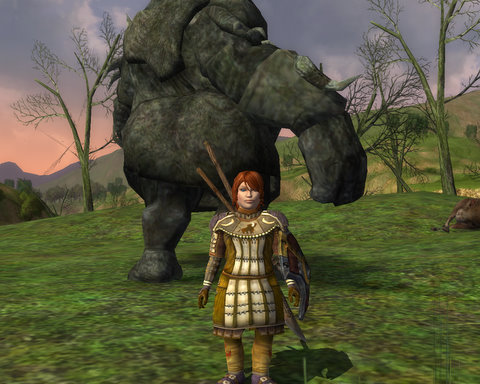
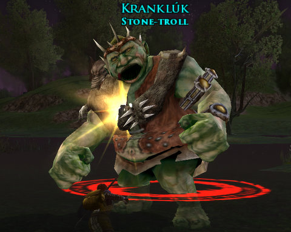

Back to: [West Karana](/posts/westkarana.md) > [2009](/posts/2009/westkarana.md) > [January](./westkarana.md)
# Lord of the Rings Online: Hobbit vs Troll

*Posted by Tipa on 2009-01-19 13:57:00*

If Bilbo could see me now, why, he'd be talking about how he (with maybe a very little help from a certain gray-robed wizard) kept three trolls arguing until morning light turned them all to stone. He wouldn't approve of what I do at all, why, not one little bit. "Un-Hobbit-like!" he'd yell. "It's just not how things are DONE!" he'd exclaim. "Even the Old Took would think twice! And then twice more! And then have a good smoke about it!"

Me, I'm a modern Hobbit. When I see a troll, I don't run and hide or try to reason with it. I don't fret about my crops and fields or worry what Sam's Gaffer might be muttering about me over his ale at the Green Dragon. I crouch. I aim. I throw. I leap.

I'm a Warden of the Shire. Why are there no trolls in the Shire? It's not because the climate isn't right, or their migration paths have shifted to the North, or they have suddenly decided Elves are tastier.

It's because I kill them all.

I was stunned by how familiar Lord of the Rings Online still is, even after all this time. I played the game a few weeks before it went live and a month afterward, and since they let people from the open beta take their characters live, I have all my beta characters. Some are still at the level 15 beta cap, some further advanced. I've been taking my old main, Lysistra, a level 33 Captain, on little tours of Middle Earth to get reacquainted with the world, but mostly she has been farming materials for crafting, and doing some crafting. All my old crafters -- Dera, the Metalsmith; Eraindiel, the Weaponsmith; Dina, the Jeweler; and Lysistra, the Tailor -- have been woken up in order to start producing gear for anyone who wants. I chose Historian as Ettie's crafting profession. This gives her the Scholar and Farming professions, as well as Weaponsmith.

I switched Ettie to Historian when I took a look at the Auction House and found absolutely nothing I could afford for dyes. There were very, very few on the market and almost all of them sold for far more than 100 silver.

Mudflation has clearly taken hold in LotRO. When I played before, the Auction House had plenty of items for characters of all levels, a nice selection, but now even the first thing a crafter might make to skill up is being sold on the Auction House for many, many times more than it's worth. The items that are actually useful -- skillup items are useless, but every tier of crafting can make things better than most drops, and rarely, better than any drop. The prices for THOSE items, nobody can afford. Since the recipes for those items are uncommon drops, and for the best things, extremely rare (and one use only). New crafters are unlikely to be able to make these things for themselves.

My original plan was just to play around with alts until I got familiar enough with the game to pick up where I left off with Lysistra, in North Downs, on the brink of traveling to Evendil (or whatever it's called. It's well known that Elves are just as confused as Hobbits about Elvish place-names).

With good friends thinking about starting new characters, I started a new one as well. After some waffling about who would play what, I elected to go with one of the new classes, the Warden. Wardens are your basic commando class. They sneak around, find their target, build power for a devastating javelin shot that stuns the enemy, then leap out and follow that up with a devastating hit. Past that, they build gambits from their base attacks that add effects like bleed, heals, taunts, knock-downs and such to their regular strikes. Very similar to the EverQuest II rogue classes, including the ability to tank fairly well. They even get a >200 point IN-combat health regeneration buff.

I wasn't surprised to see many fellow Wardens running around the newbie fields.

I reached level 15 Sunday, and am just on the edge of starting Book 1, Chapter 1 of the epic quest. That will have to wait, though, a few days for people to catch up. The whole point of playing with friends is to do the fun things, like the Epic quest, together.

The game hasn't sat still for the past two years. The Chicken-play quests are sometimes hilarious as they send you off to the edges of Middle Earth as a level 1, eminently edible chicken, dodging high level monsters with such devastating chicken attacks as Possum Impersonation, Bob & Weave and Paranoia. There's appearance armor (Ettie in the first picture is wearing some. Well, in all the pictures, but it's hard to see in the others). There is player housing, which is pretty much continuously sold to players from level 10 onward, even though its price is way beyond the means of most new players. Combine the cost of a home with the cost to furnish it and make the payments, and you're talking a really deep money-sink. I would hope that there is a faster way to travel to these homes, because they are WAY out of the way. If my home in EQ2 was so far away that it would take a good portion of a play session to even get to it, well, I doubt I'd visit much.

Travel in LotRO is still EXTREMELY slow, in keeping with the lore. The people who give the quests, though, think nothing about sending you all over the place. Running so slowly. Wardens get a run speed buff, another of the cornucopia of talents that Turbine has showered on the new class, but even with that running... S-L-O-W. Plus, the game still stresses my computer as much as it did two years ago. Bree is still an exciting slide show.

A crafter from a really friendly Kinship was sending weapons to people Saturday; I got a spear which, at level 10, was FAR better than any other weapon I'd found before or since. I sent them a gushing thank you note because, what an incredibly kind thing to do! Why would a Kinship even care at all about random guildless low level characters? Especially someone playing a Flavor-of-the-Month class such as Warden?

This time through the newbie area makes all the old adventures come back. I remember exactly what the grind from here on is like. The terrible, endless killing in Midgewater Marsh and Lone Lands and North Downs. The trilogy of terror that drove so many people from the game, and drove me from it as well. The horrible, horrible grind that is crafting, requiring exponentially more materials every tier for less and less progress (and each tier must be done twice!).

LotRO was the game that enshrined the grind. Maybe playing with friends can ease the pain.

## Comments!

**[Pete S](http://dragonchasers.com)** writes: Once you buy a house, you get a "Travel To House" skill -- basically works like your Map skill but is always bound to your house. And all characters on the account get it.

---

**[Tipa](https://chasingdings.com)** writes: I hope you also get a "Travel back to where you were" skill with that. I'd hate to be in, say, the Misty Mountains and suddenly get the notion to visit my home south of Michel Delving. And then run back to Misty Mountains which, lessee, that should be a 45 minute run, or whatever usurious rates charged by the horses on "fast travel".

Travel time is something that peeved me about Final Fantasy XI Online as well. Chocobos were rented, and the price was on a sliding scale from 'expensive" to "ludicrous" depending on the popularity of the local Choco leaser. And I played a White Mage, who could teleport! It could still take several hundred gil to get to a group...

I love roleplay and immersion and lore, I really do. But I find nothing fun at all in watching my character autorun from place to place. I do try and clump my quests together by location, I really do. But the quest givers almost never ask you to do something in the area. It's always run over here very far away, do ONE THING, then come back and I'll tell you the next step, which (surprise!) will have you running back where you just were. How many times was I sent to Overhill for "just one thing"?

I have resisted taking any quests for the northeast region because I remember that they were mostly all contained in that general area, and I don't plan to run much of anywhere before I have to leave and start the Buckland quests.

---

**[Pete S](http://dragonchasers.com)** writes: Well, you can "map back" to the quest hub, but no, you can't just teleport back to the place where you were standing...

Between Teleport to personal house, teleport to bind point, teleport to racial city (tho that isn't until 35, I think), being summoned to a mustering site, instant travel between stables, teleports by other players, and dozens of regular stable routes, I don't find travel to be particularly arduous in LOTRO. But we're talking about this very topic at Stylish Corpse and I think a huge aspect of this problem is perception and personal preference.

---

**[wilhelm2451](http://tagn.wordpress.com/)** writes: On which server are you playing?

I too could do with a few less "go run what would be 75 miles in Middle-earth, give somebody a document, bring back the receipt before I give you the real task" quests. The mob grinding however does not seem to bother me that much this time around. We'll see how I feel about that when I get really stuck into the North Downs though.

---

**[rob](http://www.lostaneighth.com)** writes: I am also curious which server you are on and if you wouldn't mind some company. I received the Moria expansion for Christmas and I would really like a group to play with as I go through the game. My current characters are all on Silverlode, and I think my highest level character is level 9 or so ... so I am nowhere in the game yet and would switch servers in a heartbeat if it meant being among "kin."

---

**[Openedge1](http://simple-n-complex.blogspot.com/)** writes: ***S-L-O-W***

And you always wondered what was in those pipes. 

Just enjoy the colors...man...(puff)...FAR OUT!

---

**[Tipa](https://chasingdings.com)** writes: @wilhelm & @rob I'm playing on the Windfola server.

I was thinking about this as I was food shopping and stuff, and I realized -- it isn't that the quests are bad (they are very typical for modern MMOs), it's that my preferred playstyle is exploring dungeons with a group of friends. I was trained, I guess, by EverQuest, where nearly every one of the few actual quests in the game were pretty involved, and I just liked not worrying about much besides having a good time and wondering what was around that next corner.

---

**[wilhelm2451](http://tagn.wordpress.com/)** writes: Windfola! d'oh! I just started playing on Nimrodel with the mostly invisible Podcaster's of Bree. Well, I still have some level 25-29 characters on Windfola, but I hate to divide my efforts.

The annoyances of the discreet server architecture.

The Great Barrow though... if you need a 6th for that, hunter, champ, or guardian, I'll come play!

---

**[Tipa](https://chasingdings.com)** writes: Now the Great Barrow -- THAT'S a dungeon!

---

**[Chadmango](http://chadmango.blogspot.com/)** writes: Ahhh The Great Barrow. Great Dungeon, had much fun in there in the early days. They unfortunatly changed Book 1 chapter 11 into a small fellwoship run now.. seems all the danger has been tempered in there now. Still great fun to run around in there though.

---

**[mbp](http://mindbendingpuzzles.blogspot,com)** writes: I am delighted to hear you are doing well out of low level crafting Tipa - hopefully you can start saving some of those profits for a horsey.

I am not a crafter but from what I can see Moria seems to have borked high level crafting. At level 60 crafted goods are no longer as good as drops or quest rewards. Even old staples like morale potions drop like water in moria undermining the crafting economy. Jewellery perhaps is still holding its value and food from farming is always useful if not particularly lucrative. I hope Turbine rectify this in future patches. 

With regard to Turbines dirty little not so secret grind - most grinds can be shared in a group. Pugging worked well for me and speeded up all those "kill ten orcs" runs. Remember also that a lot of lotro's solo quests still take place in dangerous areas with fast re spawning mobs so grouping is always a safer option. Indeed grouping becomes essential when you get to the ultimate lotro grind - killing 300 elite trolls for your valour deed. (Oops shouldn't have told you that should I? Well it is in a dungeon if that helps and in the right group grinding Sarnur trolls can actually be highly enjoyable)

---

**[Tipa](https://chasingdings.com)** writes: I already had to kill 50 spiders for the racial trait that removed my -Might disadvantage. I was fortunate I hadn't yet done the "free the walking tree" quest, so I did the bulk of my grinding there.

There are no groups for low level characters. I couldn't even find one for the two small fellowship missions I ended up soloing. I hope this will change as I advance in level. I'd definitely group if I could :/ I LOVE groups!

---

**Mallika** writes: I think grouping is dependent on server, as mine is filled with people all LFF for various group quests -- I can group pretty much any time I need to, or want to do a group quest (my highest is level 22, so that means all that LFF that I go to are for lower-level quests). I'm sorry you don't have much luck in this department. :(

---

**[Tipa](https://chasingdings.com)** writes: I was hearing lots of people looking for Epic groups, and when I was farming medium hides in Lone Lands, there was plenty of group activity going on in the LFF channel, so I'm hoping things pick up. Maybe I'll join that Kinship. Tonight is an EQ2 night, though, so maybe I will look into it tomorrow. Guilds are always a great way to meet new people.

---

**[Toldain](http://toldaintalks.blogspot.com)** writes: Doggone it, I wish you were on Elendilmir, where I am. Ah well. Groups have the most fun, that's for sure. By the way, hides sell pretty well on the AH, should you want the spare cash more than you want the skillups.

---

**[Sente](http://adingworld.wordpress.com)** writes: The problem I think with many of the quests is that while they are perhaps not bad they are not really good either. At least not to the point that you can look back and say "that was a cool/fun/neat/clever quest, I enjoyed that one". 
With too many quests that are a bit so-and-so the future tends to look bleak, since it feels it may just be more of the same.

Personally I pretty much ignore the deeds and from time to time check if I happened to complete something that might be useful and I have a slot free for it. I have no intention whatsoever to try to grind some deeds later, so I certainly hope that it won't be a requirement for progress.

---

**Sirhyl** writes: I thought this was going to be a 1 day a week group =) 

I should be on tonight for a while to try to catch up to you.

---

**[Tipa](https://chasingdings.com)** writes: Well, I haven't touched it since the weekend, just waiting for people to catch up.

I've been raiding/doing instances in EQ2 and playing City of Villains mostly...

---

**[FunnyMonster.Net](http://www.FunnyMonster.Net)** writes: Nice game!
Good Troll!

---

