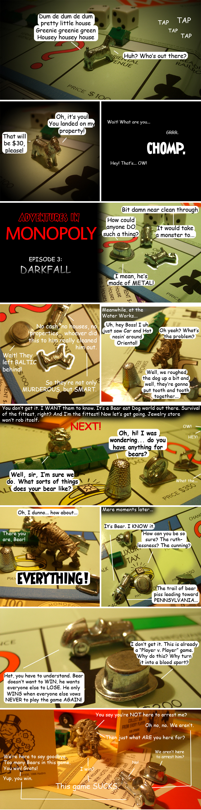

Back to: [West Karana](/posts/westkarana.md) > [2009](/posts/2009/westkarana.md) > [January](./westkarana.md)
# Adventures in Monopoly #3: Darkfall

*Posted by Tipa on 2009-01-26 02:36:17*

Big thank you to Danshir for some inspiration :)

## Comments!

**[Cow Nose the 50 Pound Cat](http://cownosethe50poundcat.blogspot.com)** writes: Yes1 OMG I love it! Best blog post ever!

---

**[Tipa](https://chasingdings.com)** writes: LOL thanks :)

But wait! There's more!

---

**[syncaine](http://syncaine.wordpress.com)** writes: Why do we always assume people looking forward to a PvP game want the sheep to come? What happens when you just get 100k or so bears?

---

**[Tipa](https://chasingdings.com)** writes: The last MMO that allowed unrestricted looting of PC corpses was Ultima Online, right? And when they opened their non-PvP shard, most of the people opted for that. I don't recall if Shadowbane let you loot everything from an opponent but really, ruin-the-other-player's-day type MMOs haven't made a huge splash. From EQ on, PvP has been something fairly low in negative repercussions. WoW has even made it into an arcade game of sorts with no negative effects whatsoever -- in fact, win or lose, you get a cookie!

What happens when you get 100K bears? Potential bear number 100K +1 doesn't stand a chance. That's what made it so hard to start in Shadowbane and why they eventually reset the worlds.

---

**TheRemedy** writes: Aren't the Lineage games a loot everything type of dealio?

---

**[Tipa](https://chasingdings.com)** writes: I think they are loot one item, but I don't know for certain.

---

**TheRemedy** writes: And in regards to UO... it was never say 100 Bears to 1 Dog. It was more like for every 10 Bears there'd be 40 Dogs. The problem with the Dogs was that they were never smart enough to travel in a pack, and most of them didn't realize how the game actually played coming into it.

---

**[The original meaning of Monopoly | No Treason](http://notreason.com/2009/01/26/the-original-meaning-of-monopoly/)** writes: [...] West Karana » Adventures in Monopoly #3: Darkfall [...]

---

**[Rohan](http://blessingofkings.blogspot.com)** writes: *What happens when you just get 100k or so bears?*

You don't. You get 50K bears and 50K sheep who think they are bears, before being rudely disillusioned.

---

**[syncaine](http://syncaine.wordpress.com)** writes: AC-Darktide had item looting in a game with more value placed on items, and people LOVED that server, so much as to debate which game (UO or AC-DT) was the better PvP environment. Lineage also allows looting. EVE goes one step further and not only do you lose a ton of stuff, you might also (if you are dumb) get set back a few weeks/months of training time, and that game continues to grow (including a very large guild of sheep called EVE University, designed to help new players out). 

Remember that UO was not only a new open-PvP MMO, it basically created the MMO space. It's PvE system was also massively flawed at launch (the whole living world thing, which sounded awesome on paper and was brutal in practice)

But bringing up UO is tough to apply now in 2009, with the MMO market the size it is now, not to mention how many people are sick of WoW trying to do PvP. Not many people really considers EQ an example of PvP, even though they had servers for it. Out of all the MMO players around now, I think DF might find the 100k bears it's looking for. Or maybe some of the dogs will actually enjoy a challenging environment, rather than being given everything wrapped in a shiny box. Crazier things have happened :)

---

**[Tipa](https://chasingdings.com)** writes: Though I poke fun at Darkfall, I do hope it does well, and I hope lots of people play it (and blog about it!). What amuses me about the game is not the fact that it's totally loot-all in your face PvP, but the over the top boasting from the devs that this game is The Perfect MMO.

It would be cool to see how many people in EVE actually participate in PvP on a regular basis. Most of the stories I read are about people trying their best to avoid it. Unlike EVE, it will be much harder to avoid PvP in Darkfall -- Gianna's first paragraph of her Darkfall preview had her being ganked by a fellow newbie as she was killing her first mob. Warhammer saw people largely flock to the least challenging form of PvP -- the scenario -- out of all that were offered. Shadowbane offered challenging PvP but found that new players were always behind the curve and served only as fodder for better equipped people.

I still maintain that MMOs are not a good fit for PvP if levels and gear trump player skill. Shooters and RTS games start everyone off equally and if you win, it's because you were better.

---

**[syncaine](http://syncaine.wordpress.com)** writes: Yea I don't like the perfect MMO talk either. Just be honest and admit you are aiming for a small niche, and that you hope to deliver something that niche will enjoy. But who knows, maybe they are just doing it to drum up news/hate. Free advertising from all the people constantly writing about DF being vapor.

Until DF is out, we won't know how hard it is to actually avoid it. It does sound more open than EVE, but you never know, maybe gear in DF is even less important than in EVE, and parts of the world will be remote enough to offer relative safety. I'm sure even players who love to PvP won't be doing it 24/7, so even they will enjoy the PvE aspects at times. That's generally what happens in EVE now.

I'm also hoping the whole gear/level thing is somewhat balanced by actual player skill. From the descriptions of the magic and archer system, it would appear that is at least somewhat true. Plus is a full looting environment, gear really can't be that important or hard to acquire.

---

