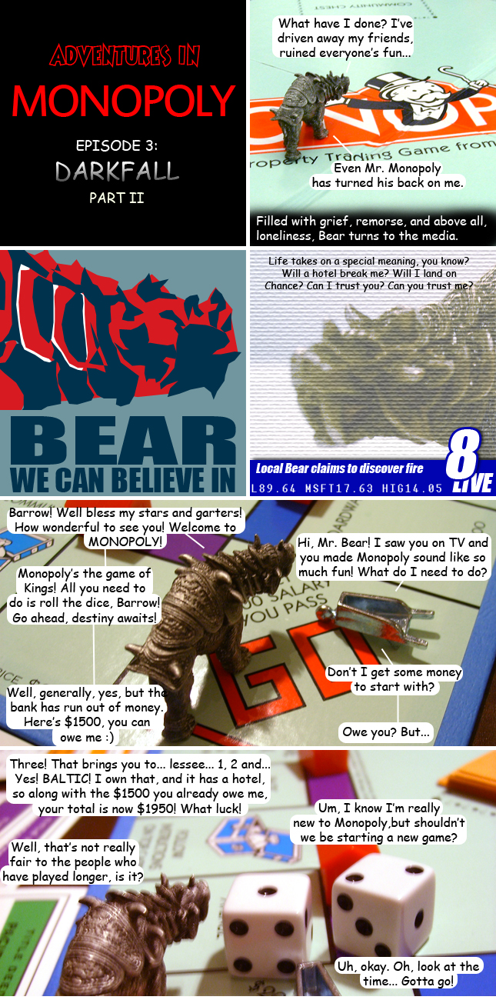

Back to: [West Karana](/posts/westkarana.md) > [2009](/posts/2009/westkarana.md) > [January](./westkarana.md)
# Adventures in Monopoly: Darkfall Part II

*Posted by Tipa on 2009-01-26 23:38:49*

Tomorrow, Part III: What are Car and Hat up to during all this?

## Comments!

**[Stefson](http://www.stefson.com)** writes: That's the weirdest, but possibly coolest looking comic I've seen in ages. How much time does it take to finish up a comic like that?

---

**[Tipa](https://chasingdings.com)** writes: Hours, unfortunately :/

---

**almagill** writes: The best things all take time.

---

**[Tipa](https://chasingdings.com)** writes: Gianna from "The Noob" has posted up [her first impressions](http://beta.thenoobcomic.com/df_preview/intro.html) of Darkfall Beta. Fun read :)

---

**[syncaine](http://syncaine.wordpress.com)** writes: What do you think of those impressions Tipa? They sound rather positive, in a cautionary way. Do they raise your interest in the game at all, or is the concept of open PvP just a pure dealbreaker for you?

---

**[Tipa](https://chasingdings.com)** writes: I've been interested in Darkfall for years. I love the RvR in DAoC, for instance -- but I could choose when I RvR'd most of the time. However, I know I'm not really very good at it, and I would just be permanently killed and all my gear constantly robbed by better players, so there's really no point in playing. I'm a sheep, I admit it.

---

**[Openedge1](http://simple-n-complex.blogspot.com)** writes: I refuse to play PvP with such circumstances. What possible fun would it be to lose all your swag? 
Love the comics though.

thanks

---

**[Tipa](https://chasingdings.com)** writes: Well, you could join a large, roving band of thugs and beat up on people who don't run away fast enough and aren't in a roving band of their own. You could take all their gear with little risk to yourself. This is the usual EVE model of PvP -- lay in ambush for weaker players with your own overwhelming force.

---

**[syncaine](http://syncaine.wordpress.com)** writes: Openedge, what fun is it to PvP when you bash the same respawning player over and over, never making a difference? What fun is PvP when some punk can talk all the smack he wants because he knows you can't do a single thing to him? What fun is an MMO where you can be the worlds biggest asshat, and the community can't do a single thing to discourage such behavior?

Every story has two sides. Some players prefer the game rules to keep them safe, others prefer to keep themselves safe.

---

**[syncaine](http://syncaine.wordpress.com)** writes: Oh and Tipa, bring a bigger force, and you score quality gear over newbie items. 

That rule has applied since UO, even the best PKs can be attacked by a stronger force, and if they are using their uber gear to beat on newbies, it only means their death is more costly than that of the newbie. Playing an actual PK in such an environment is far harder than most people give it credit, and it's not always just running around bashing the weak.

---

**[rob](http://www.lostaneighth.com)** writes: I played UO for a long time and I can't help but wonder if people who pine for the early days of UO PvP are wearing thick rose colored glasses. Being a huge fan of Ultima, all I really wanted out of UO was to explore the world and take it all in. This proved impossible thanks to the nature of PvP. I didn't want to group up ( at the time there was no "grouping up." Grouping meant that you followed a friend around. ). I wanted to just explore solo. It didn't help that there were numerous bugs and balance issues that made killing other players easy. There was a point where there was no cooldown on spell casting. Couple this with the fact that once cast, a fireball ( or other magical projectile ) would follow you forever, and you had yourself a recipe for instant death. Simply hide using the hide skill, wait for someone to come along and pause on your screen at all. Begin spamming your "fireball" key and the last thing that the victim would see would be a stream of "Vas Flam" right before the screen went white.

I eventually gave in and decided to play the game the way others were playing it. I created a character who was good with rogue skills. I would walk up to people who were trying to properly place a house, something that took some doing as finding an allowable spot was not trivial. I would pickpocket them, steal the deed and run off with all speed before they even knew what happened. That was both mean and exciting, but I quickly grew bored with it. Plus, I had my stuff stolen numerous times and, as it turns out, that is no fun what so ever! :)

I will follow Darkfall in the news, but I don't think it is for me.

---

**[Tipa](https://chasingdings.com)** writes: Sure, traveling with a superior force is definitely the way. I have a friend who actually made raids on an EQ2 PvP server to scour the newbie fields clear of enemies. They never had a chance.

But running around killing people in an army just doesn't appeal to me. What I'd love is a game where PvP is POSSIBLE, where if you wanted to kill someone, you could go ahead and take your best shot -- but you had to have a license to kill that person. So if I wanted you dead, I purchase a license and then I go kill you. All you'd know is that you had a license out on you. It would be transferable, too.

---

**[Danshir](http://www.themmoexperience.com)** writes: <3 I love these comics tipa

---

