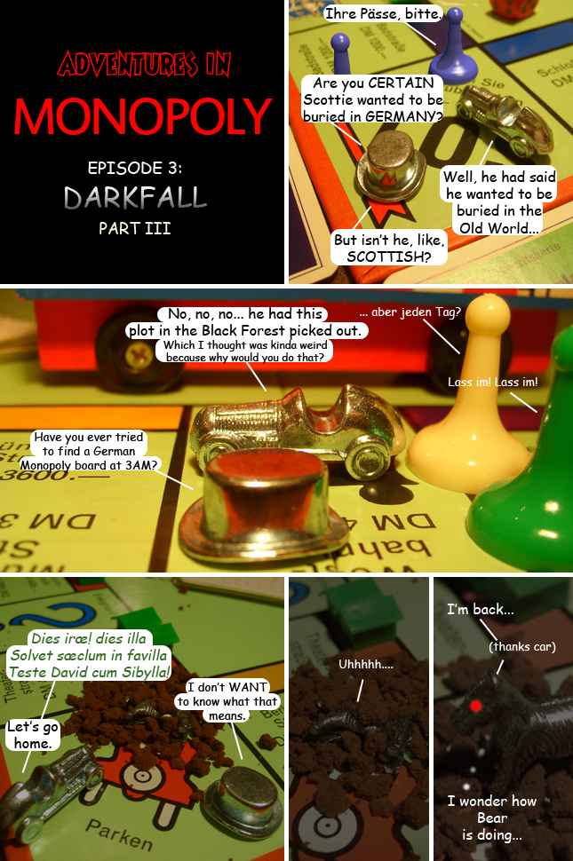

Back to: [West Karana](/posts/westkarana.md) > [2009](/posts/2009/westkarana.md) > [January](./westkarana.md)
# Adventures in Monopoly: Darkfall, Part III

*Posted by Tipa on 2009-01-29 02:34:07*

The End...

OR IS IT!?

## Comments!

**[Stargrace](http://www.mmoquests.com)** writes: Tea.. hurts.. when spewed out the nose..
Very funny hon, love the German!

---

**[mbp](http://mindbendingpuzzles.blogspot.com)** writes: OK Babel fish came up with
"this Irish Republican Army this illa solvet saeclum in favilla test David cum sybilla" ????? Then again it probably isn't German and Babel fish doesn't have a Latin option. 

I think that it was actually some kind of witchcraft to resurrect Scotty from the dead. Am I right?

Great cartoon by the way Tipa - hope you do more.

---

**[Tipa](https://chasingdings.com)** writes: Day of wrath, day that
will dissolve the world into burning coals,
as David bore witness with the Sibyll.

How great a tremor is to be,
when the judge is to come
briskly shattering every grave.

etc... :)

Neither Car nor Hat knew what it meant, they were words Scottie had asked him to say.

It's awesome when Monopoly pieces come this well-prepared for their violent deaths.

---

**[mbp](http://mindbendingpuzzles.blogspot.com)** writes: Franciscan Hymn / Witchcraft meh .. same difference.

(I am RC myself Tip I am allowed make jokes about such things)

---

**[Tipa](https://chasingdings.com)** writes: My mom's family was Roman Catholic, though we kids were raised Episcopalian. Anyway. whenever we'd visit the Pineos, we had to go to the Roman Catholic church on Sunday's. They did High Mass even though the Pope had already gave permission for the liturgy to be said in English, so my main memories of being a kid in a Catholic church was sitting around, unable to understand even one word of what was going on, watching other people for cues to kneel and silently saying the Lord's Prayer the RIGHT way instead of the Catholic way...

Singing the hymns was always my favorite part of the Protestant service. The RC church I went to didn't even have that.

---

**[wilhelm2451](http://tagn.wordpress.com/)** writes: And where did you find a German Monopoly board at 3am?

Was machen wir jetz?

---

**[mbp](http://mindbendingpuzzles.blogspot.com)** writes: Good on you young Tipa for secretly doing your bit for the Reformation :). 

I was a child of the 1960's. I grew up very much under the influence of Vatican 2. It was all folk masses, hippy priests and a supposedly vernacular version of the Gospel which combined American English and ancient Hebrew in equal measure. Its all fairly embarrassing looking back but then again I guess the past always is.

---

**Milia** writes: Who just happens to have a German version of Monopoly hanging around the house? And pre Euro. I mean, if it were Austrian, that would be OK. Everybody has an Austrian version - but German?

Gruss Gott!

---

**[Tipa](https://chasingdings.com)** writes: My oldest sister spent a semester studying in Germany. The next younger sister taught mathematics there for two years. The older one brought me back the Monopoly set back around 1980 or so as a gift when she returned :) I have treasured it ever since!

After I finished this comic, I knew what the next comic would have to be about. So this isn't the end of this particular arc, but it might be a week or two before it appears. It's gotten kinda far from just being about the MMO, Darkfall, though.

---

**[Saylah](http://notadiary.typepad.com/mysticworlds)** writes: LOL. Wonderful. I really enjoy when you do these.

---

