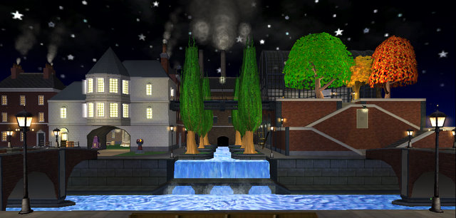

Back to: [West Karana](/posts/westkarana.md) > [2009](/posts/2009/westkarana.md) > [July](./westkarana.md)
# Wizard 101: First Night in Grizzleheim & Crafting Secrets

*Posted by Tipa on 2009-07-02 07:04:04*

I probably shouldn't have titled this post "First Night in Grizzleheim", because I hardly went there after doing the quests to open it. At 50, Tara doesn't get any experience rewards from defeating monsters or completing quests, nor are any of the gear rewards any upgrade, so she has no reason to go. Allison, my Balance wizard on my second account, just hit 30 and is a perfect level for Grizzleheim -- but she's been partnering with my level 13 Myth alt, Marissa. And level 13 is too low for Grizzleheim -- she can't get any of the quests yet.

 So, I explored all the OTHER things that came new with the expansion, instead.

First, top of the page, the sprawling neighborhood of the Marleybone Royal Estate. The new Bazaar makes it easy to overindulge on house items, and combined with the loot she was siphoning from Marissa's completed quests and monster drops, and her own equipment, she'd outgrown the modest Marleybone mansion where once she dwelt.

Next down, Tara proudly bears her "Apprentice Crafter" badge. This took awhile, not because harvesting takes too long (more on that later), but because the cooldowns on the crafting slots is so onerous. Thankfully, they want fewer items made for the first tier than they did on the test realm. But it's still pretty bad. I'm working on the Marleybone crafting quests now -- five rings and five athames for the FIRST quest, and each takes an astonishing number of harvests.

EVERYTHING takes an astonishing amount of harvests. Crafting would be utterly impossible if there weren't a trick to harvesting, and here it is. Enjoy it before KingsIsle nerfs it :)

First, find a place AWAY FROM OTHER PEOPLE where a harvest spawns. I like the room outside King Djesserit's Chamber in the Djesserit Tomb in the Temple of Storms in Krokotopia for Stone Blocks and Parchment. There are two Stone Block spawns and two Parchment spawns in that room, and there is a third Parchment spawn in his chamber, along with a possibility of two Wooden Chests, one in each room.

Start in the Ambrose realm. Check out the room, harvest anything you find, then switch realms to the next one down -- Bartleby, or whatever. Continue this until you have enough. You can speed this up with a partner checking realms, too, since you can port to someone in a different realm even if your realm change cooldown timer is still running.

I got all the Cattails and Ore I would need in the Cave of Sorrow in Moo Shu, and Newgate Prison gave me enough Deep Mushrooms to fry a hundred steaks.

I haven't found a good place for Mist Wood yet. I got the bare minimum from just running through Moo Shu's wooded areas (Grizzleheim may come to the rescue, here). And Marleybone crafting needs metric tonnes of scrap iron. I haven't found any of that yet.

The key here is to hang out in an isolated area. Other wizards will harvest whatever they come across. The guides on Wizard 101 Central point people to highly populated areas to harvest. That leads only to frustration. Harvesting is a solitary activity.

While waiting on crafting cooldowns, I took Allison and Marissa back to Wizard City to finish some quests. Since Allison has been Tara's constant companion through Moo Shu and Dragonspyre, she has leveled to 30 mostly by doing high level quests and instances and actually never -- tis sad but true -- even finished Wizard City. And Marissa needs everything, so last night, both wizards received the Three Streets Savior badge for brave deeds in Wizard City, finished their quest robes (pictured), and are poised on the edge of Colossus Blvd and the Sunken City before moving on to Krokotopia.

When Marissa turns 15 in two levels, I'll see if Grizzleheim has opened up for her. If so, I'll start mixing in those quests along with Krokotopia.

I spent some time in the Bazaar looking for fire resist gear. If I could get fire resistance up past 100%, Malistaire's devastating attacks couldn't touch me. Sadly, I was only able to get unbuffed FR up to about 45% -- far short of what I'd need. I haven't yet found anything that will ameliorate his meteor storm, but I'm working on crafting precisely because I think there is something that a master craftsman can make that will help. The forge RIGHT OUTSIDE Malistaire's instance is an obvious clue.

The sad thing about crafting, and what I hope most they will change, is that crafters cannot be fairly compensated for the things they make. Either they use their crafted items for themselves or their alts, or sell them for a fixed price on the Bazaar. And I assure you, the vast material requirements for the highest level crafted gear far outstrip the meager price you can get for them in the Bazaar.

The Bazaar is a good first attempt. But it is not a rewarding experience, and by a rewarding experience, I mean one that results in gold. In a non-managed Bazaar, wizards who harvest what they come across could then sell these items in the Bazaar at a price they set, and the prices for these resources would quickly reach a natural level, quite higher than what they are today. Crafters would buy these resources at inflated prices so they wouldn't have to go out and harvest on their own. The harvesting wizards would make good amounts of money, and the high cost of materials would tend to keep dabblers out of crafting and more inclined to sell their harvests.

Crafters could then make items and sell them for their natural price, which would likely be below the cost of materials in most cases. People looking for unique gear or home furnishings would have the chance to buy items they normally could never see, as currently, there is absolutely zero incentive for a crafter to make something for anyone's use but their own.

A managed market is never a good thing. An open market could spark a thriving community of artisans. It's just that simple.

## Comments!

**[Stargrace](http://www.mmoquests.com)** writes: I took my little wizard to Grizzleheim last night (level 21) after running around for hours looking for mist wood - eventually things got so difficult there that I headed back to Wizard City and started doing the Sunken City dungeon, had someone group up for it only to leave before the final tower (doh!) I need to meet up with you in game some time so you can show me how it's done, hehe. 

Finding mist wood was taking me forever, and I also need to upgrade my house now that my dorm room is filled with sarcophagus and my craft table, barely room for my bed!

---

**[Tipa](https://chasingdings.com)** writes: Oh! Marissa needs Sunken City; we should definitely do that!

A small Wizard City castle is only 5K, isn't it?

---

**[Ravious](http://killtenrats.com)** writes: I would've liked it if they yoinked Dofus' market system, where you only see one listing per item (unlike e.g., WoW) and the lowest price that someone has set the price at. That way the market can move, like you want, but still retain some of the simplicity that the Bazaar offers.

---

**[Sierra StarSong](http://starsongky.livejournal.com)** writes: My favorite spots for Mist Wood are the strip of lawn between Ambrose's house and the Fairegrounds, and the park in Cyclops Lane. The Cyclops park also tends to get a lot of cat tails.

---

**[Tipa](https://chasingdings.com)** writes: Way too many people looking in WC. When I am harvesting, I don't want to be racing anyone else. I'm sure to find the perfect spot somewhere in Mooshu, and I'll write about it when I do ;)

---

**Amber StarGem** writes: A good spot for mist wood is in Village of Sorrow. Near Oakheart is one spawn with black Lotus. The Next is at your first turn. Hope this helps!

---

**[Tipa](https://chasingdings.com)** writes: Oh, thanks! I've found a rooftop in Chelsea Court that spawns mist wood, stone blocks and scrap iron, as well as regular and silver chests. Just nine mist wood to go and I'll have enough to finish Marleybone crafting (I hope!).

---

**Padric Ironshade** writes: The best place I have found for Mist Wood and Cattails is Diggmore Station. The front room(with the Mayor) has 3 Mist Wood spawn points and the back place(with the Ticket Master) with 3 Mist Wood spawn points plus 2 for Cattails. In the front room they are:
 1) Next to the stray cat
 2) Top of stairs behind Mayor
 3) Next(left side) to Cop box on your way into the back room..i.e. near Sherlock Bones

In the back room:
 1) as you enter turn immediately(either left or right depending on which door you went through) and it is right behind the wall
 2) along the start of the wall for Hyde Park
 3) Back platform behind the Ticketmaster

Based on my experience...you will only every get 1 Mist Wood spawn from these six at one time and always the 2 Cat Tail spawns. The one near the Stray cat and the one immediately in the Ticket Master room give 2 each time and the others just 1.

Hope this helps!
 ~Padric

---

**[Tipa](https://chasingdings.com)** writes: Whoa, thanks! Will definitely check that out! There's also a mist wood spawn right outside of Digmoore station as well!

---

**Padric Ironshade** writes: No problem. I just got my apprentice crafter and needed 50 Mistwood. Just moving from realm to realm each minute...I got all 50 Mist wood in about 30-40 minutes.

---

**Padric Ironshade** writes: One last place...Scotland Yard Roof...Great for Stone Block and Mist Wood.

Platform as you enter:
1) Immediately to the left - Mistwood
2) Behind table - Stone Block

Kaz lab cage:
1) Left is always Mist Wood
2) Right is always Stone Block

Knight's Court area:
1) Right next to box
2) Next to Darcy
3) Left wall are 2 - both sides of box

My experience is that you will get 3 spawns each...2 front areas and 1 KC or 1 front and 2 KC ones. Wish I had done this area first since you can get both items. An occasional acorn too.

---

**[Sophia Darkthorn](http://bla.bla)** writes: WHERE THE HECK CAN I FIND MIST WOOD IN A PLACE FOR ALL PLAYERS!!!!!!!T\_T GEEZ!

---

**micheal rubyleaf** writes: u can fin mist wood by the harvet lords house in triton avenu and where the frekin heck can i find deep mushrooms

---

**[james ghosthunter](http://youtube.com)** writes: WHO WANTS TO BE IN MY VIDEO ABOUT WIZARD101 EMALL ME!

---

**[james ghosthunter](http://youtube.com)** writes: you find deep muchrooms in the gorond and the playground

---

**Shanna seabreeze** writes: 4 me mist wood is easy to find i have found 27, 22 cement blocks, 7 deep mushrooms ( watz with the deep pert?!), a but load of parchment, and at least 9 to 10 of every thing else besides cat tail, i can't find it anywere.

---

**[Tipa](https://chasingdings.com)** writes: Now cattail is easy to find -- in Digmore Station in Marleybone. That central pond always has a couple cattails poking out of it.

---

**[hi](http://yahoo)** writes: grizzlenheim opens for level twenty and up people only

---

**[hi](http://yahoo)** writes: scrap iron where do i get it

---

**[Tipa](https://chasingdings.com)** writes: I got all the scrap iron I could ever need in some of the dead ends in Chelsea Court.

---

**[colin dragonblood](http://yahoo)** writes: where the freak can i find deeps mushrooms in a non members place?
im doing the quest where u have 2 make the 2 daggers, but cant find the deep mushrooms. 
plzz help me

---

**megs** writes: where can i find cat tails in a nonmember area

---

**fader** writes: hey i need to now where to find cat tails in non member areas
and where to find deep mushrooms
and where is central park in the commons

---

**[Tipa](https://chasingdings.com)** writes: Cattails can be found in water in Wizard City commons, all over Triton Ave, and near most bits of water.
I don't know if there are any deep mushrooms in the free areas, but you can buy them cheaply enough on the Bazaar.
Central Park in the Commons is the park area where Prospector Zeke stands these days, as far as I know :)

---

**tk** writes: where can i find a prachments i have looked every where!!!!!!!!!!!!

---

**[Tipa](https://chasingdings.com)** writes: I find parchment pretty often in Krokotopia dungeons. Especially the tombs in the storm area.

---

**Thomas** writes: mistwood is like EVERYWHERE in moosho. i look for mistwood, but instead a find a bunch of deep mushrooms. everytime i go to mooshu i get about 20 each day.

---

**carson** writes: Catails,stone blocks, mistwood, ore, deep mushrooms,and parchment are common to find.For me at least.

---

**Dan** writes: Where are deep mushy room (in nonmember areas)

---

**Dan** writes: where is the bazzar

---

**[Tipa](https://chasingdings.com)** writes: Deep mushrooms are all over the place; you'll find more than you need in Mooshu, for instance, though I don't think you need to go that far for them. The Bazaar is in Olde Town, just past the Shopping District, where the tunnels to Firecat Alley, Colossus Blvd and Triton Ave begin.

---

