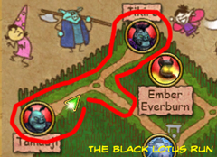
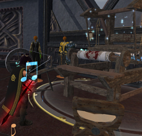

Back to: [West Karana](/posts/westkarana.md) > [2009](/posts/2009/westkarana.md) > [July](./westkarana.md)
# Wizard 101: Why crafting is broken, and how to fix it

*Posted by Tipa on 2009-07-07 00:40:39*

With the Grizzleheim expansion, KingsIsle also brought crafting to the world of Wizard 101. The crafting system chosen is the most ... um ... unique(?) ... that I've seen in any MMO.

Crafting in the real world was once the domain of skilled artisans who devoted years to learning their craft, and then spent the rest of their careers making items of art and utility for their customers. A good craftsman's name was known far and wide, but every village had a smith, and larger towns and cities would have entire quarters set aside for the crafting trades.

By and large, MMOs have used the idea of a skilled artisan earning a living by selling the items they make as the basis for their crafting systems. Becoming a skilled crafter was so expensive and time-consuming in EverQuest that those who chose to take on a trade or two were highly prized by their guilds. WoW simplified crafting, as it did so much else, so that everyone had a trade, but getting the best and rarest recipes required significant effort so that once again, the best crafters were a rare commodity. EverQuest 2 started out considering crafters a separate but equal career path to adventuring.

What binds them all is the notion of a crafter who, with great effort, is able to use their artisan skills for the benefit of their friends and guild, or just to hawk as a service to others or a means of income. In most MMOs, after spending time and money learning their craft, an artisan can earn a good return on that later.

Wizard 101 looks at things differently. 

**Harvesting**

Most WoW-like MMOs require crafters to harvest raw materials from the world, and here, Wizard 101 is no exception. Harvesting nodes spawn here and there throughout the world. W101 crafting requires so MANY resources, though, that a given zone doesn't have enough active harvesting nodes to support even one crafter. Instead, the most efficient means of harvesting resources is to find an area with several node spawns, then flip between the different servers harvesting where you can. This might seem like a hack, but it's impossible to gather the necessary items for free otherwise.

While the first crafting "badge" isn't too onerous, all later ones require hours spent flipping realms and running a route. I spent the better part of a day running the same circle in Moo Shu for enough items to complete the first of the Moo Shu crafting quests.

I don't feel this is appropriate for a kid's game, but it's not out of line with the effort required for other games, since there are no skill-ups for W101 crafting, just earning badges (analagous to levels).

But here's where W101 takes an exciting turn toward the bizarre.

**Crafting Slots**

In order to prevent crafters from being overly productive, every crafted item uses up a crafter's ability to make another item for anywhere from 15 minutes to 60 HOURS or more. Earning new crafting badges earns you more crafting slots; working on the second half of my initiate crafter badge, I have three slots available, all of which are working off twelve hour cool-downs.

Cool-downs punish crafters by making it impossible for a crafter to make things to order. But that was already never going to happen because ...

**You can't trade money or items to other people**

People love the new mannequins, which let you show off your best outfits in your home. Any Apprentice Crafter or above can make these, but they take vast amounts of very, very rare harvests, so it's unlikely to be something I make casually, especially if someone doesn't have the materials. But even if someone DOES have the materials, they can't give them to me (and I couldn't give them the mannequin) because there is no item trading in the game -- just Treasure Cards -- special, single-use cards.

The only possible way to get an item from one player to another is via the Bazaar.

**The Bizarre Bazaar.**

The Bazaar also came along with Grizzleheim. It's not really a bazaar in any traditional sense; it's more or less an NPC store where the stock is sold to it by players for a fixed amount, and bought for a fixed amount.

The first thing you'll notice about the Bazaar is that it is filled to the very top with trash items. From Wizard City through to Dragonspyre, most items awarded from battles are trash, never used, only sold for their cash value. (And helpfully, the vast majority of the equipment you can make by crafting also falls into this category, making it likely most recipes in the game will never be made by anyone, ever).

So for me to make your mannequin for you, you would have to sell your rare components to the Bazaar, I would have to buy them back (at a higher price) to make the mannequin, then put the mannequin on the Bazaar and hope you bought it before someone else did. All very risky, and with a significant chance of loss. (And a certain chance of being out lots and lots of gold for the privilege of making an item for someone else.)

The 5000 gold recipe for a mannequin, by the way, can only be used seven times.

Crafting in Wizard 101 is not any fun at all. Zero. Neither harvesting or the crafting experience itself provides the slightest bit of enjoyment, not even the satisfaction of making something useful for a friend, since even that is impossible. Having to buy three crafting stations (you get a fourth for making the very basic items for free) to make items is pointless, since you are only at them for an instant, unlike EQ2, where crafting stations have their own animations and the crafter is actively using them during the entire process of crafting (which ranges from a few seconds to a couple of minutes for hard to craft items).

**Fixing crafting**

Here's my suggestions for fixing Wizard 101's crafting.

2. Get rid of crafting slots. Instead, make crafting take a set amount of time spent at the crafting station, like WoW, EQ2, LotRO, DAoC, Aion, etc etc etc. Having crafting cooldowns of 59+ hours for some items is just ... weird.

4. Let people trade items between each other, or at least implement something like EQ2's "commission" system, where two people can join the crafting process. One provides the skill, and the other the materials (and gets the item).

6. Remove trash crafted gear. The selling point of having equipment strong in two schools loses its lustre when the items so made would seriously gimp the wearer. Case in point: Flaming Cloak of the Tomb, recipe sold by a Death school recipe vendor in The Necropolis. +1% Death accuracy, +10% Death damage, +6% Fire damage, no health, no mana, no card, nothing -- a robe no death wizard in Dragonspyre would EVER wear, for any reason, having gotten superior robes probably in Wizard City.

8. Remove trash loot from the Bazaar so it is possible to find worthwhile items.

10. Remove trash loot from the game. It just overflows backpack space and gets into the bank and overflows that as well, causing people to miss out on items of actual value because trash loot choked up all available space. Just give the gold instead.

12. Allow players to sell their crafted items for prices they set. Make it worthwhile to be a crafter.

14. Add appearance slots, so crafters can make equipment of unique appearance for wizards to wear over their battle gear.

Crafting, currently, is a money and time sink. Its only real use, thus far, is to make unique housing items (which I have done), but those taking amazing amounts of resources and aren't likely to keep up interest in crafting as a past-time. It needs a huge overhaul to be at all useful, and in its current form, I very much doubt many people will take up crafting to make items at considerable expense for no reason.

## Comments!

**Brahm Ravenblood** writes: Nicely said! I completely agree. I would also like to say that I believe the respawn timer on the foraged items is TOO LONG and should be shortened.

---

**Alex SandStone** writes: Well I started a new wizard (Myth) and I have decided I am taking on the crafting qusts all the way through DragonSpyre, I was just peeking at the recipes for housing items in DS and WOW. I want that carosell so bad, but the stuff needed is extremely hard to collect. Oh well, anything to make my house "Unique."

---

**[Victoria Silver](http://wizardsjourney.wordpress.com/)** writes: Wow, great post Tipa - I couldn't agree more. Crafting is a great idea and I'm glad they added it to the game, but it is all kinds of broken. I also have a lot of problems with the Bazaar, especially the fact that at lower levels, the prices offered by the Bazaar NPC are so low that you're better off selling things at the merchant in Unicorn Way, who at least gives you a solid price. If the Bazaar doesn't serve one of its' two purposes, buying and selling, that's a problem. It looks like you've gotten a lot more into crafting than I have, but I've run into many of the same problems and they definitely need to fix it.

---

**[Saylah](http://notadiary.typepad.com/mysticworlds)** writes: Releasing bad crafting systems seems to be a new trend. It's almost like they common sense aspects don't factor into the implementations and they don't do extensive testing of their own implementations to see and feel how it plays out. EQ2 and EVE both had mature systems before I joined those games.

WOW's was decent on release. But other new games I've played since all released with implementations where crafting items was pretty much worthless vs. the effort. WAR's meant take away the grindfest was the exact opposite because they put the comps on mobs which meant you had to grind kill versus harvest. ROM's is a ridiculous grindfest for harvesting and processing vast amounts of materials to make items that won't sell either but you need to make them to skill-up. And AOC's harvesting was equally annoying with little benefits. So this situation isn't new.

The advantage with W101 is that KI has shown a willingness to listen to reasonable and well articulated concerns from their player base. They've modified released mechanics in the past like the uproar over betting on PVP, are rethinking the boss encounter changes, gave adults a way to chat unfiltered, etc. So while it sucks now, I feel confident that they will address your concerns.

---

**[Sean E.](http://modernautomagic.com)** writes: THANK YOU! I have worked so long to simply getting the items to make the first daggers! I like your suggestion better. I would like to be proud of what I do in the game, and not simply have to throw it away.

---

**[Tesh](http://tishtoshtesh.wordpress.com/)** writes: Nice post. I wrote up a post this morning about my quibbles with some of the recent changes, and crafting and the Bazaar are significantly broken. As Victoria notes, the Bazaar doesn't offer better-than-vendor sale value for anything but the most unique and interesting of items... but if you get *too* unique and interesting, you cross into the No Trade/No Auction zone (which I have other big problems with). I've settled on selling pretty much everything at vendors (who just send them into the aether) to get better coin from them, and only occasionally do I find something useful to sell in the Bazaar.

I don't buy *anything* at the Bazaar, since the old crown gear I bought with gold far outclasses any of the new gear. Even the dual-class gear doesn't help me all that much. I've never wanted gear that protects me from my own school, I want gear that protects from other schools so I can mix and match according to the place I'm playing. (Or gear like the old crown gear that just protects from everything, so I can just forget about switching outfits.) If I could custom-tailor my gear to give me school-relevant boosts and variable school defense, I'd be a happy camper.

---

**Linda** writes: I certainly don't like that they've changed the game at such a fundamental level. Crafting wasn't added as an option to obtain treasure cards (among other things) but replaced how one must get them. It forces somone into tedium to gather ingredients and then wait while cards "cools down." (I haven't even been able to get to that point myself.) Is it manipulative? Perhaps they found that subscribers unsubscribe once they've reached the final level and they want to get all they can even if it changes the pace to nearly unbearable. While I generally battled alone, I counted on those treasure cards to keep others alive in a collaborative fight (and, yes they saved my neck a few times, too). That's come to a screeching halt.

I suppose I'll fiddle around for awhile but if I find the only way to beat a boss is to craft some special card that takes a new crafting table and weeks to create (I believe this is just a rumor at this point), I'm moving on. If people are truly upset with these untested, frustrating, plain just-not-fun-anymore changes, they should request the old options back, threaten to move on if they aren't restored... and then do so when they don't. Power to the player... or rather the players monthly payment! Right now, I'm riding the line to see how it goes. I'm getting close to thinking the bloom is off the wizardly rose.

---

**Sunshine** writes: Well put and I don't believe that it could be said better. Please email support with your comments. They are succint and to the point. Crafting items that are NO TRADE (can't trade between your own characters) NO AUCTION (whatever this means) was a bad choice on their part. Personally, I canned the "crafting trade" around Marleybone when I found the first project there came with a parts price tag of over $5,300 just in viles and ingredients. Gems and other reagents (including viles) should also be available for the finding not just purchasing. I think my biggest beef is with the NO TRADE option on any item also.

---

**[Brooke](http://Wizard101)** writes: Can you please tell me what NPC stands for?

Thx!

---

**[Tipa](https://chasingdings.com)** writes: Sure, NPC stands for Non-Player Character -- anything with a name that is not controlled by a player.

---

**Boris OwlBreath** writes: Am I missing something about crafting? I did the Marley crafting requirement, got my badge and bought two recipes one for robe, and one for footwraps. They look useful and add a lot more protection than I currently have. I did the server shuffle for better part of a day, and bought ten treasure cards.

Now the (BLEEP) crafting station won't let me make my stuff. It will let me create stuff I've already made and don't need but not my new gear. I couldn't buy the recipes until I got initiate crafter, but the recipes say apprentice crafter is all that is required to create, and now I'm above that rank.

I even tried putting on my various crafter badges but that yielded nothing. I'm getting bored abd frustrated with crafting. Can anyone help me out here?

---

**[Tipa](https://chasingdings.com)** writes: Some, well, most items cannot be crafted with the basic crafting station. You probably need to buy one of the specialized ones, for sale at vendors from Marleybone on, I believe.

---

**Fuzzy** writes: First of all, curse you for introducing me to this game. I initially wrote it off as a kid's game, but after seeing so many articles about it on this site I decided to give it a whirl. Two days later, I finished the free trial content and signed up for a year's subscription :D Level 20 now, and I just got to the Krokosphinx.

So many little graphical details in the battle system, from the symbols on the ground to the life circle under your character to the way buffs/debuffs are visually segregated.

Anyways, crafting makes me want to slit my wrists. I find gold hard to come by as it is, so I'm not really inclined to spend gold on recipes that are meh at best. I'm just hoping I have enough solid stone and parchment to make my two rings for the Krokotopia crafting quest :(

---

**[Tipa](https://chasingdings.com)** writes: I liked crafting fine until Dragonspyre crafting, and when I thought it might be a material help with tougher bosses. Now I realize it is just a time and money sink, and I have enough ways to waste my time and money already :/

---

**Brian Fielding** writes: I am in total agreement with you about crafting. I recently acquired my master artisan badge after running around Mooshu for weeks on end to collect dozens of Black Lotus/Black Pearls. I can't imagine how KI thought that those quests would be at all enjoyable especially when the only reward I get is a small portion of the money I spent doing the quest!

Maybe you can answer something for me. I got the badge so I could craft some clothes I purchased from the vendor in the Dragonspyre Academy. However once I got all the regents and went to my equipment station (to craft a robe, hat, and shoes) it said that I could not craft that at this station. 

It said I need a "Dragonspyre Table." Where do I get one of those? I've never even heard of that and they are not sold at the furniture vendor in DS. Am I missing something? Thanks!

---

**[Tipa](https://chasingdings.com)** writes: There's a crafting table outside Malistaire's instance. Maybe that's the one you need?

---

**Aaron Baldwin** writes: Another idea: 

i think that changing clothes based on the place you at takes too much time. i hate running through my spelldeck and changing what spells i have equipped too. i think solutions would rise from making the gameplay more suited to the players needs too. making a "wardrobe" of sorts where you could predesign suits and decks so you could have certain predesigned items you could select. Also, the PvP designs are weak and ill thought out, beating the game and getting to level 50 are so easy that it is almost unfulfilling, and crafting is broken. I do believe that this game has very unique concepts that i love, but the gameplay is lacking in so many areas that the designers might want to really makeover the whole game based on the players ideas.

---

**george** writes: How do you craft the sword???

---

