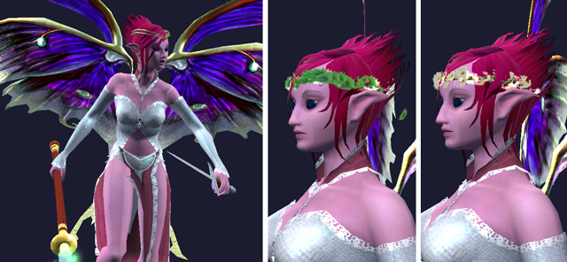

Back to: [West Karana](/posts/westkarana.md) > [2009](/posts/2009/westkarana.md) > [July](./westkarana.md)
# EQ2 Fashion Show: Metal Gear and Tramp Wear

*Posted by Tipa on 2009-07-07 07:02:35*

Wow, it's been awhile since I did an EQ2 fashion post. But, ahead of my (soon to be) triumphant return to the game in a big way -- waiting on the new character transfer service to carry my characters to a new home on Antonia Bayle server -- it's time to start getting things ready for the trip.

I really hope that Antonia Bayle server will be a more relaxed, casual experience than my current home, Najena. I was goofing off last night, listening to channels, and it sounds like T2 TSO armor PLUS mythical weapon is the baseline for TSO groups now. My main, Dina, has T1 TSO + Kunark raid armor (and her mythical), but my cleric? Her armor is just RoK group armor -- and no fabled, much less a mythical weapon. My goal is to get Dina her T2 armor, and to get Dera (cleric) T1 armor + Fabled epic.

|  |  |
| --- | --- |
|
 EverQuest2 2009-07-06 22-03-44-23 |

 EverQuest2 2009-07-06 22-09-50-37 |

Dina won't need to look like the newb she is with the Station Marketplace's new BLACKENED VANGUARD ARMOR. Now, even the lowliest bard can look like a [BAMF](http://www.urbandictionary.com/define.php?term=B.A.M.F.) with this armor made from polished shards of the purest night. Look at how happy Bear is to bear (sorry) such a deadly haffer.

Good stuff. First RMT armor I've bought, because it's just SO COOL.

Brightknife went right for the more feminine section of the Marketplace store. First up: Firiona Vie's scepter and tiara. Apparently, Firiona Vie thinks she's the mascot for EverQuest II. Brzzzat! WRONG! Firiona is *EverQuest's* tame floozy! Antonia Bayle is EverQuest II's tramptacular booth babe.

The scepter is the first "appearance only" weapon offered by the Station Marketplace -- it cannot be wielded as a regular weapon.

The other two pictures are of the Circlet of Mums and the Circlet of Daisies -- both pleasant looking, but hard to see against a character's hair.

But back to the old Firiona vs Antonia fight. They are BOTH PALADINS, right? Why do they go around dressed in harem outfits? If memory serves, when Firiona went about in the world of Norrath, she was dressed in plate armor. But on the boxes -- you have Firiona Vie in [a bondage position being threatened by a lizard](http://www.mobygames.com/game/everquest-the-ruins-of-kunark/cover-art/gameCoverId,14301/) on the Rise of Kunark box; Firiona Vie knee deep in snow [dressed in nothing but veils and goosebumps](http://www.mobygames.com/game/windows/everquest-the-scars-of-velious/cover-art/gameCoverId,14299/) on the Velious box... seriously, wouldn't you have more respect for both Firiona Vie and her sister in slutitude, Antonia Bayle, if they dressed the part?

|  |  |
| --- | --- |
|
 Firiona Vie in EverQuest. Note the plate armor and sword.
 | 
Firiona Vie as she might look in EQ2
 |

Fact is, teenage boys are just going to play WoW anyway, so there's no need to splatter softcore on the game boxes, and to SOE's credit, they've largely stopped doing so.

## Comments!

**[Spinks](http://spinksville.wordpress.com/)** writes: She's a paladin?? no way, I never would have guessed that from the box art (!)

---

**[Tipa](https://chasingdings.com)** writes: Exactly my point. Firiona Vie was a paladin on the front lines, defending Felwithe (usually unsuccessfully) against the dark elves and orcs of Neriak and Crushbone. Antonia Bayle is the most recent of a long line of paladin protectors of Qeynos. What's up with their OUTFITS?

---

**[Green Armadillo](http://playervsdeveloper.blogspot.com)** writes: I don't care much what they put on the box cover, but I do find in-game female "armor" vaguely irritating. At least EQ2 allows for appearence armor, so you don't have to be embarassed on behalf of your female characters. In WoW, we have [plate chestpieces that cover little more than a bra](http://playervsdeveloper.blogspot.com/2008/06/breast-debacles.html) and you have only limited options to cover them up.

---

**JC** writes: Considering how bad the standard human models in EQ2 are for the women, when I "met" Antonia Bayle during betrayal from Qeynos, I always thought she was rather fugly in that getup. That said, it looked nice on their spokesmodel/boothbabe, and in theory that's why they actually made it look like that. gotta market to the young male video gamer crowd.

TBH, once of the biggest reason most of my characters are elves is becuz the character models aren't *too* terribly grotesquely oversized, unlike the humans and barbarians. *shudders*

And curse you!!! I've been avoiding the SC store in EQ2 but now some of those appearance items are tempting me to check it out.

---

**Lessling** writes: I look forward to possibly seeing you on AB (I live in the UK so may or may not share some time with you). Not all groups require full tier 2 shard and a Mythical, but some days I feel woefully undergeared :-) Fortunately not all of the server raids so you do find people that just want the usual things (i.e. a full group with a healer, mob control, etc.) I really look forward to one day getting my group of friends to the position that we can work on Epics (average is at 70 now which is cool) but as it's just a way of getting together and laughing at each other (extreme fishing anyone?) there is no hurry.

For most boys AB is wearing too much, but then if she is a paladin it's amazing what a good armorer can do!

---

**Melodysong** writes: This is why you go with the Overlord! He doesn't skank himself out in a bikini/mankini. 

All praises to the Overlord!!

---

**[Tipa](https://chasingdings.com)** writes: /sign!

---

**[Keen](http://www.keenandgraev.com)** writes: I rather like the box art. :P

---

**[We Fly Spitfires](http://blog.weflyspitfires.com)** writes: The RoK box is my favourite :P

---

**[Green Armadillo](http://playervsdeveloper.blogspot.com)** writes: LOL [New ROM Classes](http://www.massively.com/2009/07/07/runes-of-magic-introduces-druids-and-wardens-in-the-elven-prophe). :-/

---

**[JC](http://phoenq-magson.blogspot.com/)** writes: /sign on to the "Overlord rules!" thingie also. 12 toons, 10 are evil, and 9 of those 10 betrayed. . . .

---

