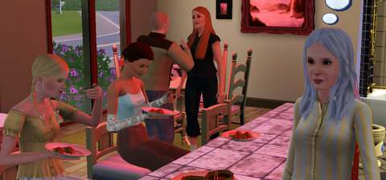

Back to: [West Karana](/posts/westkarana.md) > [2009](/posts/2009/westkarana.md) > [July](./westkarana.md)
# Sims 3: Alice comes for a visit

*Posted by Tipa on 2009-07-10 07:48:51*

Awhile back I gave the renowned homeless family whose story is chronicled in [Alice and Kev](http://aliceandkev.wordpress.com/) a lot of their own in my Sims 3 town. I check in on them now and again, thinking of excuses to visit their lot. Alice never wants to visit, but I have the Party Animal ability to force people to come to my parties and have fun. Handy little ability, that. Anyone I invite, has to attend.

It's a great way to see that Alice gets fed, anyway. That's her eating Dim Sum, second from the left, well into her Young Adult phase, a fair distance from her beginnings as [a young girl with an abusive dad](http://aliceandkev.wordpress.com/2009/06/09/alice-and-kev/).
## Comments!

**[Saylah](http://notadiary.typepad.com/mysticworlds)** writes: Although I already own it, I don't think TS3 is going to be for me. There are two expansions fundamental to the why I play TS - Seasons and Open for Business. I hacked and mod'd my way to playing like that years before the actual xpacs. I just can't see going backward in game play. Lastly, my daughter came by this weekend with TS3 on her laptop to show me her family and house. She explained that ALL community buildings are now disabled from entry. They are just shells and you interact with menus but never go inside?!? She's disappointed and annoyed by that as I would be too. Seriously???? I don't get to walk around inside shops, restaurant, dance clubs etc.? Wow, that's another huge setback in game play. According to her, you can't even build custom community lots in more. I find that outrageous.

---

