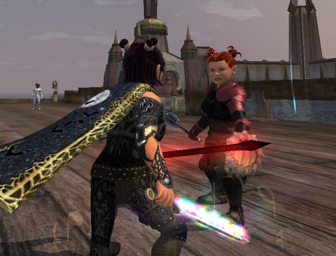

Back to: [West Karana](/posts/westkarana.md) > [2009](/posts/2009/westkarana.md) > [July](./westkarana.md)
# EQ2: Antonia Bayle, Day 2

*Posted by Tipa on 2009-07-16 23:33:03*

It's been a year since ~~Dina~~ Tipa and ~~Dera~~ Arda were able to be in the same place on the same server. I've got a HECK of a lot of "solo" quests to get done now, and now that I have a pet healer, they won't take forever because of downtime.

Today I moved Brightknife -- my character who does the fashion shows and the EQ2 one-panel comics -- and Dina, my main, to Antonia Bayle. Dina lost her home due to a bug that happens sometimes when you have to change your name in a move. The same bug hit Stargrace, and a GM dumped the entire contents of her home into her inventory. That's a nice thing for them to do, but my home had a Stargrace-built theater in it, and though she volunteered to build it again if she had to, I'd rather she didn't have to.

I'm soaking in the AB ambiance. For all its fans, the tone of the chat channels is identical to Befallen and Najena. There are lots of guild recruiting, and from their various spams, I build a picture of my perfect guild. Alt-loving, casual, occasionally raids t5-t7 content for fun and AAs, groups and does quests, maybe some TSO instances, or maybe just grouping at level 30 or 50 with an alt and just relaxing and having a fun time.

I need to start on the Moors solo quest line, and do that Order of the Rime quest, while keeping my ear open for guilds and talking to people. With any luck, by the end of the weekend I'll have found a home and can complete my next goal, leveling Tailoring to 80 and getting the tradeskill epic for Tipa. I'd also like to finish the quests that open up the shard-a-day dungeon; even if I never get a shard group, I can eventually get my T2 gear just by logging in each day.

It's good to have Dina and Dera back together again!

## Comments!

**[Lars](http://mmomentofzen.blogspot.com/)** writes: How does AB compare to Najena? I've contemplated moving before - mainly because I like the fact that AB has all these player run events. But I'm attached to my guild. I have two lowbies on AB I keep there just so I can check out the two Festivals and so on.

---

**Wrapye** writes: I've heard that the RP on AB is lacking. Or non-existent. I heard once that LDL is more RP, but don't know if that is true anymore.

---

**[Tipa](https://chasingdings.com)** writes: I've been in one RP group since I moved. I was kept trying to figure out how to talk about the quests we were doing in Lavastorm as if my character really cared about them. It was unnerving.

There's a place for RP, but not while doing something as utterly pointless as questing. My character would certainly have more important things to do than carry rocks for goblins. If I were roleplaying my characters as I wanted to roleplay them, I would be in Enchanted Lands and Rivervale trying to cleanse the lands and restore Halflings to their proper home. But that's not something the game will let me do. All I can do in EL or RV with halflings is kill them. There are quests for that. There are WRITS for that.

Goblins are the natural enemy to halflings -- I mean, let's be honest. No halfling would do menial tasks for goblins -- EVER. But if you want to get the xp and other rewards from the new LS quests, you have to do menial tasks, and then kill a vast selection of the inhabitants of Lavastorm.

There's discussions nightly on AB about the lack of roleplaying. The prevailing mood is that WoW players come to EQ2, choose the most popular server (AB), log in, then, while complaining about how EQ2 is not WoW, gum up the chat channels with obscenity.

It's the same on any server, aside from mentioning roleplaying. All but that one RP group have been identical to any other group on any other server....

Now that said, I like AB, the server. But not for its roleplaying. Though I AM looking forward to the Festival of Discord, and for that, I look forward to the roleplaying.

---

