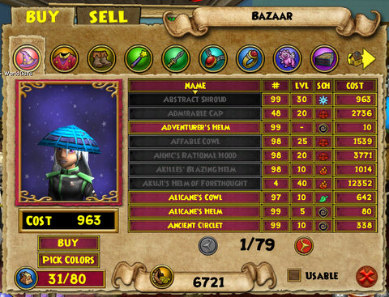

Back to: [West Karana](/posts/westkarana.md) > [2009](/posts/2009/westkarana.md) > [July](./westkarana.md)
# Wizard 101: New Bazaar on Test

*Posted by Tipa on 2009-07-18 08:57:17*

See, this is what I like about KingsIsle. The Bazaar wasn't all that useful when the Grizzleheim expansion launched. It did the job, but it wasn't easy to use. KI has an entirely new Bazaar up on the Test server, and invites all W101 subscribers to give it a try this weekend before it opens on all servers.

Items may be sorted by school, price, usability, minimum level and quantity. It becomes extremely easy to find upgrades.

The mechanics haven't changed -- you still sell and buy items for a fixed price -- nut it's far easier to find what you are looking for.

The full announcement after the break.

> Wizard101’s Test Realm is now Open for the Weekend!

From our player feedback, we've taken a look at the Bazaar and added sorting of items as well as improved the overall experience with the Bazaar. 

We need you, our players, to spend some time in the Test Realm at the Bazaar and really test out how the new system works. Buy and sell as much as you can, and remember what you do on the Test Realm in no way affects your Live Realm characters. 

Once you've given the new Bazaar experience a thorough testing, post your feedback on the Test Realm section of the message boards.

