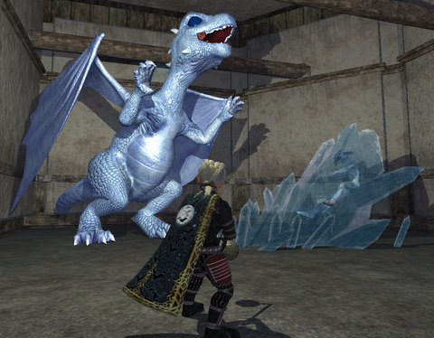

Back to: [West Karana](/posts/westkarana.md) > [2009](/posts/2009/westkarana.md) > [July](./westkarana.md)
# EQ2: There's a reason the room was so cheap...

*Posted by Tipa on 2009-07-18 12:07:31*

I finally got around to unpacking my things from the move to the Antonia Bayle server. First step: renting a new apartment from ~~Big Bend~~ New Rivervale's friendly slumlord. He wanted 5 silver for one dingy room, but this haffer wasn't born in a cabbage patch. Well, actually, I WAS born in a cabbage patch -- long story -- but I'm still a pretty sharp cookie.

Mmmm, cookie.

Oh yes, where was I ... ?

I asked him if maybe there wasn't a room a little cheaper -- after all, most of the (soon to be FORMER) residents of New Rivervale are easily twice my size, so I should only have to pay half as much! I could see I was wearing him down, and he finally agreed to rent me a special room, furnished! He normally charges TEN SILVER for that room, but since I was, as I'd pointed out, only half the size, I'd only have to pay half the price. I gladly handed him five silver pieces and grabbed the keys before he changed his mind.

You know, now that I'm thinking back on it, something seems a little off about that.

I found my inn room and was about to put the key in the door when I heard this ROAR! I summoned my wolf, Cinnamon, to my side, got all my best spells ready, turned the key and opened the door, ready for anything...

Anything but a DRAGON.

Turns out that roar was him freezing a goblin who was trying to convince him to return to Permafrost, but he wasn't having any of it.

The Dragon -- his name is Ralph, by the way -- actually has been living in Freeport his whole life. He and his entire "clutch" -- dragons laid in the same hatching -- were stolen from their nest by goblins for sale to adventurers all over Norrath, who would hatch them and raise them in their inn rooms, apartments and guild halls as pets. PETS! Well, when some adventurers raised Lady Vox from the dead a few years back, and she found out what had happened to her hatchlings, she was more than a little angry, and has been forcing ice goblins to track down each and every dragon, and return them, willing or no, to Permafrost, where she can give them a proper education.

There aren't many jobs available for a dragon in Freeport aside from being the title of someone's "kill quest", so Ralph has been laying low, eating the occasional ogre or troll that tried to steal Ralph's hoard (really, it's just a pile of commemorative "D'Lere? D'lightful!" buttons from the Freeport sesquicentennial a few years back, but shhhh, okay?).

I'm not even a bite-ful to him, so we worked out an arrangement. If I keep bringing him food, he'll keep my stuff safe and, maybe, someday, help me clean out all the Ogres and Trolls that are hanging out in New Rivervale. 

Come by to visit, any time! If I'm not home, give Ralph the message. And if you have any giant parts on you, just leave them by the door. He'll thank you for them.

(Ethra, btw, leveled from 52 to halfway through 54 in nearly continuous grouping last night. So much fun! Best part: Being the sole healer in a mid-fifties group in Permafrost, taking on the Epicx2 flying thing in there -- and on our third try, taking it down. Who says Defilers can't heal? I have to admit that the Court of Innovation afterward was a LITTLE over my head, and I was very glad to see there was also a Fury in the group.)

## Comments!

**[Ziboo](http://mmo2go.blogspot.com)** writes: That was a delightful story!

---

**[Cow Nose the 50 Pound Cat](http://cownosethe50poundcat.blogspot.com)** writes: What an awesome blog tipa thanks so much for writing it up! It was a great read. :D

---

**[We Fly Spitfires](http://blog.weflyspitfires.com)** writes: Hehe, awesome story!! Love the pic too :)

---

**[Saylah](http://notadiary.typepad.com/mysticworlds)** writes: I enjoy the blogroll but I love your RP stories more. Nice to see one.

---

**Noffin** writes: Hi there :)

---

**[Tipa](https://chasingdings.com)** writes: Noff!!! How have you been?

---

