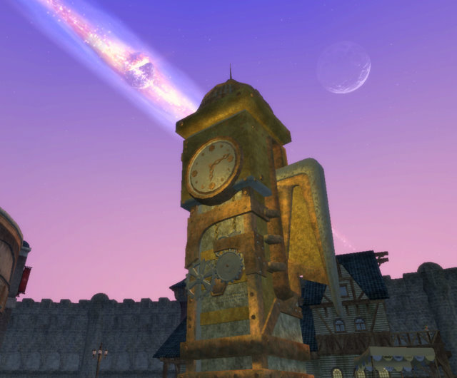
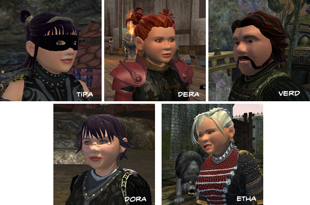

Back to: [West Karana](/posts/westkarana.md) > [2009](/posts/2009/westkarana.md) > [July](./westkarana.md)
# EQ2: The sixteenth minute -- a rebuttal

*Posted by Tipa on 2009-07-22 07:53:45*

Where I live, both Burger King and Texas Steak House are in walking distance. Both serve meals, and both of those meals may contain beef. I could walk into the steak house and notice that the wait was too long, the menu was not posted prominently with pictures of the meals as you walked in, the meals were vastly overpriced, the music was too loud, the place was too crowded, the servers demanded I decide how I wanted my meal cooked, they served alcohol, and that since Burger King was arguably a LOT more popular, they would be well served by changing their business, or at least to be more aware of the BK way.

And the server staff occasionally breaks into line dancing! BK doesn't do that AT ALL! What are they THINKING?

But I won't go there, because that would be weird. Burger King and the Texas Steak House do their own things, and the world of fine dining is enriched by the choices on offer.

Wolfshead wrote a piece a couple days ago about [EverQuest 2's first fifteen minutes](http://www.wolfsheadonline.com/?p=2570). He mentioned this is the sort of review you might find a game undergoing in game development, but the post was written for public view and in the time-honored role of the blogger, here are my thoughts on it.

Much of his review was actually a direct comparison between EverQuest 2 and World of Warcraft, where WoW's positioning of the ESRB warning, the background for its character selection screen, and lower emphasis on crafting at lower levels were seen as the gold standard from which all better MMOs would do well to copy.

First, it's pointless to EVER design an MMO, even a fantasy MMO in the same general genre as World of Warcraft, as an homage to WoW. Blizzard will always be better at making WoW than a third party, and as Wolfshead points out, most WoW players couldn't really care less about non-WoW MMOs, so efforts to copy the game would mostly be for nothing.

Secondly, WoW is indisputably the most profitable MMO in the world. But is it the best? That's where personal tastes enter the picture. World of Warcraft is an on-rails, largely solo game until the level cap (even when I played WoW pre-BC, hardly anyone grouped outside of instances). EverQuest 2 is meant to be a more social game with many different paths to the level cap. Both approaches are valid.

**The Shadow Odyssey**

Wolfshead wonders why, several weeks in, he still doesn't know where The Shadow Odyssey takes place, whereas he knows exactly where Wrath of the Lich King takes place in WoW. Well, truth is, he's probably already been there. TSO added breadth to the game -- it added more dungeons and quests to zones all over Norrath. The Freeport newbie fields, Commonlands, holds TSO content. Everfrost, Lavastorm all have TSO stuff. The new zone, Moors of Ykesha, you can travel to and do certain quests from level 45. This is something unknown to the WoW world, but common in the EQ world -- the broadening of the world.

Especially for crafters (but also for higher level adventurers), TSO opened a new leveling path -- and for those who like soloing, it is almost entirely a solo leveling path.

Crafting, in EQ2, is a separate line of advancement. You can be a level 80 crafter and have access to the appropriate level chat channels and so on -- and have special high level crafting armor and jewelry -- without gaining even one level in your adventuring class. This is unknown in the WoW world, where your crafting abilities are tied to your adventure level.

One of the first questions you were asked when you left the newbie island in the original EQ2 was if you were to be an adventurer or a crafter, though your answer did not constrain you to one or the other path.

Minute 2-3 -- inappropriate character background screen. This got a big "HUH?" from me. I thought back to all the fantasy MMOs I have played -- Guild Wars, Spellborn, EverQuest, Dream of Mirror Online, Florensia -- and tried to recall what the character selection backgrounds were. Well, in EQ, the background used to be a little room specific to your class you could run around in. That was fun :) EQ2 used to have random character background screens before they replaced them all with the current screens from Echoes of Faydwer's New Tunaria background. But still... background screen?

**Minutes 3-4: Character Creation — Too Many Choices**

EQ2 was so proud of their character creator that they gave it away prior to the game launch so that people could design their characters in advance. Most people saw this as a good thing, including me. Here's some of my actual EQ2 characters. All are halflings, most of them female. Their faces are unique and yet consistent. Tipa's mood is happy, while Etha's is angry -- you can change your expression to fit your mood in EQ2 (but because that option is not available in WoW, does it matter?)

Should you decide to change your face, that option is available for a single gold piece in major cities. So there's no problems with hitting the random button a few times at character creation until there's something you can live with, then coming back to it later. I've changed Verd's face a couple of times.

**Minute 6-7: Class Selection**

Wolfshead's comment: Class selection should tell how good each character is at soloing, grouping and raiding. Well -- that changes all the time. All classes can solo, have group skills, and raid options. I play a bard, and the bard's role in raids is about to drastically change from being utterly necessary to meh, one will do. Each class has one or more specs that will increase its soloing potential; each has one or more specs that would help groups, and one or more specs that would boost its raid use. Any two specs can be freely switched with the aid of an AA mirror. Wolfhead's comment on class selection has no meaning in EverQuest 2, while it might in WoW.

**Minutes 8-10 – The Player Arrives in Norrath**

Largely spent trashing EQ2's user modifiable UI with the non-modifiable (without addons) WoW UI. Eh, different tastes. EQ2's casting and combat are very different than WoW's; in particular, EQ2 has far, far more options. Whether this is a plus or a minus is a matter of taste.

Wolfshead acknowledges that pretty much all of his perceived issues could be solved by a custom UI, such as those commonly and nearly universally used in WoW. As a hard of sight person myself, I was able to arrange things for easy seeing. Here's my UI -- and yes, it's busy, but that's EQ2 for you. A matter of taste. I can find everything I need.

Clearly, a new character's UI won't be this busy -- but it needs to have room to expand. WoW's fixed default UI won't last you very long at all, unless the thought of switching hot bars all the time appeals to you. (Note, I am not acquainted with the WoW UI aside from the game as it was when I played.)

**Minutes 12-14: Combat and Abilities**

Combat in EQ2 is very different from WoW's. There's no global cooldown timer, for instance. There ARE some instant (or at least, extremely short cast time) abilities, but I'm not sure how many a new character would have. I tend to recall only a few things being offered to new characters. I use a mix of fast and slow abilities on my characters.

The melee bar to EQ2, which not only tells you you are in combat mode but also when your autoattacks will hit so you can plan ability use around auto-swings should have shown Wolfshead when he was not only in combat mode, but in combat range. Not sure how he missed that.

He also advises reducing cast times by 30% for everything. I'm not sure why. Plenty of buffs, AAs and item effects which do that as you level, anyway.

**Minutes 14-15 – Exposing the Player to Crafting Too Early**

Already covered this -- crafting is a separate character advancement path. Crafting characters, of which I have a few (Dora is my foremost), probably want to get started crafting right away, without having to kill stuff. Also, this low level crafting stuff sells for good money to other adventurers. Why wouldn't you want to harvest it?

Wolfhead concludes that EQ2 fails on many fronts, most of which can be traced back to: It isn't WoW, and is clearly subjective, though he mentions these things as if they were incontrovertible fact.

Here's are my subjective thoughts: I find WoW's character graphics grotesque and very off-putting. The bizarre death grins on the human males is particularly disturbing to me, but most WoW characters, especially as they advance, look as if they were crudely sculpted from Play-Doh.

It's subjective! I LIKE the old EQ2 character graphics, and that's what I use to this day. Wolfshead doesn't like them. That's okay! It doesn't make EQ2 better or worse than WoW, just different.

His main recommendation is to update the newbie experience, which is such a good idea that SOE has done it many times. The Isle of Refuge has been entirely revamped, and new newbie experiences have been added in Kelethin, Neriak and Timorous Deep which not only improve it in various ways, but are so different from one another as to provide entirely new leveling paths.

I can't look back on my first fifteen minutes at WoW for comparison, because they are all caught up in my year in the game. I liked WoW, I loved its newbie experience, I'm not going to say it was disappointing, because it was not. But I liked EQ2 as well, and I don't ever want it to be WoW. EQ2 should NEVER add a feature JUST because it exists in WoW -- it should always go its own way.

There's nothing SOE could do to EQ2 to convince a million WoW players to switch, after all. That said, EQ2 does get a good share of WoW players -- and I'm one of them.

## Comments!

**[Stargrace](http://www.mmoquests.com)** writes: *great* write up, echoing my thoughts exactly on the whole "WoW vs. EQ2"debate that we've heard for years now. They're not the same game, they've never been the same game, and comparing two games that play very different from one another is never going to result in a "fair" answer.

---

**[Ethic](http://www.killtenrats.com)** writes: You are correct of course, "different" is not the same as "worse". (old man voice) Back in my day, most of the time you spend playing a new MMO was just trying to figure out how to do things. And we liked it!

Truth be told, there are quite a few things in EQ2 that WoW should be including. Not only housing, but the ability to place things almost anywhere in the house. Brilliant. I spent a while just placing my books on a table, placing them side by side. Let's not forget about climbing as well. I loved that ability. Another good thing, the skills you get automatically when you level? Super!

That said, I pretty much HATE the character models in EQ2. They just look super phony and creepy to me, the old uncanny valley problem. However, some of your characters above don't look too bad so it's clear you *can* make a decent looking character.

---

**[Lars](http://mmomentofzen.blogspot.com/)** writes: Isn't the auto attack bar an add-on for EQ2? I swear I remember having to download it to get the timer.

As for character models, I hate hate hate the original models. Even the constipated look of the WoW characters is better. So I use the SOGA models in EQ2, because they look like they were designed by people who actually have artistic talent. I don't care much for the anime direction though. Oh well. I play the game for the game not the character models.

---

**[Spinks](http://spinksville.wordpress.com/)** writes: I don't recall seeing an auto attack bar timer on the base UI, not sure about that one. 

Maybe the new content and locations are obvious to people who know the game. I'm struggling to even figure out where my next zone is and none of the NPCs have mentioned dungeons yet. Although I'm pretty sure that WoW doesn't do a great job at pointing you at the low level instances either unless you're already in the right zone.

I think it's just very hard to compare an old game that you're familiar with to an old game that is new to you. I often feel too dumb to play EQ2 (people give me advice and I barely understand if they're even speaking English), but I'm guessing people new to WoW would have a similar reaction.

---

**[Pete S](http://dragonchasers.com)** writes: All in all, well put.

My issue with the anonymous Wolfshead is this pretense he has that he is "helping" SOE by pointing out all these aspects that he perceives as flaws. If he were genuinely only interested in helping SOE, he could write something like this and send it to one of the designers there. But clearly, like all of us, he's posting because he wants to start a conversation. There's nothing wrong with that, but be up front about it. Don't position yourself as being on some kind of altruistic mission to save SOE from themselves. 

But what he is doing here is certainly not "helping" SOE in any way, because at best someone on the fence about trying EQ2 is going to read his post and decide it just isn't worth trying. 

I also totally disagree that people judge an MMO by their 1st 15 minutes of playing it, anyway. By the time they've bought and patched the game, they've invested enough time that they're going to give it a longer trial than 15 minutes.

I don't actually disagree with everything he said, but it's pretty obvious that his yardstick was WoW and a lot of what he said boils down to "This is different from WoW." And when he starts off criticizing the ESRB rating and the background when you're creating characters, that just seems really petty.

WoW is definitely very newbie friendly, sure. I don't know that every MMO has to be, though. I rather like to have more diversity in the MMO space.

---

**[Sente](http://adingworld.wordpress.com)** writes: I think there was a mix of valid \_opinions\_ on what could be improved in terms of game design and preferences/taste for a specific person what should be in an MMO. 

And if some specific preferences/taste are more popular it does not necessarily make it "better". In that sense I think the amount of pain points for people would be more important - are there features that many people dislike or get annoyed by? There has been a fair amount of work on EQ2 to address such matters.

---

**Aarkan** writes: Thank you Tipa! I thought you dismissed this much too quickly in your last post on it. I read the article and was thoroughly disgusted. I play WoW every day and I love WoW and feel it's the most fun game on the market by a large margin but that doesn't mean that any other game should be WoW. EQ2 is an excellent game, I love the world of Norrath and I love what they're doing with the marketplace and character customization while still adding more solo, small group, group and multi-group(raid) content. Being able to be a Vah Shir err Kerra Ranger in shining armor which I earned from hunting vampires and covered in a purple void glow from Legends of Norrath is incredible to me. EQ2 has a ton going on and if it's your flavor of ice cream it tastes sweeter than anything. Also every single one of his complaints are either frivolous or uninformed who gives a shit about the ESRB rating and simulated alcohol use? Who cares about what's going on behind your character? In WoW it's the racial starting city because there are distinct differences between each race and there are few races. Complaining about too many choices? TOO MANY CHOICES?! I don't want to live (or play) in a world where everyone wears gray suits and drives gray cars and works in a grey building at a gray desk. EQ2's character creation and customization are incredible. Character creation for your first character SHOULD take you 15-60min! Not because there's necessarily a lot to do but a lot of choices! I spent an hour and a half making my first character in City of Heroes and tons of time on the EQ2 pre-release character creator and even more in game as each new race was added or more cities etc. The EQ2 starting experience I always thought even from the Isle of Refuge was awesome and the Isle was most definitely not the first thing they made and went through plenty of revisions before launch and during the first year and it's been totally overhauled since then. The Kelethin, Neriak and Gorowyn starting zones are just as good as the WoW ones! Leveling 1-20 in Neriak was more fun than most WoW starting IMO only dethroned by the Burning Crusade ones. It's a bummer that all of this talk is wasted anyway, he clearly didn't even give it a chance. Who the hell would bitch about too many choices? Who the fuck wants to be crowbarred into being something you don't exactly want? Why don't you want to choose your race and class independently of each other? In WoW I was "forced" to be a Night Elf because I wanted to be an alliance druid but in EQ2 I could choose to be a Kerra Ranger or hell if I even wanted to I could be a good race as an evil class! Froglok Shadow Knight? Dark Elf Paladin? Unfortunately the narrow minded wow player won't think in those terms and we're lumped with a lot of bad press on a great game. I know quite a few people who would enjoy EQ2 far more than WoW but are playing WoW thanks to the system specs. 

Sigh I rambled too much. /rant off. tl;dr I love WoW and EQ2 and they're both great for some of the same and different reasons and wolfshead is an ass

---

**[Saylah](http://notadiary.typepad.com/mysticworlds)** writes: There are aspects of EQ2 I always wished where in WOW and some elements of WOW in EQ2. In my perfect world view, EQ2 would have been just a little more fun, tolerant of solo play and less laggy, and I would have preferred to be in EQ2. But there's something about that games quest design, more similar to LOTRO than WOW, that I never could abide. Still, I'm not so enamored of WOW that I think every game has to be direct rip off or I won't play it.

Now that Runes of Magic has come along and I've seen yet another view point, if EQ2 was exactly what it is now but with questing, dailies and player communities more tightly integrated into the questing zones ala ROM, I'd take EQ2 over WOW.

---

**[Hudson](http://hudshideout.com/blog)** writes: Phew man you got a lot of responses fast! Nice post

---

**[rob](http://www.lostaneighth.com)** writes: I gravitate back and fourth between WoW, EQ2, and LOTRO. To me they all scratch the same itch, but they scratch it in vastly different ways ... if that makes any sense. I can't deny that on a very fundamental level that playing any of them exercises the same muscle groups and thought patterns: Hold right mouse button to look around and press the left button to move keeping my left hand in the WASD nerve punch grip. Click a panel of buttons/hit number keys to perform my skills in a certain order, etc ...

However, and I know I have said this in your comments section before, Tipa, but the thing that makes the difference and ultimately is what makes up my mind of which game to play to "scratch that itch" is the little bits that my imagination fills in. What is my character like? Why are they the way they are? What motivates them to do what they do in the game? This makes my WoW characters vastly different from my EQ2 characters, and so on.

---

**[We Fly Spitfires](http://blog.weflyspitfires.com)** writes: Excellent post. I think EQ2 is a better than WoW yet I think WoW absolutely has a better first initial impression on the user for all of the reasons Wolfshead summed up. The first 15mins of WoW are undeniably better than EQ2 for non-MMORPG gamers (for veteran MMORPG gamers, I doubt they care or even see a difference) and I'm sure it's one of the reasons why it pulls in more pundits.

"There’s nothing SOE could do to EQ2 to convince a million WoW players to switch, after all."

Never say never! I think EQ2 is a better core game and I'm convinced if SOE put in the time to make enough changes and then relaunched the game, they could make a dent in WoW's numbers. Of course, it would mean putting new developers on hold and reworking original content. I'd love to see it happen :)

---

**[Tesh](http://tishtoshtesh.wordpress.com/)** writes: And now I'm idly wondering about the first fifteen minutes of EVE.

---

**Neiebuse** writes: I think he made some valid points that a new player, not even one that is coming from WoW would make. 

There ARE a lot of class choices. Frankly, I think the class system remains one of the biggest fundamental problems with EQ2. Most games, sadly, do a pretty poor job of explaining what a class DOES. Personally, I'd like to be able to see all of a class's core spells and talents BEFORE I make a character. But hey, WoW has the same problem -- I don't know if they've changed it but you couldn't even LOOK at talents before level 10. My Mystic is a VERY different character in day-to-day play at level 80 than at 1.

The UI IS confusing and cluttered... it's not just a matter of simpler-WoW style UI versus more customizable EQ2 UI, it's just that over the years, they've added more and more features and so the UI gets more cluttered. MMO UI is a subject I could rant on endlessly, but suffice it to say that I think most MMOs have terrible UIs. I like that EQ2's is pretty clean and I can make it get out of my way, but there's a lot of room for improvement. And I don't mean just copying WoW (if WoW's UI was all that good, people wouldn't need to install addons to consider it playable).

And the character models... they need work. EQ2 CAN push some really nice looking graphics and the more recent expansions have really done a more better job of having the art direction match what the engine can do. Plus the engine's getting better as well. Some tweaking and work could really bump things up. Better textures (and/or shaders), minor model tweaks, NEW HAIR... and the characters could really look a lot better. Hell, just give me hair that doesn't look like it's been sculpted out of play-doh and I'd be willing to take my helmet off.

Don't get me wrong. ESRB logo too big? Come on. Loading screen doesn't give you an idea where The Shadow Odyssey takes place? What does 'odyssey' mean, again? Lack of racial backgrounds on the character select screen? Please.

I guess what I'm trying to say is... I think he makes some valid points. I just don't think WoW has the solutions.

---

**[Tipa](https://chasingdings.com)** writes: re: Character models. I don't mind the models, but the hair DOES look plasticy unless you color it. So does the skin, but there you hit the real issue -- the characters are almost never lit well, and the shadows on the faces look weird. It is hard to take convincing character portraits without a good amount of positioning and lighting.

@Lars, et al. -- the autoattack bar may have come with my UI. I thought it came with GU 51, but maybe I just happened to update my UI and got it. In which case, he has a semi-point, though the border of your character info pulses when you are in combat mode. This may be easy to miss.

@Spinks -- I'm not sure where you are in EQ2. The Kelethin and Timorous Deep newbie paths connect you with the Faydwer quest line. The Neriak quest line skips over Commonlands (maybe not the best choice) and connects you with the quests in Nektulos Forest. In Freeport, you are shunted into Commonlands, which also leads to Nektulos Forest. For all levels, city writs will bring you to the zones in which you should be leveling. But with today's faster leveling, it might be all too possible to level right past a quest chain that was intended to bring you to your next zone.

Now I feel I just ended up sounding like another EQ2 player spouting gibberish in an effort to help :/

@Aarkan -- love you :)

@Saylah -- I wonder how EQ2 could be made more fun. WoW stopped being fun for me, though I am willing to concede it might be more fun now. I just, at the end, found it boring.

@rob -- character stories -- absolutely! Missed, I think, in all this is -- what does your character DO?

@Gordon -- I can't believe you just suggested SOE do a SWG-style NGE to EQ2. I don't think it will have the intended effect :P

@Tesh -- The EVE Online ESRB is small and in the corner.

@Neie -- well, everyone complained when EQ2 launched with the archetype-class-subclass system... When I created Dina (now Tipa), I thought my main jobs would be melee dps and crowd control -- it even said so. They took away my melee dps and then they took away my crowd control (to a great extent). So it's really pointless to tell people what their class DOES up front when they can change it at any time.

For those wondering, a bard's current role is buffing.

Great discussion today :)

---

**[Isaiah Spelldust](http://www.defendersofthespiral.blogspot.com)** writes: Just to let you know about my first ever Comic Contest!

-Anyone can enter!
-The comic has to be Wizard 101 related
-Entries can be submitted between July 22-August 13
-No run-offs of anyone elses comics!
-The winner's ( 2-3 ) will get to make a comic with me. Except YOU get to make up the theme!
- You must submit all comics to me via e-mail; Isaiahspelldust@gmail.com
-Have fun! And relax, there's no rush in this race!

Good Luck

---

**[Pete S](http://dragonchasers.com)** writes: One of the problems with the character model debate is this:

You already have 2 sets of character models, and each of those has die-hard fans. I will *only* use the SOGA models because I agree that the original models aren't very pleasing to the eye. However I know there are other people who will *only* use the original models and love them to bits.

So if they were to 'redo' the models again, then they'd have 3 sets (and already one complaint is that there are 2) which would just make things even more confusing. Or, alternatively, they could toss out the existing 2 and upgrade everyone to the new models, and piss off vast numbers of their installed base. IIRC DAoC did this once and Mythic was crucified for it.

One last question, and it is an honest question. The underlying tone to Wolfshead's post (reinforced in some of the comments over there) was that EQ2 was in need of saving. Does anyone have subscriber statistics to show that this is the case? Or NPD numbers for the expansions that would show the audience is leaving? Or was he just assuming that the numbers were dwindling in the same way he assumes everyone is ADD-afflicted and having to spend more the 5 minutes on character creation might kill us?

---

**[Tipa](https://chasingdings.com)** writes: Well, the most amusing bit was, assuming EQ2 IS in need of saving, the best way to do that would be to slavishly copy WoW.

---

**[Praising With Faint Damning | Stropp's World](http://stroppsworld.com/2009/07/23/praising-with-faint-damning/)** writes: [...] mentions that the newbie areas and quests could handle some improvement. As Tipa points out in her rebuttal to Wolfshead’s post, that actually has happened – a number of times. And perhaps they could use still more [...]

---

**[Stropp](http://stroppsworld.com)** writes: To me it appeared that Wolfshead was simply looking for things to criticise about EQ2, and not being able to find too much, picked up on some really minor points. Irrelevant stuff really. 

I do think he had a point about the UI. While I'm used to it (I don't use any addons yet since I don't feel the need) it might be a bit overwhelming to a new player. That can be something a games veterans can forget about.

And I don't really mind the character models either, 'cept I tend to play the beastie species', but yeah I can see where he's coming from in the way the humanoid models look. I think there's a graphics revamp coming soon though isn't there? Something about new shader code?

Anyway, as I said, too much drinking of the WoW-Koolaid.

---

**[Wolfshead](http://www.wolfsheadonline.com/)** writes: 
> Where I live, both Burger King and Texas Steak House are in walking distance. Both serve meals, and both of those meals may contain beef. I could walk into the steak house and notice that the wait was too long, the menu was not posted prominently with pictures of the meals as you walked in, the meals were vastly overpriced, the music was too loud, the place was too crowded, the servers demanded I decide how I wanted my meal cooked, they served alcohol, and that since Burger King was arguably a LOT more popular, they would be well served by changing their business, or at least to be more aware of the BK way.

Yet I doubt that the Texas Steak House charges you $4.99 like a Burger King combo meal costs? Steak houses are notorious for pricey menus and even pricier a la carte offerings.

The flaw in your analogy is that if SOE is the Texas Steak House then we should be expecting an amazing meal when the exact opposite is true. The SOE meal while tasty in it's own right is being served in a brown paper bag from a guy with a cigarette dangling from his mouth. The meal coming from WoW is more refined, tasty and served properly despite the fact that millions seem to go there and pay for it.

Of course both WoW and EQ2 are different MMOs. I'm not arguing that they should be exactly the same and it's unfair to imply that.

> Secondly, WoW is indisputably the most profitable MMO in the world. But is it the best? That’s where personal tastes enter the picture. World of Warcraft is an on-rails, largely solo game until the level cap (even when I played WoW pre-BC, hardly anyone grouped outside of instances). EverQuest 2 is meant to be a more social game with many different paths to the level cap. Both approaches are valid.

Actually I've argued this at length over at my blog and said the exact same thing about WoW. It may be the most popular MMO out there but is it the best? Popularity does not equal quality. But on the other hand, lack of popularity doesn't necessarily equate to high quality.

From my limited knowledge of EQ2 I would agree that the community is far more mature and social. I've been spared Chuck Norris jokes so far on chat channels. *crosses his fingers*

> The Shadow Odyssey

Wolfshead wonders why, several weeks in, he still doesn’t know where The Shadow Odyssey takes place, whereas he knows exactly where Wrath of the Lich King takes place in WoW. Well, truth is, he’s probably already been there. TSO added breadth to the game — it added more dungeons and quests to zones all over Norrath. The Freeport newbie fields, Commonlands, holds TSO content. Everfrost, Lavastorm all have TSO stuff. The new zone, Moors of Ykesha, you can travel to and do certain quests from level 45. This is something unknown to the WoW world, but common in the EQ world — the broadening of the world.

Especially for crafters (but also for higher level adventurers), TSO opened a new leveling path — and for those who like soloing, it is almost entirely a solo leveling path.

I do appreciate the great info and heads up here on the Shadow Odyssey. As a EQ2 newbie I've yet to be impacted by the Shadow Odyssey and have no clue of what it's about. I still think that's a valid concern. 

The opening scenes tell me nothing except that there's a pretty lady with flowing black hair somewhere in the expansion being chased by a skeleton. I'm the admitted newbie here. If I can't figure out what the expansion is about then there is probably something wrong. My point is that SOE has missed a great opportunity to promote EQ2.

Also why is there no expansion cutscene?

> Crafting, in EQ2, is a separate line of advancement. You can be a level 80 crafter and have access to the appropriate level chat channels and so on — and have special high level crafting armor and jewelry — without gaining even one level in your adventuring class. This is unknown in the WoW world, where your crafting abilities are tied to your adventure level.

Again this is great info. However, how does one gather items if one doesn't level up? I've seen most resource nodes usually near enemy camps in hostile areas?

> Minute 2-3 — inappropriate character background screen. This got a big “HUH?” from me. I thought back to all the fantasy MMOs I have played — Guild Wars, Spellborn, EverQuest, Dream of Mirror Online, Florensia — and tried to recall what the character selection backgrounds were. Well, in EQ, the background used to be a little room specific to your class you could run around in. That was fun :) EQ2 used to have random character background screens before they replaced them all with the current screens from Echoes of Faydwer’s New Tunaria background. But still… background screen?

This is the kind of polish that is missing from EQ2. I realize you think that these kinds of things are trivial but they speak to the culture at SOE that seems unconcerned about things like this. A talented artist could take a few weeks to produce fitting backgrounds for each race that would help to get the player in the mood.

Do you or anyone at SOE truly believe that it's appropriate for a gigantic menacing ogre warrior to be standing in front of a cheery scene of waterfalls and elven buildings?

What is classier: getting a ornately wrapped gift or getting a gift that hasn't been wrapped? The gift is the same but how it's presented tell us more about the person who gives the gift then the gift itself. I'm not prepared to let SOE off the hook so easily for this faux pas.

> EQ2 was so proud of their character creator that they gave it away prior to the game launch so that people could design their characters in advance. Most people saw this as a good thing, including me. Here’s some of my actual EQ2 characters. All are halflings, most of them female. Their faces are unique and yet consistent. Tipa’s mood is happy, while Etha’s is angry — you can change your expression to fit your mood in EQ2 (but because that option is not available in WoW, does it matter?)

From what I saw of other races I was absolutely horrified at the poor quality of the avatar choices. If I have time I may put up another rogues gallery of some of the other races. They make the human pictures posted on my blog look like fashion models.

Halflings aren't that bad to be honest. I can appreciate your fondness for Tipa's avatar too. I think that despite the bad art that if you work hard you can get some acceptable avatars from the character creation screen but my point is that a newbie may not want to expend all that effort -- instead they want to choose a great looking avatar and play the MMO.

This should not be what we as veteran MMO gamers are comfortable with, it should be about what EQ2 feels like from the perspective of a new subscriber. This is what my article was about and it's the bigger picture: seeing EQ2 from the perspective of someone who's never played the game and trying to improve EQ2 for everyone.

> Minute 6-7: Class Selection

Wolfshead’s comment: Class selection should tell how good each character is at soloing, grouping and raiding. Well — that changes all the time. All classes can solo, have group skills, and raid options. I play a bard, and the bard’s role in raids is about to drastically change from being utterly necessary to meh, one will do. Each class has one or more specs that will increase its soloing potential; each has one or more specs that would help groups, and one or more specs that would boost its raid use. Any two specs can be freely switched with the aid of an AA mirror. Wolfshead’s comment on class selection has no meaning in EverQuest 2, while it might in WoW.

Again I just approached class selection from the point of a newbie looking to choose a class. I remember the original EQ where you were screwed in the endgame if you happened to choose the wrong class, so forgive me of being suspicious of SOE. 

I liked the classes I saw in EQ2 and stated as much. New players aren't going to have the advantage of you explaining to them all of this great info -- which I appreciate btw :)

> Minutes 8-10 – The Player Arrives in Norrath

Largely spent trashing EQ2’s user modifiable UI with the non-modifiable (without addons) WoW UI. Eh, different tastes. EQ2’s casting and combat are very different than WoW’s; in particular, EQ2 has far, far more options. Whether this is a plus or a minus is a matter of taste.

Wolfshead acknowledges that pretty much all of his perceived issues could be solved by a custom UI, such as those commonly and nearly universally used in WoW. As a hard of sight person myself, I was able to arrange things for easy seeing. Here’s my UI — and yes, it’s busy, but that’s EQ2 for you. A matter of taste. I can find everything I need.

Clearly, a new character’s UI won’t be this busy — but it needs to have room to expand. WoW’s fixed default UI won’t last you very long at all, unless the thought of switching hot bars all the time appeals to you. (Note, I am not acquainted with the WoW UI aside from the game as it was when I played.)

How about at least admitting that I'm right about the UI? Do you honestly think the stock EQ2 UI is competive in today's MMO market?

When most of your players resort to using 3rd party mods to get a proper interface then it's sign of failure on SOE's part. No wonder nobody complains about the poor UI since most players have probably abandoned the standard UI long ago leaving only poor fools like myself and other prospective subscribers to struggle with it.

When I see an amateur, incoherent, jumbled UI like this you bet I'm going to voice my displeasure.

> Minutes 12-14: Combat and Abilities

Combat in EQ2 is very different from WoW’s. There’s no global cooldown timer, for instance. There ARE some instant (or at least, extremely short cast time) abilities, but I’m not sure how many a new character would have. I tend to recall only a few things being offered to new characters. I use a mix of fast and slow abilities on my characters.

The melee bar to EQ2, which not only tells you you are in combat mode but also when your autoattacks will hit so you can plan ability use around auto-swings should have shown Wolfshead when he was not only in combat mode, but in combat range. Not sure how he missed that.

The melee bar does not reflect this at all. Only your name flashed red if you are attacking. It took me quite a while to figure this out. This is what life is like for folks that use the stock UI and it's unacceptable.

> He also advises reducing cast times by 30% for everything. I’m not sure why. Plenty of buffs, AAs and item effects which do that as you level, anyway.

Why? Because it felt tedious. You spend a lot of time looking at the casting bar/progress bar when you are casting or gathering. I felt it was a common theme in EQ2, that everything is created to be a laborious timesink. Perhaps it goes away but why torture and frustrate a new player with long casting times for spells and abilities?

> Wolfshead concludes that EQ2 fails on many fronts, most of which can be traced back to: It isn’t WoW, and is clearly subjective, though he mentions these things as if they were incontrovertible fact.

All I said is that there is a lack of quality that was obvious to me in the first 15 minutes. Poor character artwork, a disconnected and incoherent UI, a lack of focus and refinement in presentation to name a few. My article had many positive points to make as well.

I'm taken aback that you feel somewhat threatened by what I've said in my article. Aren't we all on the same side here? Don't we all want EQ2 to be a better MMO that attracts new subscribers? I'm not advocating the destruction of EQ2 as we know it, all I would like to see is some basic and fundamental issues addressed. 

Failure to address them in a timely manner and trust me, the marketplace will take care of things. Every day there are more MMOs being released that "get it". Everyone one of those MMOs is going to be leaving EQ2 with a smaller share of the subscriber pie.

> Here’s are my subjective thoughts: I find WoW’s character graphics grotesque and very off-putting. The bizarre death grins on the human males is particularly disturbing to me, but most WoW characters, especially as they advance, look as if they were crudely sculpted from Play-Doh.

It’s subjective! I LIKE the old EQ2 character graphics, and that’s what I use to this day. Wolfshead doesn’t like them. That’s okay! It doesn’t make EQ2 better or worse than WoW, just different.

That's a fair point but the old EQ2 character graphics are unacceptable in today's highly competitive MMO market. I do concede that I love my little male dwarf's face in EQ2 -- I've grown quite attached to him so I know where you are coming from here.

> His main recommendation is to update the newbie experience, which is such a good idea that SOE has done it many times. The Isle of Refuge has been entirely revamped, and new newbie experiences have been added in Kelethin, Neriak and Timorous Deep which not only improve it in various ways, but are so different from one another as to provide entirely new leveling paths.

It's wonderful that SOE has created these new and polished newbie starting areas but woe to the hapless player that decides to start in Qeynos or Freeport. I'm going to talk more about this in my 2nd article.

> I can’t look back on my first fifteen minutes at WoW for comparison, because they are all caught up in my year in the game. I liked WoW, I loved its newbie experience, I’m not going to say it was disappointing, because it was not. But I liked EQ2 as well, and I don’t ever want it to be WoW. EQ2 should NEVER add a feature JUST because it exists in WoW — it should always go its own way.

I agree but don't you think that SOE could benefit from Blizzard's way of doing things that put a premium on quality, excellence, detail and polish -- just to name a few things? Of course nobody wants EQ2 to be WoW, but you have to concede that WoW has been a game changer in the industry and with that comes certain expectations among prospective EQ2 subscribers.

> There’s nothing SOE could do to EQ2 to convince a million WoW players to switch, after all. That said, EQ2 does get a good share of WoW players — and I’m one of them.

You really believe that? I can think of a hundred key points that if I were a marketing person at SOE that I would use to entice jaded WoW players to try EQ2. I wouldn't be playing EQ2 now if I didn't believe that there's something special and unique about the MMO.

---

**[Brian 'Psychochild' Green](http://www.psychochild.org/)** writes: Wolfshead, I've been meaning to write on your blog, but you made a few comments I read here first that I want to point out.

Wolfshead wrote:
*This should not be what we as veteran MMO gamers are comfortable with, it should be about what EQ2 feels like from the perspective of a new subscriber.*

then wrote:
*I remember the original EQ where you were screwed in the endgame if you happened to choose the wrong class, so forgive me of being suspicious of SOE.*

You contradict yourself in these two sentences in the same comment. So, which is it? Are you looking at the game from fresh eyes untainted by previous associations, or are you bringing in your existing biases and opinions? I think that's the core issue here, and the reason people are taking you to task for the continuous comparisons to WoW. You're not really looking at this from a fresh perspective, and it shows. (Not to say the rest of us could easily set aside our biases, though. Mine shine through quite completely on my own blog.)

Let me give another example:
*However, how does one gather items if one doesn’t level up? I’ve seen most resource nodes usually near enemy camps in hostile areas?*

Again, you're speaking as the veteran here. You want to know everything about the game, and you want to know it at the start! A less experienced person is going to go in and experience the game. Sure, you're not going to be harvesting the highest level resources a few hours after making your first character. But, as you learn the game, you'll figure out how you can get resources. In LotRO, I've taken my level 26 character into areas that are level 40+ to collect resources. You could do the same thing in EQ2 once you know the game better.

And, one last big then I'll stop hanging you with your own words. (At least on here. ;)
*Because it felt tedious. You spend a lot of time looking at the casting bar/progress bar when you are casting or gathering. I felt it was a common theme in EQ2, that everything is created to be a laborious timesink. Perhaps it goes away but why torture and frustrate a new player with long casting times for spells and abilities?*

You see tedium, I see a more thoughtful pace. I loved EQ2's combat much more than WoW's because it was slower paced, *and* there were more options. You a wide variety of abilities instead of a handful of abilities that get upgraded again and again. If you increased the speed of combat in EQ2, then all those options would be overwhelming. Again, you're looking through the eyes of an expert. "I know how to push buttons, so let me push the damned buttons faster!" EQ2's combat doesn't work that way for a good reason, and it becomes apparent at higher levels.

The irony here is that the combat seems tedious at the lower end exactly for the newbies you want to represent. They're not masters of hotbar combat. They don't want to be rushed into pushing the wrong button at the wrong time and feeling like they fucked up. It's us experts that are happy to barrel forward and hope for the best, knowing we'll be able to pick ourselves up if we suffer a setback.

I think that what you wanted to do was great: look at how a game holds up under the scrutiny of a newbie player. But, I think you're bringing a lot of your existing notions to the table. I'd love to see you try again, though, because I think it can truly be insightful.

---

**[Gareth](http://www.eq2-daily.com/discuss/yaf_postst711_EQ2-Wolfshead-Onlines-Analysis-of-the-First-15-Minutes-of-EQ2-good-discussions-ensuing.aspx)** writes: I liked a lot of Wolfshead's article, one big small thing that's true is that while the Rivendale style backdrop is great for Good characters I think they missed a mood thing when a big troll is standing there, it doesn't need a Picasso in the background, but something mood setting for each distinct race would be great.

The biggest bone I have though with his comments are on character customisation and also looks, personally I was quite horrified at the thought of someone from SOE reading them and thinking "this is a good idea" with the result that overnight EQ2 gets filled with beautiful Anime style characters that all look a bit the same as each other, man that would drag! Guildwars is already standing there in that spot, they look beautiful, they all look very similar, I like that game but still prefer EQ2. (as an aside I find it really cool that you can find people who choose to play trolls in EQ2, I respect a player who can do that!).

Personally I play a Froglok and the character customisation for them is awesome, I feel a connection with the character that I don't so much with WoW, WoW's changing to a product made for video gamers who want the instant gratification, yet as they go further down that route I find that I cannot get the sort of pleasure from playing WoW that I used to at the same time, so basically they're driving people like myself out, but I digress.

If WoW is the gold standard, well they have a lot of really ugly races to play, yet they have a lot of people who choose to play what you see are ugly races, so I think you've gotten this one wrong. 

For some people its about being beautiful, but for most its really about being something you can believe in, its a role play thing because even WoW bills itself as a RPG (although its sort of a very basic one, and barely one at all these days at the end levels). But the lack of customisation here really does bite badly for long term play, its a natural impulse that people have in many cultures especially the western ones for people to look different. In WoW a lot of complaints come out that people look too samey at the end game, most are looking at the armour, but when I played it I had many a moment where I thought I saw a friend, but instead it was an identical avatar for someone else, that sucks.

So overall I think you are right on a few quality issues, I disagreed on the button pushing thing with times, playing WAR for example lots of abilities are very fast, yet they feel very weak, in EQ2 they feel more powerful when they do happen. There is though a culture shock thing going from WoW to EQ2 with the lack of Global cooldown, its a step worse going to WAR where you can stack commands over time (which results in abilities going off seconds after you wanted to).

---

**[EverQuest2: Stranger in a Strange Land | Wolfshead Online](http://www.wolfsheadonline.com/?p=2764)** writes: [...] week she decided to rebut my article. Fair enough. It’s a good and informative read from what you would expect from a [...]

---

**[The First 15 &#8230; er 20](http://wiqdintentionz.com/studios/blog2/?p=544)** writes: [...] the first 15 minutes of EQ2 that’s had a fair bit of publicity (and even backlash?) from the established EQ2 community. The article chronicles the very first 15 minutes of playing EQ2 right down to the startup splash [...]

---

**[foolsage](http://foolsage.wordpress.com)** writes: Good discussion here. Honestly, I think Wolfshead made some valid points, especially about the UI. If you need to rely on 3rd party mods, the UI itself isn't that great. Note that this same problem is very much the case for WoW. Who plays WoW without a ton of plugins these days? I also agree with the character creation background issue - it's trivial but it does make an impact. The ESRB notice isn't significant to me and I don't see a need for change. I also think it's valid to question what content is introduced in a new expansion. The game should make this plain to the player so we can make informed choices about whether we want to purchase the expansion. Frankly I never had a clear sense what content was in TSO either, in the time I played EQ2.

I do however agree with Psychochild that it's good to be clear on whether you're approaching a review as objectively as possible (i.e. as an outsider with as much of a tabula rasa as possible) or subjectively comparing it to other MMOs. Both approaches are quite valid - subjective reviews of games and other media have become fairly normal for blogs in the last 5 years or so, and there's nothing at all wrong with it. However, there's a shift of tone from one to the other in Wolfshead's article that's a bit disconcerting to the reader.

---

**[Dragonchasers &raquo; Blog Archive &raquo; Rebutting Wolfshead&#8217;s Rebuttle of Tipa&#8217;s Rebuttle](http://dragonchasers.com/2009/07/23/rebutting-wolfsheads-rebuttle-of-tipas-rebuttle/)** writes: [...] handle ‘Wolfshead’ posted a fairly scathing critique of the first 15 minutes of EQ2. Tipa rebutted his post. And Wolfshead rebutted her [...]

---

**[ysharros](http://stylishcorpse.wordpress.com)** writes: Wow, a week away from blogland (and rss feeds) and all EQ2 hell breaks loose! Meanwhile, I've... happily been playing EQ2, in between heavy working bouts. Which leaves me with 2 observations:

-- It was REALLY nice to be away from blogland and the RSS feeds, and have some mental peace and quiet for a chance. All this sturm und drang we shake, rattle and roll... it's all in a teacup. An interesting one, but a teacup nonetheless.

-- Amen, sister. I have 3 (almost 5) level 80 crafters and no adventuring chars over 58. Hell, I was 70 crafting back when I was 30 adventuring, and harvesting quite happily in level 70 zones. So I died a few times... so what? It's not impossible. And EQ2 is one of the very few games that absolutely does not force me to adventure in order to craft. That is a rare and precious thing, especially since the majority of players STILL think crafting is that button you click when you can't find a group to go run a dungeon instance with.

I seem to have lost my taste for polemic in the last week or two. Thanks for writing this rebuttal. ;)

(Oh and AFAIK there is no auto-attack timer bar in the base UI and there really, REALLY should be. I've played nearly 18 months in my couple of EQ2 stints and it's only recently that I got any kind of understanding of what auto-attack does, what a huge part it plays in combat (for some classes) and why you shouldn't mash buttons so fast you never get one in. Anyway, there *are* modded auto-attack bars available.)

---

**[Angry Raider](http://www.angryraider.com)** writes: My only issue with this whole thing is Wolfshead's insistence that these are all just his opinions, and then turning around and insisting he's right.

But we all know it's fun to bash something that people like and get them riled up. Just ask Tobold.

---

**[Sturm und EQ2 drang &laquo; Stylish Corpse](http://stylishcorpse.wordpress.com/2009/07/23/sturm-und-eq2-drang/)** writes: [...] Tipa disagrees. [...]

---

**[Wolfshead](http://www.wolfsheadonline.com/)** writes: 
> Wolfshead, I’ve been meaning to write on your blog, but you made a few comments I read here first that I want to point out.

Wolfshead wrote:
This should not be what we as veteran MMO gamers are comfortable with, it should be about what EQ2 feels like from the perspective of a new subscriber.

then wrote:
I remember the original EQ where you were screwed in the endgame if you happened to choose the wrong class, so forgive me of being suspicious of SOE.

You contradict yourself in these two sentences in the same comment. So, which is it? Are you looking at the game from fresh eyes untainted by previous associations, or are you bringing in your existing biases and opinions? I think that’s the core issue here, and the reason people are taking you to task for the continuous comparisons to WoW. You’re not really looking at this from a fresh perspective, and it shows. (Not to say the rest of us could easily set aside our biases, though. Mine shine through quite completely on my own blog.)

I think you are holding me to an impossible standard here. I stated that I as a game designer was trying to simulate what a new subscriber to EQ2 might be thinking during their experience with introductory content. That person may very well have only played WoW before. I've made the point continually that part of what I was trying to do was to see how a WoW subscriber might perceive EQ2. I and others also made the point that it's folly to ignore 11.6 million players currently subscribing to WoW. It's would be unthinkable to analyze EQ2 without measuring the impact of WoW.

There are lots of people who've chosen classes in WoW that find they aren't particularly useful in the WoW endgame. I feel that is a legitimate question that a potential EQ2 newbie would want to ponder when deciding to choose a class. I'm not sure how stating this hurts my case.

For me one of the core and innate abilities of a good game designer is having empathy for your players. Being able to put aside your own wants, needs and elite skills and think about the situation of the player. The ability to transpose your mindset into the mindset of the average gamer is a rare skill indeed. I don't claim to have it but at least I tried to approximate that via the article. Take it for what it's worth :)

> Let me give another example:
However, how does one gather items if one doesn’t level up? I’ve seen most resource nodes usually near enemy camps in hostile areas?

Again, you’re speaking as the veteran here. You want to know everything about the game, and you want to know it at the start! A less experienced person is going to go in and experience the game. Sure, you’re not going to be harvesting the highest level resources a few hours after making your first character. But, as you learn the game, you’ll figure out how you can get resources. In LotRO, I’ve taken my level 26 character into areas that are level 40+ to collect resources. You could do the same thing in EQ2 once you know the game better.

The experiment is over for the purposes of my article and I'm now here replying as "me" not "Joe Newbie" to some comments about crafting where it's been said that you can level crafting up independently of your character via combat. Of course a new player may not know that is possible or not possible. Speaking for me here, I'm very intrigued about other aspecsts of EQ2 beyond the newbie experience which explains my questions re: crafting.

> And, one last big then I’ll stop hanging you with your own words. (At least on here. ;)
Because it felt tedious. You spend a lot of time looking at the casting bar/progress bar when you are casting or gathering. I felt it was a common theme in EQ2, that everything is created to be a laborious timesink. Perhaps it goes away but why torture and frustrate a new player with long casting times for spells and abilities?

You see tedium, I see a more thoughtful pace. I loved EQ2’s combat much more than WoW’s because it was slower paced, and there were more options. You a wide variety of abilities instead of a handful of abilities that get upgraded again and again. If you increased the speed of combat in EQ2, then all those options would be overwhelming. Again, you’re looking through the eyes of an expert. “I know how to push buttons, so let me push the damned buttons faster!” EQ2’s combat doesn’t work that way for a good reason, and it becomes apparent at higher levels.

Some really good points and I don't disagree. EQ2 does have it's own pace and that's fine for some. All I would say is that if you look at casting times 30% would not cause an NGE apocalpyse and radically change the MMO. Still I think it would mitigate some of that "waiting for the spell bar to finish" sense of tedium that I experienced. 

Blizzard recognizes this (sorry to mention them again...) and you'll notice that for the first few levels most spells have very short cast times which slowly creep up in a few levels. So it's not just me saying this. The idea is to hook the player and get them attached to the MMO as fast as possible.

> The irony here is that the combat seems tedious at the lower end exactly for the newbies you want to represent. They’re not masters of hotbar combat. They don’t want to be rushed into pushing the wrong button at the wrong time and feeling like they fucked up. It’s us experts that are happy to barrel forward and hope for the best, knowing we’ll be able to pick ourselves up if we suffer a setback.

Have you been at a focus test of young video gamers lately? Their skills blow me away and they should not be underestimated. Trust me, I've seen kids ages 7-9 who we brought in to test some handheld games who play Halo and Gears of War and other FPS games that are twitch fests show up at professional focus testing centers. They are simply going to log into EQ2 and find it a snooze fest.

> I think that what you wanted to do was great: look at how a game holds up under the scrutiny of a newbie player. But, I think you’re bringing a lot of your existing notions to the table. I’d love to see you try again, though, because I think it can truly be insightful.

I appreciate the compliments. I spent a considerable amount of time doing the research and writing the article. It was rewarding in its own right and I'm glad that many people found it fascinating and it seems to have sparked some good discussions. I wanted it to be informative and helpful. Interestingly enough, I've found that I've learned quite a bit about an aging MMO and how communities react to things. Thank you again for insightful comments and advice!

---

**Theo** writes: To put some perspective on how subjective all of this is. The SINGLE thing that brings me back to EQ2 above all others is the character models. They breathe, their movements while running, swimming, jumping - all top notch. While many mention art I am talking about animation. Avatars in EQ2 feel alive, WoW and others after long in EQ2 feel like plastic pieces. 

I admit I use SOGA as I fine the artwork more appealing. But why does no one ever talk of the most superb avatar animations in MMO existence when in this debate?

---

**[Stropp](http://stroppsworld.com)** writes: @Theo - Ysharros and I were discussing this the other night. I was in Wailing Caves and most of the mobs there were gray to me. When I approached even the most fearsome mobs (when they weren't gray) they'd cringe in fear and hide their faces. 

The same applies when a guard walks by me, or I pass a random NPC, they look at me. I'm not being ignored!

That's a great attention to detail moment that makes me feel a little like I'm in a living world.

---

**[Taymar](http://www.mmorpg-info.org/)** writes: *I could walk into the steak house and notice that the wait was too long, the menu was not posted prominently with pictures of the meals as you walked in, the meals were vastly overpriced, the music was too loud, the place was too crowded, the servers demanded I decide how I wanted my meal cooked, they served alcohol, and that since Burger King was arguably a LOT more popular, they would be well served by changing their business, or at least to be more aware of the BK way.*

I love this!

---

**[/AFK &#8211; July 26 &laquo; Bio Break](http://biobreak.wordpress.com/2009/07/26/afk-july-26/)** writes: [...] looks at the first fifteen minutes of EQ2 and surprisingly doesn’t use the /pizza command.  Tipa rebuts.  Wolfshead rebuts the [...]

---

**[Travels in EQ2 &laquo; Welcome to Spinksville!](http://spinksville.wordpress.com/2009/07/27/travels-in-eq2/)** writes: [...] Tipa wrote a rebuttal, Stropp also has some comments on the piece. Wolfshead responded with a re-rebuttal (but he’s going to keep playing EQ2 and make it his pet project anyway), Pete@Dragonchasers has some comments also, and so does Ysharros – who has been our generous and long suffering EQ2 guru goddess. [...]

---

