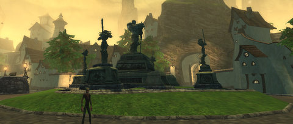

Back to: [West Karana](/posts/westkarana.md) > [2009](/posts/2009/westkarana.md) > [July](./westkarana.md)
# Daily Blogroll 7/23 -- Aftermath edition

*Posted by Tipa on 2009-07-23 07:26:16*

Okay, [THAT was a day of good discussion](../../../index.php/2009/07/22/eq2-the-sixteenth-minute-a-rebuttal/), so [thanks, Wolfshead](http://www.wolfsheadonline.com/?p=2570) :) Why did I feel your "first impressions" article needed rebutting? Well, SOMEONE had to stand up (and [thanks to Hudson, who did](http://hudshideout.com/blog/?p=3034)!). I couldn't say that stuff about WoW and expect to come away without comment. In grand blogging tradition, Wolfshead now has [a rebuttal to my rebuttal](http://www.wolfsheadonline.com/?p=2764) :)

Adding fuel to this smoldering fire, Warhammerer does the same [first few minutes analysis to SOE's Vanguard](http://exploringwar.wordpress.com/2009/07/22/vanguard-first-glances/). That company just can't catch a break these days, even if it had sealed box with the words "WARNING -- DO NOT OPEN -- LIVE BREAK" stenciled on it.

Planning on playing Aion when it comes out, or have you pre-ordered it and are now allowed to play on the preview weekends? Naamah of Aionic Thoughts has [some useful tips](http://aionicthoughts.wordpress.com/2009/07/22/tips-for-aion/) which will make your game flow more smoothly. Naamah also has some screenshots of [the new lingerie](http://aionicthoughts.wordpress.com/2009/07/22/a-very-belated-video-and-screenshot-sunday/) introduced with the latest, 1.5 patch. This is the last major patch before release, if I remember right.

Stingite at Friendly Necromancer [shows off the new sword](http://thefriendlynecromancer.blogspot.com/2009/07/becketts-most-recent-info-on-wizard101.html) he got from a code in Beckett's Massive Online Gamer magazine. Pretty swanky, looks like an EQ1 epic...

Hey, did you hear that Sam Raimi of "Evil Dead" fame is [making a new movie](http://www.blizzard.com/us/press/090721.html)? About World of Warcraft? Zoso of Killed in a Smiling Accident managed to snag [a few pages of the shooting script](http://kiasa.org/2009/07/22/warcraft-the-movie-draft-shooting-script/). Hilarity ensues when the Hunter rolls "need" on everything.

Anjin is concerned that [Champions Online won't encourage solo play](http://bulletpointsblog.blogspot.com/2009/07/news-filter-forget-soloing-champions.html), but then corrects himself. Truth is, Champions Online supports solo play the way EQ2 does. You can solo, but you won't be able to do a certain portion of the quests from the yellow exclamation point dotted quest hubs unless you have a group available.

Yellow exclamation points above the heads of NPCs clustered in quest hubs? Not sounding super-heroish? Green Armadillo is just [not a fan of the WoW model at all](http://playervsdeveloper.blogspot.com/2009/07/levels-60-70-in-eq2-and-tyranny-of-wow.html).

After Saylah of Mystic Worlds has been going on about [the multi-boxing lifestyle](http://notadiary.typepad.com/mysticworlds/2009/07/color-me-purple.html) in World of Warcraft, Spinks chimes in with the goods and bads of [duoing through WoW](http://spinksville.wordpress.com/2009/07/22/twos-company-duoing-in-mmos/).

Keen continues with his look back to the elder days of MMO gaming with his latest article on [the importance of factions in old EverQuest](http://www.keenandgraev.com/?p=2733). I remember getting my dark elf shadow knight loved in Rivervale!

And lastly (early meeting today) -- as seen on Rock, Paper, Scissors, and from the creator of Crayon Physics Deluxe, [a Post-It Note shooter](http://experimentalgameplay.com/blog/2009/07/play-post-i-t-shooter/).

## Comments!

**warhammermer** writes: I don't actually dislike vanguard. I actually think more people should try it based on what its fans say about it. Its one of those games I am interested in but am only trying now. So please go kindly on my thoughtless comments.

---

**[Tipa](https://chasingdings.com)** writes: I didn't say you disliked Vanguard, just that you were doing a similar analysis of it's first few minutes.

---

**[Zoso](http://kiasa.org/)** writes: Ooh, loot rolls, that's an idea for the next scene. I mean, err, I wonder if they'll feature on the next scene our "source" gets hold of...

---

**[Anjin](http://bulletpointsblog.blogspot.com)** writes: Thanks for pointing out my error to the entire blogging community. :) I am glad that got straightened out so fast, though

---

