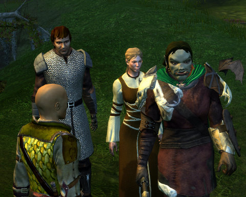

Back to: [West Karana](/posts/westkarana.md) > [2009](/posts/2009/westkarana.md) > [June](./westkarana.md)
# Neverwinter Nights 2

*Posted by Tipa on 2009-06-02 06:52:14*

Out of nowhere, I was invited to take part in a weekly online gaming group as they explore the world of Neverwinter Nights 2 (which, it turns out, is an entirely separate game from Neverwinter Nights Platinum). I'd originally bought NWN2 to play with its level editor, but I never really learned it well enough to bring it all together. The levels seemed a lot smaller, for example, than I'd have liked. Smaller than in Neverwinter Nights, even.

I'd never actually played the game because, well, I'd gotten stuck in the tutorial. If I remember right, I couldn't survive the general brawl event.

When I re=installed it last week, I figured this would be my litmus test: If I could figure out the tutorial and complete all the objectives, I'd be on my way.

This time, I got stuck in the magic tutorial, because, it turns out, I didn't read the tutorial text in the popup. I'm just so USED to hitting "OK" "DONE" "COMPLETE" "GO AWAY YOU DAMN BOX" on every popup window that the idea that such windows may contain useful information is entirely foreign to me.

So try #3, last night, I actually read all the boxes and figure out the tutorial. The fact that I chose a HUGE half-orc barbarian for a character instead of a willowy elf or a tiny hobbit turned out to help a little in the general brawl, but I was of somewhat less use because it wasn't entirely clear who the good guys vs the bad guys were, and I was having trouble moving around and having to click to select the baddies was getting tiresome.

As I'm writing this, I understand, finally, that MMOs, with all their time-saving conveniences, have trained me to approach RPG combat in exactly the same way, every time. Little use of the mouse, a camera which acts intelligently, tab-target-attack till it's done. I was also unready for auto-attack -- in EQ2, if you aren't pressing a button, you're not doing your job.

I have no idea what it'll be like to play NWN2 with other people....

Time to reinstall Vent!

## Comments!

**[mbp](http://mindbendingpuzzles.blogspot.com)** writes: Tipa

I am not a big fan of the dice obsessed game mechanics of AD&D games. In my opinion its time to move on from 20 sided dice. Nevertheless I had a lot of fun in single player NWN2 last year and I can only imagine multi player will be even more enjoyable. Just watch out for game breaking bugs. I played about half way through the single player NWN2 campaign last year only to run straight into a bug which stopped me in my tracks. 

If I recall correctly it arose from a scene in the tavern where I and my followers had taken residence. We had just survived an attack on the tavern. Immediately after the battle I was supposed to talk to some character who would launch the next part of the main quest. Somehow I managed to bypass this and instead went off and did a whole bunch of side-quests thereby losing forever the opportunity to talk to the guys and continue with the main quest. It was a particularly insidious bug that didn't manifest itself until many turns later ensuring that all my recent save games had the bug embedded.

With the help of internet forums I eventually got a work around which involved manually editing save games! That was altogether too much effort for a game that had been out for a few years and was fully patched up to date.

---

**the friendly necromancer** writes: Tipa, I have that tutorial DOWN now. What you do is complete all the quests but the brawl first. This will level you. You then go into your character screen and run through assigning points and what not, THEN take on the pesky brothers. Mbp's note is well taken...

---

**[Anjin](http://bulletpointsblog.blogspot.com)** writes: I really wanted to like the NWN games and completely failed to do so. Playing an angelic hooker in Sacred 2 is deep a game as I can deal with nowadays.

---

**[syncaine](http://syncaine.wordpress.com)** writes: You uninstalled Vent? Why?

NWN2 is a great RPG, finished it single player at some point last year and really enjoyed it all the way through. I'll have to catch you on xfire and see if you have room for one more in that group, would love to play that game multiplayer with others.

---

**[Tipa](https://chasingdings.com)** writes: Vent's not been installed yet on the new computer. I've kinda been using Skype more lately.

---

