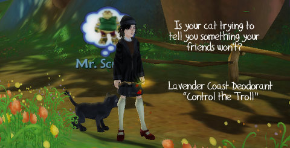

Back to: [West Karana](/posts/westkarana.md) > [2009](/posts/2009/westkarana.md) > [June](./westkarana.md)
# Daily Blogroll 6/2 -- E3 edition

*Posted by Tipa on 2009-06-02 08:06:38*

Oh, speaking of Free Realms, the band that does the theme song "It's Your World and Welcome To It"*, the Dares, [will be performing the song live at E3 AND on the Snowhill stage in game](http://www.freerealms.com/article/detail.action?articleId=106) (on all servers, from what I understand) at 7PM EDT or 4 PM PDT. If you West Coasters are at work and can't see it, we'll let you know how it went because, like, we're three hours ahead of you. In the FUTURE. (* not the actual song name)

It's E3 week, the hype is unbelievable. Highlights: Microsoft's "Natal" project, which uses a camera to put you in the game in new and exciting ways not seen since the PlayStation Eye-Toy and the Nintendo Wii. [The video was full of science fiction goodness](http://www.youtube.com/watch?v=03thQvGRVvQ) and happy people having wholesome family fun in their future world (possible East Coasters?) Compare the sci-fi preview of that version of Natal with [a demo of the actual product](http://www.youtube.com/watch?v=MnbWfY_hGxM). Only professional actors could make splashing paint on virtual paper seem like so much fun.

The Gaming Goob (among others) [shares this E3 video of Bioware's upcoming Star Wars: The Old Republic](http://thegaminggoob.wordpress.com/2009/06/01/swtor-this-must-be-shared/), where, if the trailer is to be believed, we will be able to crash starships into palaces so our hordes of saber-wielding Sith can jump out to kill all Jedi and destroy the Republic, as we bombard Coruscant from the air. Also, there WILL be "bullet time", so [sad ex-redpills](../../../index.php/2009/05/29/the-matrix-online-unplugged/) can once again enjoy their slow-motion combat.

Massively has [the latest Jumpgate: Evolution trailer](http://www.massively.com/2009/06/01/e3-2009-jumpgate-evolutions-e3-trailer-evokes-that-space-opera/), which is like EVE Online, but with a lot more explosions and destruction. EVE has that too, but one of the things I like best about it is that it's not a game entirely about blowing stuff up. You can make things, explore places, and live in a peaceful way if that's how you want to play it. Where are the games that hold hope for a better future? 

I get so tired of game trailers that always go on about "It's a time of war. A place of war. A time of dying, of destruction. When everything bright is being leeched from the world. A time of horror, of death, of despair, of endless conflict whose hunger is never satisfied, whose thirst for blood is never quenched. You will never win, you can only hope to fight until you die, only to be resurrected to live and kill and be murdered once again." Maybe it's a girl thing, but after these games, [who needs Hell](http://www.sfsite.com/07b/wo85.htm)?

Jennifer at "Girl, Unplugged" (rumored to be, [unlike Ferraro](http://biobreak.wordpress.com/2009/06/01/girls/), an actual girl) compares the (presumably) all-male lineup of Team Fortress 2 (where the guys look businesslike and not all that sexy) with the hyper-sexy girl versions of the team. What's wrong with drawing girls that look more like real girls? Or hyper-sexy men?

Lars at MMOment of Zen [looks at the walled gardens of servers](http://mmomentofzen.blogspot.com/2009/06/easy-breezy-server-transfers.html) in games that don't allow easy transfers (EQ2, WoW) vs those games for which server switching is common, free, instant and easy (Wizard 101, Guild Wars, Free Realms), and points out that if people are invested on a server that is dying, or is different from one their friends play on, that they are more likely to just quit than pay a huge fine for the crime of starting on the wrong server to be transferred, or worse of all, restart. Um, total agreement here? Being on a different server from your friends is [the WORST. THING. EVER](http://mmoquests.com/2009/05/30/did-we-just-pull-that-off/).

Yeah, I know I have written about the benefits of having server-specific communities. I was wrong. I admit it. MMO devs, take note. Don't separate your players.

Ardwulf wonders [if SOE will announce EverQuest III at this year's E3](http://ardwulfslair.wordpress.com/2009/06/01/an-everquest-iii-announcement/). I would be utterly shocked if that happened; I already think SOE announces games too early (how long have we been reading about The Agency and DC Universe Online? And how many years are they away, still?). My gut tells me that EQ3 (if it exists) is still in pre-production. They are just taking on the management staff now!

EQ fan Hudson takes us in a trip forward into the past as he explains [why the extremely simple, un-automated interface of the default EverQuest is all you really ever need](http://hudshideout.com/blog/?p=2590). Well, I'm a big [Lodi](http://lodidodi.net/) fan myself, but the point is, the UI assists you but doesn't do your job for you. I like that.

Over at io9, Graeme McMillan [wonders how to get kids to become more interested in science](http://io9.com/5273522/how-do-you-make-kids-love-science). It's no secret that I love math (geek creds: #3 in the 1978 NH Math competition and have the trophy to prove it), but I was entirely unsuccessful in getting either of my children to get beyond the drudgery of calculation to see the exciting worlds of number theory, topology, probability and so on that lie just over the ridge. But then, I had a great math teacher in high school who answered a question of mine by telling me about complex numbers. Oh, and that Tom Lehrer song about [Nikolai Ivanovich Lobachevsky](http://www.youtube.com/watch?v=UQHaGhC7C2E). 

And lastly, Green Armadillo finds out he doesn't have to choose between healing and fighting in EverQuest 2 [because melee healers kick much butt](http://playervsdeveloper.blogspot.com/2009/06/eq2s-take-on-melee-healers.html). I'm pretty sure those were the words he used.

Have fun gaming, watch those E3 announcements with a skeptical eye, and keep safe out there!

## Comments!

**[openedge1](http://simple-n-complex.blogspot.com)** writes: I want to personally thank you for doing these blogrolls. I find more news in an instant through your postings than I do trying to filter my RSS. The posts are fun to read as well, because sometimes us other bloggers can be pretty dried and cut...to PIECES!
(Sorry, Horror Genre moment..)

Thanks again!

RSS Karana Rocks!

---

**[Hudson](http://hudshideout.com/blog)** writes: That Lodi interface is pretty slick. I might have to look into that

---

**[Spinks](http://spinksville.wordpress.com/)** writes: I'm still not decided about single servers. It sometimes is nice to be able to pack up and start all over again on a fresh server with a different community. I know it's weird and stupid but ... yeah I dunno where I'm going with this.

---

**[Spinks](http://spinksville.wordpress.com/)** writes: Also... that looks like a wizard to me in the screenie? :) How're you liking it, I know it was my fave of the classes.

---

**[Saylah](http://notadiary.typepad.com/mysticworlds)** writes: I love the blogroll too. I prefer reading blogs to news sites. But there are SO many good ones these days and my time is severely limited. Tipa's digest helps me get the sound bites and I know where to go check for more when I have time. Lovin it!

---

