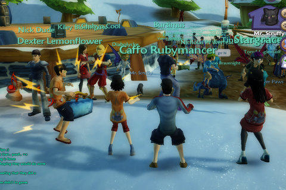

Back to: [West Karana](/posts/westkarana.md) > [2009](/posts/2009/westkarana.md) > [June](./westkarana.md)
# "The Dares" in Free Realms

*Posted by Tipa on 2009-06-03 06:54:45*

  
*Jamming and dancing after the show. Note the concert tees, put on only AFTER the show, as according to the Rules of Live Concerts*

I admit it. I had fun at The Dares concert inside Free Realms last night. The Dares, who wrote and sing the Free Realms theme song "It's Your World", were live on stage in E3 and live on stage across all servers in Free Realms.

Though I'm not sure how live they actually were; Stargrace told me that they'd played a longer set live, and in game they sounded exactly like the song we've all heard. The band would suddenly appear on stage several times singing snippets of the same song, so what I think we ACTUALLY got was The Dares live on stage at E3, and a pre-recorded performance in game.

Zam's Free Realms pro-site writes that The Dares won [a Guinness Book of World Records certificate](http://fr.zam.com/story.html?story=18275) for the first simultaneous live and real world concert. Hard to believe that this hasn't been done in someplace like Second Life before, but, grats Dares :)

The pre-concert waiting reminded me a lot of real open-air concerts. People were making noise and running around, pets were everywhere, roadies were up on the stage trying to get people excited, the band was late.... A good time to meet up with friends. Stargrace was there, and Jason from Channel Massive showed up, Beau Turkey was lurking about, Caffo and Cambrian were in the house, it was SO COOL to be hanging out with friends waiting for the concert to begin, even if the experience was virtual.

Suddenly, the Dares were on stage, they played their song and then were going. That was it? That was it. I caught most of it using Free Realms' in-game video recorder, but the file it made was SO LARGE, I had to run it through Windows Movie Maker and re-encode it before I could upload it to YouTube.

Afterward we hung out for awhile, danced, showed off our outfits, put on our concert tees and chatted.

I... I really had FUN.

Video below -- high quality, full screen works great on this one.

## Comments!

**[stargrace](http://mmoquests.com)** writes: It was.. SO much fun. The most fun I've had in Free Realms. I'd love to see more events like this put on. The crying at the end is killer. LOL. Great job!

---

**[Saylah](http://notadiary.typepad.com/mysticworlds)** writes: I'm really sorry that I missed it. I just couldn't be on last night. Dang. Besides the fun it sounds like it was the perfect opportunity to get people on the dreaded friends list. I am surprised this hasn't happened in SL. Then again for all the opportunities that exist for virtual events in SL I think they still bear a huge stigma of the sexually explicit content lurking around every corner and that people could show up to an event as anything and wearing anything or nothing at all for that matter.

---

**[Tateru Nino](http://dwellonit.blogspot.com/)** writes: Yeah, the simulcast sort of performance has been done more than a few times in SL. Over the years, I've had at least a dozen press releases telling me that some particular one was the historic "First" of its kind.

@Saylah: A whole lot of that stigma is pretty unwarranted, alas.

---

**[Hudson](http://hudshideout.com/blog)** writes: Does Free Realms have apartments and things like gardens and stuff? I cannot remember. If so I can get my significant other hooked easily

---

**Neiebuse (Inoxia)** writes: Yeah, it was pretty fun! It did say on the web site that it was going to be streaming live... but I doubt it. Still, it was a fun Live Event. I actually think that SOE could have something going connecting with Sony Music artists. 

There's no housing yet, but those of us who were in the early but still post-NDA beta will recall there was a housing section on the Marketplace, so I'm sure it's coming in the future.

---

**[Beau Turkey](http://www.spouseaggro.com)** writes: Yeh, lot's of fun. It reminded me of the band that plays in WoW, it's a scripted event that replays over and over...but still really fun to see the crowd "jumpin'" to the music! lol

 I wanna' see more of this kind of thing...too bad the GM's didn't just hang out and ban the spammers. Still, loads of fun!
 BEau

---

**[Cuppycake](http://www.cuppycake.org)** writes: Also, Anarchy Online actually did this in game first, with a full streaming live performance. 

http://www.mmoz.com/forum/showthread.php?p=28917

---

**the friendly necromancer** writes: Too bad the song isn't all that great, but the event sounded fun!

---

**[Tipa](https://chasingdings.com)** writes: Hey, you can hit F10 to hide the UI!

I bet everyone but me knew that already :P

---

**[The Dares Concert in Free Realms &laquo; Exploring War Like Worlds.](http://exploringwar.wordpress.com/2009/06/04/the-dares-concert-in-free-realms/)** writes: [...] For those who wish to see what the first showing in EST was like, check out west karanas video [...]

---

**EndlessBlue** writes: The Dares actually didn't write "It's Your World"

It was written by the guys that wrote the Hannah Montana theme song. They are Robbie Nevil and Matthew Gerrard.

I was there and also had a good time, and yes, I was sporting a concert tee. =)

---

**[Tipa](https://chasingdings.com)** writes: I'm not sure if knowing that fact makes me like the song more or less :P

---

**Bhagpuss** writes: Sorry to have missed this. I would have been there but I was asleep. Not a good fit for GMT.

One of the best things about LotRO is the genuine live music. My favorite memory of my time there is watching a group of minstrels playing a concert in Bree and being amazed by the convincing versions of songs I knew. If only they could add vocals.

---

**stuber82** writes: Here's some great footage of The Dares performing the Free Realms theme song "It's Your World!" 
www.clipser.com/watch\_video/1323499
It was also announced the game hit the 3 million user mark in just 7 weeks... great game, and I definitely recommend checking it out!

---

**game_pal_09** writes: Been playin Free Realms for the past month now, and I'm absolutely crazy about the game! Not very often do you come across an MMOG that older and younger kids can all get into! LOL, i also love the Free Realms There Song by the Dares! You can buy it here from iTunes: http://www.apple.com/search/?q=the+dares

---

