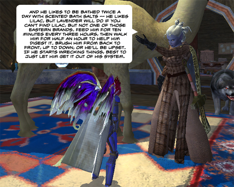

Back to: [West Karana](/posts/westkarana.md) > [2009](/posts/2009/westkarana.md) > [June](./westkarana.md)
# EQ2: No good deed goes unpunished

*Posted by Tipa on 2009-06-05 00:22:21*

  
*When a friend asks you to look after their pets for a couple of days, don't just automatically say yes...*

Finally got around to reinstalling EQ2, so it launches and works and all that fun stuff. And they had new pets in the Marketplace! So naturally, a camel came home with me. And by home, I mean not the guild hall, as the new pets can't be placed there. Sadness.

A drunken dwarf (never met any other kind) was offering to reward anyone who came to him at the North Qeynos gates and performed a certain task for him. He was standing, as it turned out, right between two heroic guards who were very interested in adding a notch for a certain level 31 Arasai to their belts. I asked the dwarf if he were able to move just a few metres out, and he did and offered me the quest as well -- twenty harvests.

By the time I returned with them, the goddess Tunare was making a visitation. Tunare's always been a dancer -- who can forget her power-kick move back in the Plane of Growth? But this time she was happy to just play the tease. Norrathian gods -- you never know what you're gonna get with one of them.

The reward was some cheese soup, so that was kinda blechy. A rat slipped me some milk and cookies, which I found kinda odd, because if you give a rat a cookie, then she'll want some milk to dip it in, right?

