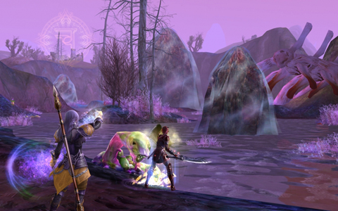

Back to: [West Karana](/posts/westkarana.md) > [2009](/posts/2009/westkarana.md) > [June](./westkarana.md)
# The Players of Aion

*Posted by Tipa on 2009-06-08 06:58:41*

The NDA for Aion prevents me from saying anything specific about the game; press doesn't face these same limitations, so you can read some impressions [at Massively and other places](http://www.massively.com/2009/06/07/hands-on-with-the-aion-beta-becoming-a-daeva/), and I'll give my own impressions when I can. Having an NDA when there's a million people playing is kinda weird, but I'll stand by the agreement I clicked upon.

But there's no NDA that tells me I can't talk about the players.

Take one step into the world of Aion, and from that moment on, you're an expert player. All your years playing MMOs has prepared you for this moment, and nothing you encounter will give you a moment's hesitation. By the end of the preview Sunday, many characters were fairly high level, guilds had been set up and there was a rough hierarchy of achiever guilds vs casual, friend-based guilds.

Every quest hub had player vendors hawking their wares, competing with each other on price and selection and in most cases, using work-arounds in order to get profanity through the filters and into their advertising message "come here for the best sheet".

There were the soloers, there were the two-three person groups, and there were the full groups already tearing into the tougher content most players won't see for awhile.

That's Aion, the game you already know how to play. And because it's so familiar, it's extremely enticing. When I logged off Sunday, it's because the game had grown concerned that I had spent so much time online.

More when the NDA drops.

## Comments!

**[Saylah](http://notadiary.typepad.com/mysticworlds)** writes: Too bad. I guess I'll have to wait on your post. I love Massively for gaming news but NOT for opinions on games. News sites have to walk a fine line with the developers and publishers so...

When the guild I was in evaporated on ROM over the release patch changes, I'd heard Aion was where they'd all disappeared to.

---

**[openedge1](http://simple-n-complex.blogspot.com)** writes: Well, can it be. I have been waiting on this game, and it is the next I wanted to play. Looks like my affection was not unwarranted.
Thanks for this, and based on what you are saying..it is familiar to us old time players, but will feel fresh enough to keep us engaged. Right?

Cheers

---

**[rob](http://www.lostaneighth.com)** writes: I can't wait to try out Aion just because it looks beautiful. Coincidentally, I finally tried out Lineage 2 this weekend thanks to a $10 4th anniversary edition I found in a local Gamestop. It came with 60 days play time so it seemed like a steal. So far I am surprised by how much I enjoy it. I expected it to be pretty typical Eastern MMO fare, and it is, but I am just in love with the art direction in the game. I double that Art Direction alone will keep me playing for years, but for now it is sure nice to look at.

---

**[We Fly Spitfires](http://blog.weflyspitfires.com)** writes: I'm definitely getting excited about this game. I think the lack of any new MMO releases this year has built the hype and my desire. When does it release? Amazon UK is saying September :(

And I read that pre-ordering it gets you into the beta?

---

**[Keen](http://www.keenandgraev.com)** writes: North American release is in September. I don't know about Europe. Pre-ordering gets you into beta, but beta is more of a "weekends" type thing (and not even every weekend).

---

